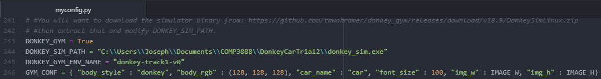
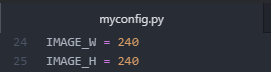
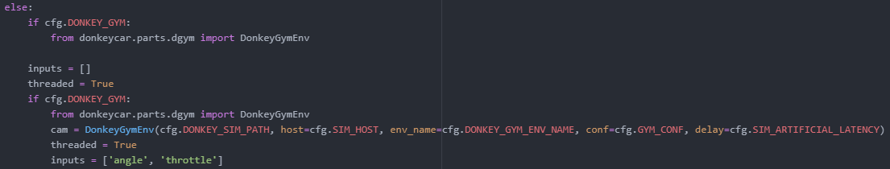
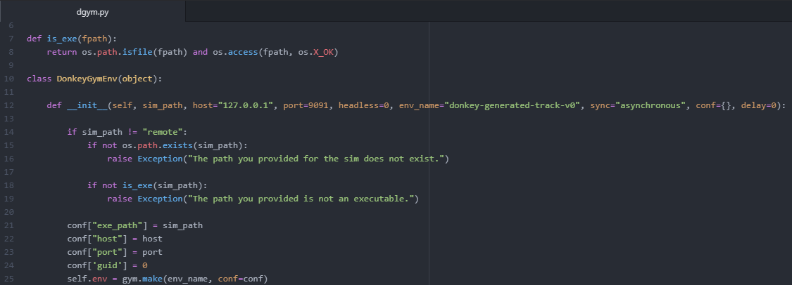
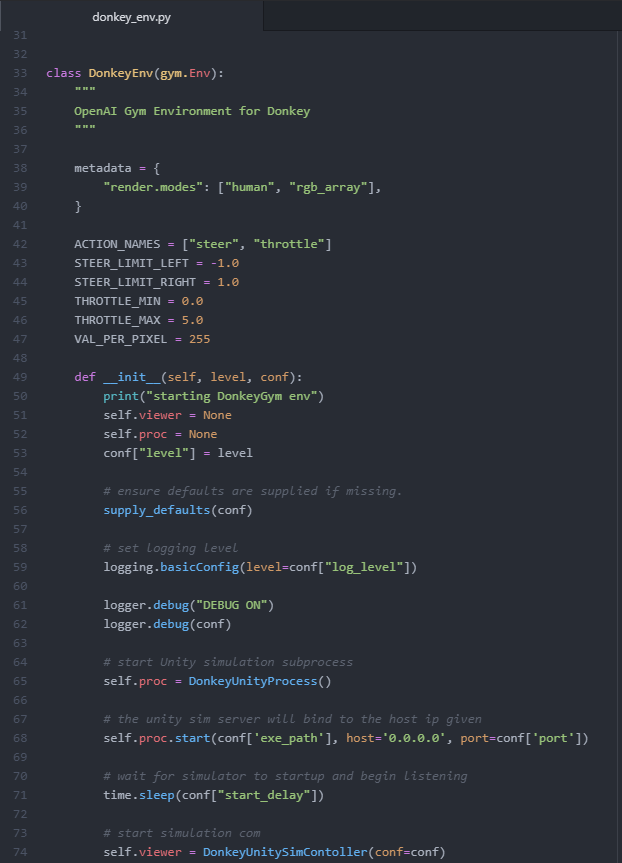
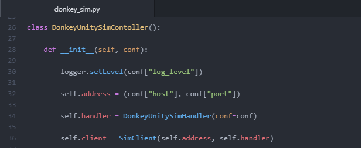
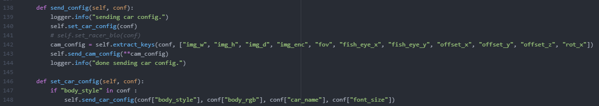
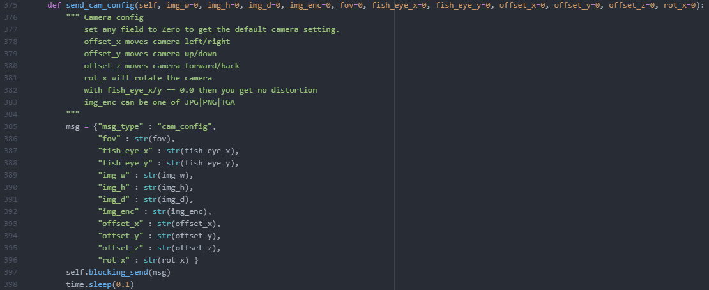
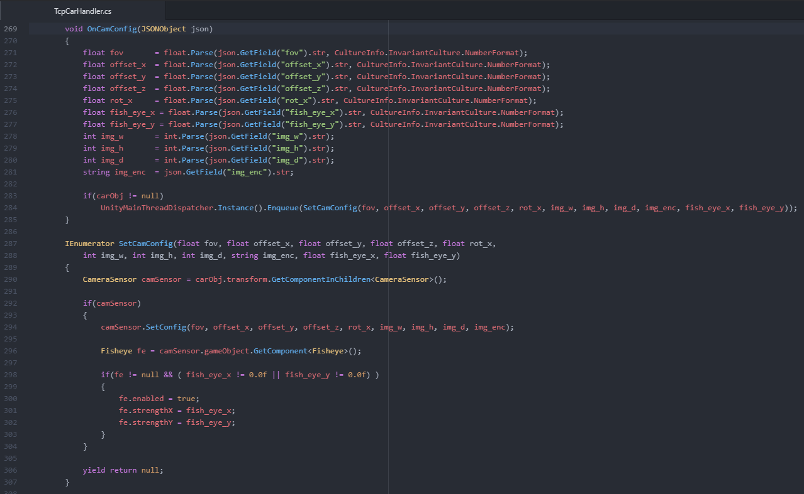

# Camera Configuration

We have figured out how to get camera resolution to change in the configuration file (“myconfig.py”/”config.py”), in the ‘mysim’ folder, instead of manually changing it in the simulator. To do this you have to add extra parameters to the ‘GYM_CONF’ at line 246. The extra parameters are adding “img_w” : IMAGE_W and “img_h” : IMAGE_H. 

Note: as we can see from GYM_CONF should look like that for the resolution change to work.

So, change the camera configuration is a very easy step, we however made it into the template so that you don’t have to do it yourself. So, all you really have to do is change the resolution that you want.

To actually pick what resolution we want go to line 24 and 25 in “myconfig.py” and uncomment it out and pick the resolution you want with “IMAGE_W” being the width and “IMAGE_H” being the height of the photo taken in the web.

Note: So, I have changed the image to be 240 by 240.

---

## Extra Information

We will go through how the actual configuration work, so how it sends it to the simulator and what the simulator does.

So, from the GYM_CONF line in the config file and it is received in “manage.py” (located in ‘mysim’ folder) 

As we can see our “cfg.DONKEY_GYM” is set to true and so will always run those two blocks of codes. The ‘DonkeyGymEnv’ function is the function that actually sets up the information to send to the simulator for the gym/web. So ‘cfg’ is your actual ‘config’ file so the obvious one as there the ‘cfg.DONKEY_SIM_PATH’ is for actually starting up the simulator, ‘cfg.SIM_HOST’ is for what port you want to use, ‘cfg.DONKEY_GYM_ENV_NAME’ is the track the donkey car will be driving on and the thing we are paying attention to in this documentation the “conf=cfg.GYM_CONF”. 

This ‘DonkeyGymEnv’ function is from ‘dgym.py’ in the donkeycar/parts folder. 

What important here is line 25 this actually starts up the gym, so all this function doing is getting all the information that is needed to start the simulator. So, if we go to where the function gym.make which is file ‘donkey_env.py’ in the folder gym-donkeycar\gym-donkeycar\envs. 

So, what important here is line 74 where it sends the configuration to the simulator

So these are the lines of codes that change the camera resolution for the simulator as this send it to the simulator which is received here in the ‘TcpCarHandler.cs’ in the folder called sdsandbox-master\sdsim\Assests\Scripts\tcp. This is not entirely true as it actually sends it to the simulator executable but that’s encode into the actual program, so I am unable to show to you. So, I will just show the code that the program uses for car configuration.

So, it obtains the information sent from ‘donkey_sim.py’ and sets up the camera to the configuration given to it. This is how the camera configuration goes from the ‘myconfig.py’ file all the way to the simulator.