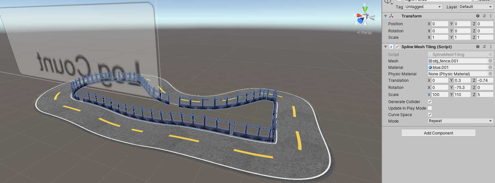
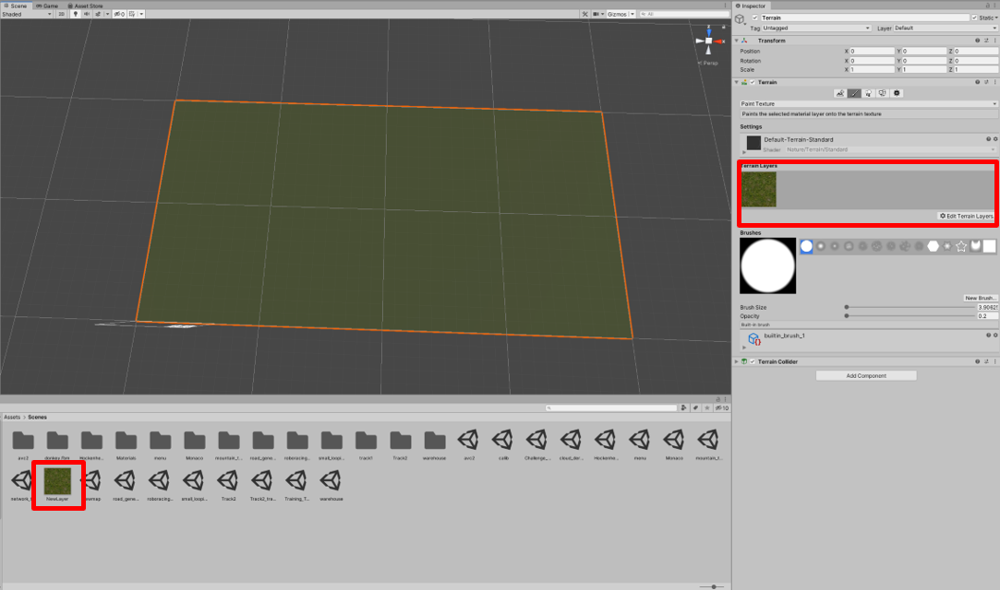
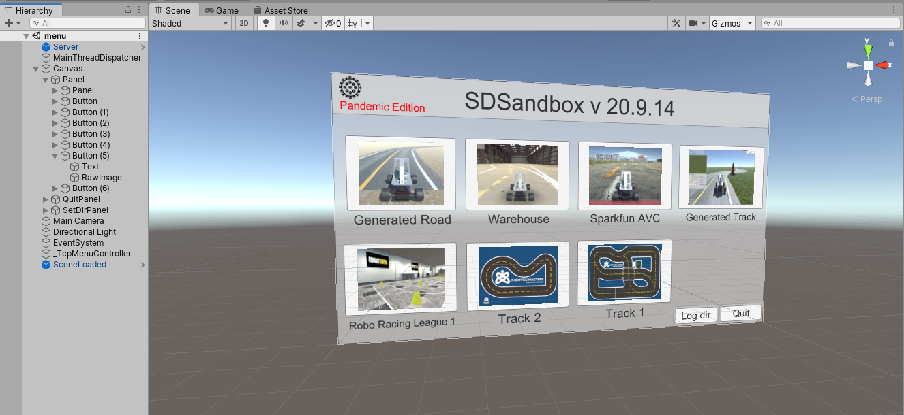
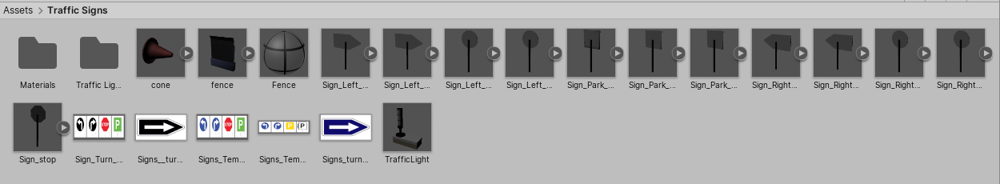

# Creating and Modifying Simulator

**Table Of Content**

[TOC]

# Map Implementation
The first thing to do is to download the Unity program, to do this download the files from [here](https://bitbucket.org/comp3888-t17a/comp3888_t17a_group5/src/master/).

From here open up Unity and Load the Unity project sdsandbox/sdsim in Unity. When done you should have this:

## Track Creation

There is two track ways that tracks can be, they can be either a flat track or a track with elevation. We will discuss the creation of both track type below.

### Flat Map Creation

From unity open the scene folder in the directory then right click and go to create and click on ‘scene’. From the left panel also known as the Hierarchy, delete the ‘main camera’ and ‘directional light’. From here, go back to the assets directory and go into prefabs folder. Find the prefab called “ScenePrefab.prefab” and then drag it into the scene. Then set the position of the prefab to be 0,0,0.

Note: The scene should look like this when you drag it in and place it at position 0,0,0.

Now we have to change the dimensionality of the map. So, from the left panel click the arrow for sceneprefab, world then environment. From here click on the Plane. We know that the scale of the plane is 1 equal to 7.4m so change the x axis for width of the map and the z axis is the height of the map.

Note: I have made the map 15m (scale of x = 2.03) by 10m (scale of z = 1.35)

Now all we do is drag the image of the track onto the plane and that’s it you have the initial part of the map.

Now we want to add the boundaries to the map so that the car doesn’t fall off. To do right click the right panel and go to ‘3D Object’ and Quad. Click on the ‘convex’ in mesh collider and also change cast shadows from ‘On’ to ‘Shadows Only’. Now move the quad to the edges of the map and increase the scales to reach the full edge of the map and tall enough as well.

Note: This is the wall of the map so that you can’t fall off the track

The last thing we need to do is shift where the donkey car actually spawns in. To do this click on ‘donkey-start’ and move it to the start location of the map and rotate it to the correct direction. Click the play button at the top to see if you did it right and if you didn’t change it until it is correct.

### Elevation Map Creation

For elevated maps, the initial creation of the map is generally the same as for flat maps. So we do the following

From unity open the scene folder in the directory then right click and go to create and click on ‘scene’. From the left panel also known as the Hierarchy, delete the ‘main camera’ and ‘directional light’. From here, go back to the assets directory and go into prefabs folder. Find the prefab called “ScenePrefab.prefab” and then drag it into the scene. Then set the position of the prefab to be 0,0,0.

Note: The scene should look like this when you drag it in and place it at position 0,0,0.

Now we have to change the dimensionality of the map. So, from the left panel click the arrow for sceneprefab, world then environment. From here click on the Plane. We know that the scale of the plane is 1 equal to 7.4m so change the x axis for width of the map and the z axis is the height of the map.

Note: I have made the map 15m (scale of x = 2.03) by 10m (scale of z = 1.35)

Now all we do is drag the image of the track onto the plane and that’s it you have the initial part of the map.

From here click the asset store and find ‘SplineMesh’ by Benoit Dumas and install it into unity. 

Note: This is the asset page from the asset store

Now click the right panel and go to ‘3D Object’ and click on “Spline”. Click on the spline and now on your map there should be two grey squares, these grey squares are known as your nodes. 

Note: See the two nodes are grey while the red squares are the direction.

We will be doing all of this in the 2D plane first and do elevation later. So first click on the nodes and drag them to the centre of the track road (Note only move it in the x-z plane, never touching the y axis). Dragging the red square so that the spline mesh is always at the centre of the road. Click the add nodes on the right panel and then continue this until you reach the beginning of the track then click on the ‘is loop’ to finish.

Note: The basic outline for the road track.

From here click on add component on the right panel and search for spline extrusion. We have supplied a road texture for you known as ‘Road_Pratice’ but you may use your own. Set the vertices equal to 6 and then type these numbers in

Note: these are the numbers used to create the roads

From here change the scale of each node so that the width of the spline road is the same as the road width. Now clicking on plane then the square box next the name on the right-hand side. Now you should have the road only.

Note: the road is built, and the plane is inactive

Now for elevation what you need to do is click on the nodes that have higher elevation and change their y axis to the elevation you want. Also change the direction’s y axis as well.

Hint: If you are doing a real-life track, I recommend you use Google Earth Pro and sketching out a path to get the elevation profile. A tutorial of this is given [here](https://youtu.be/NE2oY9FMAKk).

Next, we will be adding fences to the track, to do this create an empty child for the spline by right clicking on the spline and clicking on ‘create empty’. Click on the add component and find ‘Spline Mesh Tiling’. We have provided a mesh for the fence by it is up to you if you want to use it. Click on mesh and search for 'obj_fence.001' and pretty much fill out the same as the picture from the bottom

Note: We have made the right side of the fence

Do this again for the other side of the track and then fill in the gaps for the fences. Now we just have to add the windows for the fences, to do this do the same step as above but instead of picking obj_fence.001 click on obj_fenchmesh and for materials click on fence 

Note: the fence windows have been added with the right panel being the things that needed to be changed to get the windows to work

You now have the basic implementation for the elevated map. If you have any complication watch this video if you want a more hands on look, [here](https://www.youtube.com/watch?v=dI-CaKepWIA).

## Terrain Creation

To get started making the terrain for your track, we must first create a terrain object. In the hierarchy view, right click to bring up the menu then navigate to 3D Object->Terrain. This will create a square terrain.

To modify the size of the terrain, first select the object. This will bring up some properties in the inspector tab. Click on the rightmost gear icon and find the ‘Mesh Resolution’ property. The ‘Terrain Width’ and ‘Terrain Height’ can be used to rescale the terrain.

Now to add a texture to the terrain, navigate to the second tab with the brush icon. From the drop-down menu, select ‘Paint Texture’. Now select ‘Edit Terrain Layers’->Create Layer. This will open a new window where you can select your desired texture to be applied. 

Note: Creating a new layer converts the texture into a layer file. This will be created in whichever folder you are currently in. In order to organise your project, it’s best to rename and move this file to your map folder.

Now to begin modifying the terrain we select the ‘Raise or lower Terrain’ option in the drop-down menu. Simply hold Left Click over the terrain to begin raising it or hold Shift + Left Click to lower it. The brush size changes the area affected while the opacity changes how fast the terrain rises/falls. Different brush types can be selected by simply clicking the respective icon.

From the drop-down menu, the ‘Set Height’ tool acts similarly to the previous, except that the terrain will only rise to a certain height specified. Shift + Left Click cannot be used to lower the terrain with this tool

Finally, the ‘Smooth Terrain’ tool can be used to reduce the ‘roughness’ of the terrain by evening out the selected area. A high opacity is recommended to see the effects of this tool.

# General Map Implementation

## Menu Implementation

We pretty much finished making the maps aside from signs but that will be discussed later. 

Now we want to go back to scenes and click on the Unity program called ‘menu’. From here duplicate one of the buttons on the left hand-side and change the text to the map name and raw image to a preview of your map. Move your new ‘button’ to a position where you want it to placed by moving its x and y axis.

Note: This is the menu when I added two tracks already, but same rules apply.

Now, click on file at the very top left of the Unity program and click on build settings. A window should open with names of the scenes, drop the Unity program of your new map into the ‘Scenes in Build’ window. So, you should see a number next to your Unity program.

Now go back to your explorer and open scripts (sdsandbox-master\sdsim\Assets\Scripts) and up SceneLoader.cs to your preferred code editing software and from here copy one of the functions changing the number to the number next to your Unity program.

Note: I did for the maps that I have added so just do this for your map.

Now go back to the Unity program and click your button again, scroll down change the onclick() to the new function you made in SceneLoader.cs.

Now go back to your explorer and go to tcp (sdsandbox-master\sdsim new\Assets\Scripts\tcp) and open up TcpMenuHandler.cs. Scroll down to the function called ‘SendSceneNames()’ and copy the same structure as any of the previous one but just change the name to your map. You also have to add something in function called ‘OnLoadScene’ but adding another else if statement and copy the previous ones except change the loader.\_\_\_\_\_\_ to your loader function you made in “SceneLoader.cs”.

Note: just copy the formatting of the previous ones and it should be fine.

However, if you wanted to make a second page for the menu for more tracks what you need to do is right the first ‘Panel’ and hover over ‘UI’ and click on “Button – TextMashPro”. Change the text for the button by opening it children and clicking on ‘Text (TMP)’ and on the right panel change it to “Next Page”. From here move it just above the log and quit buttons as seen below. Also change the name of ‘Panel’ to ‘Page 1’.

Note: The menu should look like this now

Now duplicate ‘Page 1’ and rename it to ‘Page 2’. From here click the inspector off for page 2 and keep page 1 on. Now click the next button variable on the left panel, scroll down the right panel until you see a section called “On Click()” click the plus button and where it says “None” click on and find page 2, then click on the ‘No Function’ and hover over ‘GameObject’ and click “SetActive” then click the empty box. Click the plus button again and where it says “None” click on and find page 1, then click on the ‘No Function’ and hover over ‘GameObject’ and click “SetActive” then leave box unticked.

Note: Just replicate what was done here

Now for page 2 create a previous button, and just do the same as before but flip the ‘SetActive’

Note: See that Page 1 is ticked now while Page 2 isn’t

To make more pages just duplicate the step above. Also, when are you done making the menu pages you should set all page but page 1 to be inactive. 

With this the unity component is done for implementing the map. So just go to file and click “Build and Run” it will ask you to place it into a file just place it wherever you want.

## Environment Creation

Now the environment will be needed to be set up so that it can be used in your sim. In this part it will just be a lot of adding code to pre-existing python files. The first file you want to change is “**gym_test.py**” (gym-donkeycar\examples) and search for ‘env_list’ it should be an array where you add whatever name you want environment to be called.

  

Note: I added “donkey-track2-v0”, “donkey-track1-v0” and “donkey-racing-league-v0” so you should only see the first 5 environment names so just add your track after.

Do this same step from above with these files: “**test_cam_config.py**” (gym-donkeycar\examples), “**simple_gen_driver.py**” (gym-donkeycar\examples\genetic_alg), “**ddqn.py**” (gym-donkeycar\examples\reinforcement_learning), “**ppo_train.py**” (gym-donkeycar\examples\reinforcement_learning).
Now go to the “**donkey_env.py**” (gym-donkeycar\gum_donkeycar\envs) and scroll down to the very end of the python file. You should see classes here for other environment from here you want to add a class for your environment using the same formatting as the other tracks environment but change the level to be the number that the scene is associated with i.e.

Note: We get the SendSceneNames() from the “**TcpMenuHandler.cs**” (sdsandbox-master\sdsim new\Assets\Scripts\tcp) and so for the class change what level equals to depends on the order you put the scenes into. So, for Track2 we made it equal to level 5 so change that in the donkey_env.py respectively.

There is one last thing we need to do before we can actually run the environment and that is to register the actual environment. To do this go into “**\_\_init\_\_**.py” (gym-donkeycar/gym_donkeycar) and register your environment with the names you used before i.e. “donkey-track2-v0” and pretty much just copy the layout of the previous tracks.

Note: see “donkey-track2-v0” everything is pretty much the same aside from change the end of ‘entry_point’ to be the environment you created above.

Now all you have to do is change DONKEY_GYM_ENV_NAME in “**myconfig**” (gym-donkeycar\mysim) to equal to your new environment name and now you can drive around in your new map.

# Sign Implementation

We will go through sign implementation through two ways: if you want to add a new sign or if you just want to play a sign that already in the simulator.

## Addition of a new sign

Sign Implementation is quite simple to do if you already have the models made in blender, so if you have model in blender what you want to do is export the model as an FBX. This make the blender file into a 3d model that we can place into the Unity engine. So now that you have exported the model as an FBX place the FBX file into the asset folder in sdsim more generally in the model folder under another folder with the environment name. i.e sdsandbox-master\sdsim\Assets\Traffic Signs

Note: These are the models for all the sign

Now open up the Unity program ‘sdsim’. Go into the scene/track (this is normally placed in Assets  Scenes) you want the signs to be placed in. Now go to the folder where you put the signs in the Unity program. 

Note: so, in Unity I have transverse to where I placed the sign in the previous part.

Now just drag your sign you want in the track from the assets bar into the track. Place it in the track wherever you want it to be.
 
Assuming the sign dimensions/ratios are correct then the last thing we have to do check if it is scaled correctly or not. Place your sign lying down and add a cube. Since we know the scale of the cube to be 8.79 to 1m then if we know the sign is 12cm than we scale the cube to 1.0548. Now try to scale the sign so that it fits the cube completely.

Note: we have to scale our sign to 2.4 of the original for the sign to equal to 12cm

So now click the sign in the assets bar and change the scale factor to equal to the scale factor you obtained from above. So now just click apply and that sign should be to scale now so just add it back to the map.

Now the last thing we have to do is add collision to the sign to do this just click on the individual parts of the sign, normally there is a pole part and a sign part. Just click one of them and click the ‘Add Component’ button and search for box collider. This should add collision for that part of the sign. Do it for the other part too.
Now just repeat the same steps as above for all the signs.

## Placing Signs

Placing signs is very simple and easy, all you have to do is drag the sign from the asset bar into the scene and then change its position and rotation and that is it. So, if you go to asset -> Traffic Signs, and whatever sign you want in the map just drag it in position it wherever you want and rotate to the correct way as well.

Before:

Note: So go to traffic signs in the asset folder and drag in the object

After:

When you are done adding the signs just save the file and run and build. You are now finished you have added signs to the map.