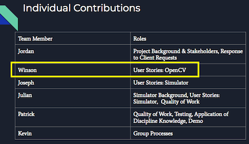

# Individual Report for Winson (wche5722)

[TOC]

# Statement of work done

## Slack Expert
As the Slack expert, I was responsible for the creation and management of the Slack channel. This role was made redundant through the complete transition towards Discord.

## Work done as tracker from the end of Week 6 onwards

As the roles within the group became more formalized, I was assigned the tracker role for the rest of the project. My responsibilities to was to individually check-in with their weekly plan and progress for all group members biweekly (Thursday and Sunday). Evidence for this can be found in the wiki [here](https://bitbucket.org/comp3888-t17a/comp3888_t17a_group5/wiki/Weekly%20Individual%20Progress/Landing). Below is an example of the information I would collect each week, in this case, Week 7.  

These reports start from MidSem and end with Week 12

## Work done as a tester

I assisted in the testing process with the creation script used to rename files for the tests. The commit message for the script can be seen here.  
  

## Technical work done
My technical contributions have focused around OpenCV and RMRacerLib as well as the installation of Donkey software. My main contribution is cone detection and its respective response. This can be seen in these two commits.  
  
  
I also assisted Jordan to implement his circle turn detection into the simulator in a pair programming effort.  
  
  
I also worked a lot on bug fixing regarding the transition to Donkey version 4 and adding to the DonkeyCar community (where rahulrav is a developer for DonkeyCar).  
  
  
I also created changes to the DonkeyCar code to allow for a smoother deployment requiring less user input, such as manually changing lines, automatically installing dependencies, and removing outsourced repository.  
  
  
  
I have also implemented Maxime's (a DonkeyCar maintainer) brake changes for our group including bug fixes in early stages.  
  
  
Lastly, I implemented Cian's (our client) speed changes into RMRacer for our group.  
  

## Non-technical work done
My non-technical work includes assisting mostly in the paperwork process, notably the demo and the presentation portion of the user stories for OpenCV. I also rewrote the installation documentation.  
  
  
  
I solved the problem of the repo size where branch merging, deletion and our own garbage collection did not decrease the size. This was done by contacting Atlassian support, which was done twice.  
  
  
  
  
I have been consistent with attending and contributing to all team and tutorial meetings, and client meetings once a week (see [Meeting minutes](https://bitbucket.org/comp3888-t17a/comp3888_t17a_group5/wiki/Minutes/Landing) for more, for client meetings I attend the second client meeting so check any meetings under Client 2). I have also uploaded a weekly update video at the clients request every week (see bottom of [Weekly Reports](https://bitbucket.org/comp3888-t17a/comp3888_t17a_group5/wiki/Weekly%20Updates/Landing) e.g. [Week 7](https://bitbucket.org/comp3888-t17a/comp3888_t17a_group5/wiki/Weekly%20Updates/Week%2007)). Also, I consistently and frequently check for new messages by other group members and try my best to assist solve problems that come up (Note that I usually go to bed at 9:00 pm).  
  
  
I have also offered assistance to other teams working on the same or similar projects when they run into problems I have had before.  
  
  

## Weekly plan and achievement

### Week 1-6 work done

|Week|Main work|
|-|-|
|Week 1|Familiarization with team and course|
|Week 2|Setting up environment|
|Week 3|Learning OpenCV code and code components, basic unit test created|
|Week 4|Read papers, improved traffic light detection|
|Week 5|Integrated RMRacer|
|Week 6|Fixed major bug with RMRacer integration, report and presentation works|

*** Note: the evidence for these cannot be found on BitBucket due to the deletion of branches. However, they can be obtained through the videos at the bottom of the weekly update. Link is after the rest of the weekly progress.

### Midsem - Week 12 work done

|Week|Planned|Achieved|
|-|-|-|
|MidSem|Stop response, cone detection|Stop response and cone detectioon|
|Week 7|Improve stop response|Implemented brake (more reliable stopping than reverse throttle)|
|Week 8|Cone response|Improvements to cone detection (required to implement response)|
|Week 9|Cone response, pair programming with Jordan to solve turn response implementation problem|Basic cone response, successful turn implementation|
|Week 10|Park response, test cone response, implement speed|Cone response improved and tested, park response done, speed implemented, wrote the script for test cases|
|Week 11|Presentation and demo work|Structure presentation and prepared code for demo|
|Week 12|Presentation, demo and deployment|Recorded presentation and demo, improved code for smoother deployment|

Evidence can be found in the individual progress page. [Linked here](https://bitbucket.org/comp3888-t17a/comp3888_t17a_group5/wiki/Weekly%20Individual%20Progress/Landing) and also as a part of the [weekly update video ](https://www.youtube.com/playlist?list=PLASOYD8xBgsYNDojr8gLz6jvFiRb7NVYG). Note Week 2, 6, 8, 11, 12 are missing due to uneventful (Week 2), mainly presentation work (Weeks 6, 11 and 12) and administrative errors (Week 8)

# Extent of work done

## Effects of technical work

My work on cone detection and response directly improves the user story relating to the detection of park sings. I have also directly contributed towards the user stories by assisting in the implementation of a novel circle detection algorithm. The script I created to change file names assisted in the creation of test cases especially for tests involving a large amount of data. My technical work involving bug fixing with DonkeyCar helped me better understand the code and allow me to implement a smoother method of deployment. It also assisted in creating a collaborative environment between the groups as well as improving the deployment process.

## Effects of non-technical work

My efforts in the presentation and demo assisted in the administrative requirements of this project. My installation document contributes to smooth client deployment as a part of the handover process.
Being able to clear out the repo was extremely important. Without it, further work and collaboration could not be done. To add to the importance, the second time it occurred was leading up to the final client deployment and handover. Without being able to make these changes would have lead to not being able to make crucial last-minute changes necessary. Although anyone could have done requested it, the idea was not thought of as the other members were confused with why local garbage collection did not improve the solution and there was a lack of alternative possible solutions.  
  
Helping other teams contributed to fostering good relations between the teams that played a part in other teams assisting us with our problems and creating a culture that improves the student experience among members.

### XP Roles
My role as a tracker helped the manager (Julian) make weekly plans and complete the weekly report. It also created passive social accountability to create pressure to stay organized and provide meaningful updates from team members. It also created a centralized location for evidence of planning, an area that we severely lacked in the first report. 

## Quality of technical work
My cone detection quality can be seen in its results.  
  
The response passed basic user testing functionality as seen in the demo and can also be seen in video format [here](https://www.youtube.com/watch?v=cuv_PrZjcxY).
The quality of the turn sign implementation is confirmed through pair programming with Jordan.
The DonkeyCar changes quality of work can be shown via ease of installation of the project from 12 steps to 6 steps (lower in the technicality of the steps) as well as being able to run DonkeyCar.

# Reflection

## Version control
Problems with version control have been more present in the second half of the project. There have been issues with members working on older code due to lack of frequent merges and pull request. This has led to some members in the OpenCV teams not understanding the new changes implemented whilst still developing code. This caused some frustrating problems when it came to merging changes as we had to find parts of the code that was not compatible with the latest version.

## Coding style
Coding style has been a problem in terms of some members having inconsistent styles (poor variable naming conventions) and creating unnecessary functions (likely due to a lack of asking themselves, do we really need this). This problem was also a part of the code we wrote earlier. This has led to some problems implementing changes but these problems were only minor annoyances. Otherwise, the coding style has been legible enough to get the job done.

## Extreme Programming
Since the first half, formal roles were implemented. This made the workflow much more productive and improved team member engagement. The majority of this improvement was knowing who was responsible for certain jobs which allow questions to be directed at the correct person the first time around. Despite the formalization of roles, the team did not encounter any issues with overcontrolling and micromanagement styled leadership. We (including me) could have improved on the frequency of commits on the OpenCV side and the agility of members to have transitioned to sign response as it was lacking more than sign detection.

## Challenges and resolution
We met some communication challenges in terms of missing/late to meetings and ensuring group work submitted. These are resolved with reminders of upcoming meetings and assigning someone responsible for submitting the reports. Other challenges such as the move to DonkeyCar 4.0 was met with initial frustration, however, level-headed discussion with the client and those more knowledge with DonkeyCar assisted greatly in finding the solution. Initial frustration is to be expected and I am happy that the frustration did not progress further.

## Project and team
I am enjoying the project as it has given me new perspectives on big scale code production, computer vision and group work. The teamwork has been pleasant with most members having a solid work ethic and frequent, transparent communication. I expected work that was less experimental/research-like and more creation of code. This desire became more evident in the second half as there was a lot of compatibility issues and it was beginning to feel like my job was to fix DonkeyCar rather than code our project. I do understand it could not be avoided as it was a dependency to further develop our project. I am also a little grateful of it, as messing with the DonkeyCar code allowed me to fix bugs during the deployment phase given my increased familiarity due to by earlier debugging. I have also gained a new appreciation of the computer science discipline as I have been exposed to more members of the community. This project has been a part of my reconsideration of continuing working within this field.

## Improvements
Some improvements could've been made with the familiarity of git and its pull request functionality, allowing for better version control. We could have also benefitted with better prioritization towards the response as we had a basic level of sign detection function. Explicit documentation of events in the future would also be an area of improvement. Although our paperwork has improved quite a bit since the first report, a lot of evidence I thought I had could not be used in solidarity and required a lot of contextual information. This made me reconsider if I could make a claim and back up with evidence