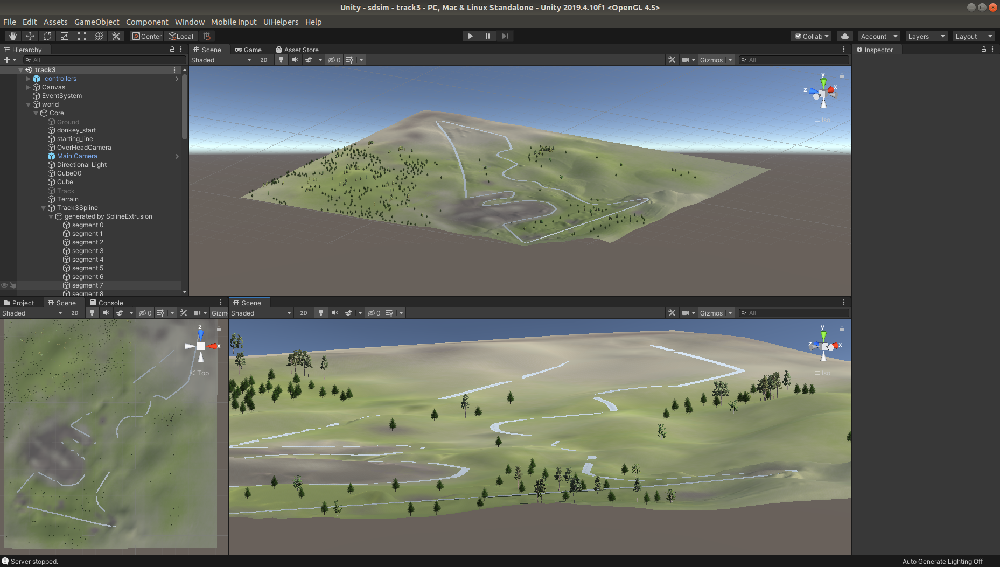
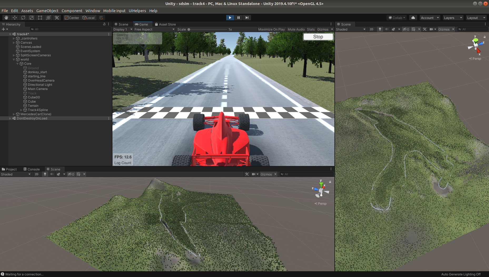

# Formula 1 Track Creation

Information on the process of creating these tracks and their development in Unity for the simulator is located on the [Simulator Wiki Page](https://bitbucket.org/jarodreynolds/comp3888_t15a_group4/wiki/Simulator). This page is intended to provide some video links to the creation process of these tracks, a showcase of the tracks and demonstrate some screenshots of the final results.

## Videos

* [Circuit de Spa-Francorchamps Showcase Video](https://youtu.be/WXL-DDb0f3M)
* [Circuit of Americas Creation Video](https://youtu.be/IgZ-dYSeHwE)
* [Circuit de Spa-Francorchamps Creation Video](https://youtu.be/RLf8rN4uti8)
* [Circuit of Americas Altitude Modification](https://youtu.be/S7EIM3CUcZw)
* [Circuit de Spa-Francorchamps Altitude Modification](https://youtu.be/ZHvmXDiR--U)

## Images

### Circuit of Americas Track

### Circuit de Spa-Francorchamps

