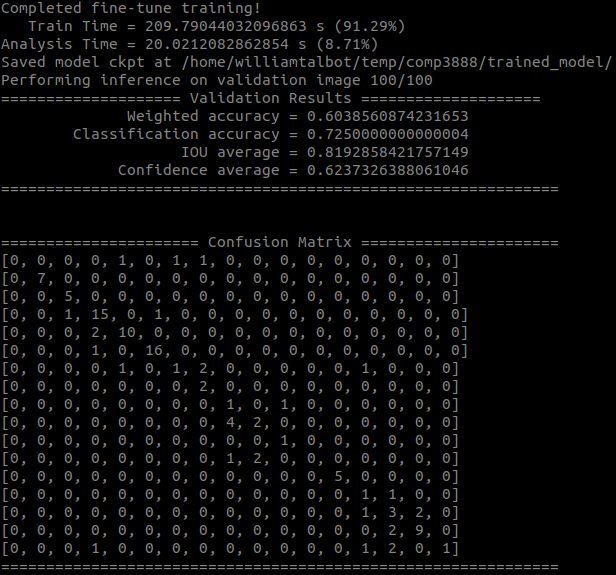

# Tensorflow #

## Experimental Installation ##

We want to be working with TF2 and training on GPUs if possible. As shown here and through personal struggles, more modern CUDA versions (e.g. 10.2 or 11.0) are incompatible with current TF2 versions. Furthermore the master branch of the donkeycar simulator is not yet compatible with TF2. Here is a working draft to get things working for the simulator.

1. Check your CUDA version. The `nvidia-smi` command with *NOT* show you your CUDA runtime version necessarily, but will show you which version of CUDA your graphics driver can work with. Instead use `nvcc --version` (if you don't have `nvcc` then you haven't got CUDA installed properly. To install CUDA 10.1 (to work with TF 2.1.0, 2.2.0 and 2.3.0, i followed the instructions from [here](https://medium.com/@exesse/cuda-10-1-installation-on-ubuntu-18-04-lts-d04f89287130) and found [this](https://medium.com/@praveenkrishna/downgrade-cuda-for-tensorflow-gpu-17831db59099) useful also.
2. After cloning the `autorope/donkeycar` repository, checkout the TF2-compatible branch `dev-4.x`. This has not had its install scripts updated to install TF2, so after creating your environment with `conda env create -f install/envs/ubuntu.yml` and `conda activate donkey`, uninstall TF 1.13.1 with `conda uninstall tensorflow`. Then if you have a compatible GPU `conda install tensorflow-gpu==2.2.0` otherwise `conda install tensorflow==2.2.0`.
3. Do the standard `pip install -e .[pc]` in the donkeycar repository and in the parent of `gym-donkeycar` run `pip install -e gym-donkeycar`.
4. To get the `object_detection` API tools:
```
git clone --depth 1 https://github.com/tensorflow/models
```
```
sudo apt install -y protobuf-compiler
cd models/research/
protoc object_detection/protos/*.proto --python_out=.
cp object_detection/packages/tf2/setup.py .
python -m pip install .
```
This produces the following error messages:
```
ERROR: After October 2020 you may experience errors when installing or updating packages. This is because pip will change the way that it resolves dependency conflicts.

We recommend you use --use-feature=2020-resolver to test your packages with the new resolver before it becomes the default.

tensorflow 2.3.1 requires numpy<1.19.0,>=1.16.0, but you'll have numpy 1.19.1 which is incompatible.
apache-beam 2.24.0 requires avro-python3!=1.9.2,<1.10.0,>=1.8.1; python_version >= "3.0", but you'll have avro-python3 1.10.0 which is incompatible.
kaggle 1.5.8 requires urllib3<1.25,>=1.21.1, but you'll have urllib3 1.25.10 which is incompatible.
```
5. I ran into `Could not create cudnn handle: CUDNN_STATUS_INTERNAL_ERROR` issues which seem to be fixed in CUDA 11. It seems to be related to small GPU memory issues (I have 3GB). To get around this one can run `export TF_FORCE_GPU_ALLOW_GROWTH=true` or add lines of code specified [here](https://github.com/tensorflow/tensorflow/issues/24496). What also works is trying to reduce what is using your GPU (you can look at your GPU with `nvidia-smi`) which includes unplugging any attached monitors!

## Installation on Mac OS ##
As the installation above is on Linux, the installation steps on Mac are slightly different. Here is the problems we have encountered during Mac Installation.

1. When trying to create a conda environment using `conda env create -f install/envs/mac.yml`, building might fail because of
```
ResolvePackageNotFound:
  - list of package name
```
For the situation, we need to edit the `.yml` file by moveing the missing packages from dependences to pip.

2. As there is no `apt` on Mac, the installation of `protobuf-compiler` is also troublesome.
First, download the protobuf from github https://github.com/protocolbuffers/protobuf/releases.
Then, switch to root with `sudo -i` and go to the decompressed protobuf file to make everything.
```
./configure --prefix=/usr/local/protobuf
make
make install
```
Finally, you need to setup the environment.
```
cd ~
open .bash_profile
```
and add two lines at the end of file:
```
export PROTOBUF=/usr/local/protobuf
export PATH=$PROTOBUF/bin:$PATH
```
close and sourece the file to make change
```
source .bash_profile
```
Then you can check your protoc version with `protoc --version`.

## Nightly Build Installation ##

Install the nightly build distribution of `tensorflow`:
```
pip3 install tf-nightly
```

I also had to deactivate my `conda` environment before the code would run with `conda deactivate`. Before this I tried:

* To install with `conda`, but `tf-nightly` was not found with `conda install`.
* To run the code with regular `tensorflow`, however encountered `AttributeError: module 'tensorflow.keras.preprocessing' has no attribute 'image_dataset_from_directory'` because this function is only in `tf-nightly` (not yet in `tensorflow`).

## Tutorials ##
### Image Classification ###
To kick things off we started with the image classification tutorial found [here](https://www.tensorflow.org/tutorials/images/classification).

### Object Detection ###

[Tutorial here](https://github.com/tensorflow/hub/blob/master/examples/colab/tf2_object_detection.ipynb) goes through how to use an existing model (COCO) to detect objects.

### Retraining Detector ###
[Few Shot Training Tutorial](https://github.com/tensorflow/models/blob/master/research/object_detection/colab_tutorials/eager_few_shot_od_training_tf2_colab.ipynb)

Results of retraining ResNet-50 (Week 6):

* In preliminary tests, tried several combinations of number of images, batch size, learning rate and number of iterations. The larger trains required several minutes on my 3GB 1060 NVidia GPU.
* Faced issues with GPU out of memory crashes when using too many images. This is an issue I will look at fixing.
* Unlike the classifier network, for which it was very easy to estimate testing and validation accuracies, test functions must be developed as a high priority to assess such accuracies for a detection network going forward.
* There are two key accuracies to assess: Intersection over Union (IoU) accuracy of the bounding boxes, and classification accuracy. These should be assessed both separately _and_ together.

After training, a summary of training information is provided, so that the user can easily assess the viability of the model.



## Troubleshooting ##
### Clashing environments (donkey and Tensorflow object detection API) ###

Installing the object detection API dependencies into the donkeycar environment seems to result in inconsistencies within the environment. When you next go to `conda install` something, it will attempt to fix these inconsistencies and code will no longer run (in my experience).

If you break your environment in this way, it is straight-forward to rebuild the environment (Linux):
```
conda deactivate
conda update -n base -c defaults conda
conda env remove -n donkey
```
```
cd donkeycar
conda env create -f install/envs/ubuntu.yml
conda activate donkey
pip install -e .[pc]
```
```
conda install tensorflow-gpu==1.13.1
```
With `gym-donkeycar` in `cwd`:
```
pip install -e gym-donkeycar
```

The installation lines that seem to cause this conflict come from https://github.com/tensorflow/hub/blob/master/examples/colab/tf2_object_detection.ipynb under visualisation tools.
```
git clone --depth 1 https://github.com/tensorflow/models
```
```
sudo apt install -y protobuf-compiler
cd models/research/
protoc object_detection/protos/*.proto --python_out=.
cp object_detection/packages/tf2/setup.py .
python -m pip install .
```
