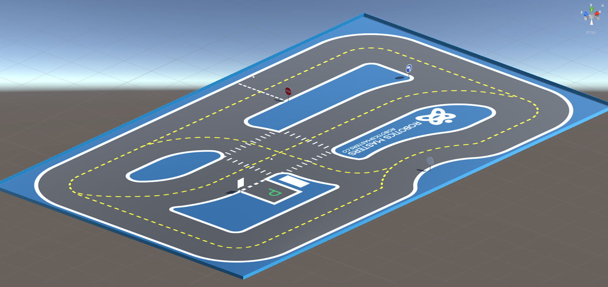
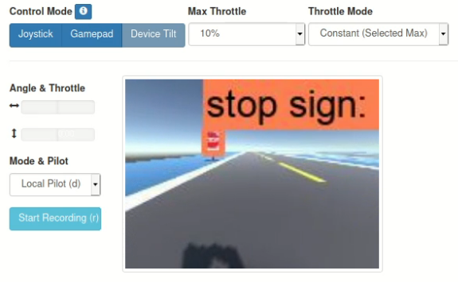
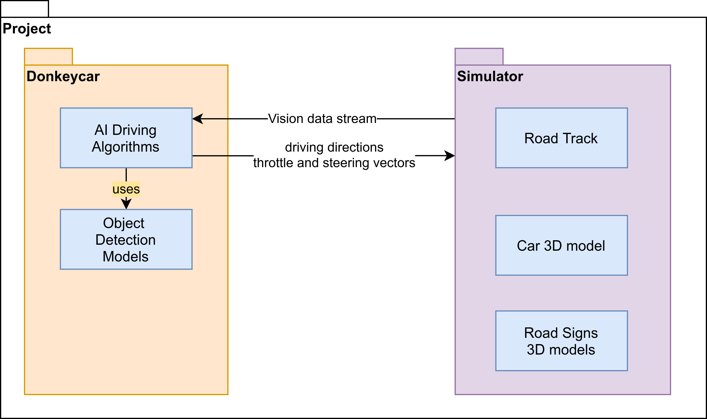

# Implement Sign Detection Using TensorFlow

## Group Report 1

| Contributors | SID |
|--------------|-----|
| Manfred Ai | 470421015 |
| Calum Baird | 460362054 |
| Benjamin Lilley | 480353056 |
| Jarod Reynolds | 460325222 |
| William Talbot | 460299923 |
| Zhaobo Wang | 480526926 |

**Tutor:** Abdallah Lakhdari

**Client:** Cian Byrne (Robotic Masters)

# Executive Summary
This report details a moderate overview of the workflow and structure of the Sign Detection using TensorFlow project. The project is centered around the self driving car software, donkeycar, and draws on TensorFlow to detect signs. By building TensorFlow models and driving algorithms based on sign detection, we aim to produce a driving AI capable of reacting to a series of signs and objects.

The project is being completed by the contributors displayed in the appendix.
This report is structured as described by the table of contents below.

We acknowledge that the project relies on the documentation and programming of the donkeycar project.
# Table of Contents
[TOC]

# Introduction
The project our team has undertaken is Implementing Sign Detection using TensorFlow, to develop specialised AI algorithms that detect real road signs on the roadside and to respond and act autonomously and appropriately to the road signs detected. For example, when our AI driver detects a left turn then it will turn left immediately. We use [tensorflow](https://www.tensorflow.org), a machine learning platform, to process our recorded vision data, train sign detection models, and run those models on live vision data to detect signs.

This project depends other existing projects, most notably [donkeycar](http://docs.donkeycar.com) and [sdsandbox](https://github.com/tawnkramer/sdsandbox).
`donkeycar` is a self driving AI that can drive robotic autonomous model cars.
`sdsandbox` is a 3d graphical simulator you can model driving environments and run donkeycar in.

We will be building on both donkeycar and sdsandbox. in donkeycar we will be implementing new AI driving algorithms. and in sdsandbox we will be modelling new tracks and signs to tests our donkeycar driving AI.

Using Tensorflow, we will develop specialised object detection models to detect specific traffic signs and traffic objects, identifying them from other objects in the world.
We will develop algorithms that drive the car as the road signs direct, as well as model new driving environments and assets for testing these models and algorithms.

We will demonstrate that our driving AI responds and acts autonomously and appropriately to the road signs it encounters, in both the simulated and the real world.

Once completed this will be a project others could build on to ultimately realise an autonomous car.

# System Overview

In this project, "User Stories" are used to describe at a high-level the functionalities desired by each user group and why. Under the extreme programming and agile paradigms, these user stories have a concise, fixed structure that clearly communicates what the new functionality is, who specifically it is targeted for, and why that user desired this feature. In the creation of these user stories, the project requirements, set explicitly in a scope document from the client, had to be broken down into bite-sized and estimable deliverable functionalities that met client's expectations and could be acceptance tested upon their completion. The system overview will be described in terms of these user stories.

## Ongoing User Stories

Work has started towards completing the following user stories:

**Track Additions in the DonkeyCar Simulator**
As a user of the DonkeyCar simulator, I want four new track layouts incorporated into the simulator, so that I have more environments for driving and testing additional software.

**Automated Driving**
As a user of DonkeyCar simulator, I want to have a driving model trained on the new tracks using the donkeycar software package so that the car can drive around the tracks autonomously.

**TensorFlow Sign Detection Training**
As a machine learning developer, I want to be ability to train my neural network on both simulated and real datasets of any reasonable size, so that the trained detection model can be easily adapted to have satisfactory performance on new data sources.

**TensorFlow Sign Detection Inference**
As a user of the DonkeyCar simulator, I want the car to use TensorFlow to accurately detect and report common traffic signs and objects, so that I time the initiation of corresponding autonomous behaviours.

**Creation of Traffic Sign Objects for the DonkeyCar Simulator**
As a user of the DonkeyCar simulator, I want traffic sign objects created with Unity and Blender and incorporated into the simulator, so that the environments I drive in are more realistic and facilitate testing of sign detection software.

**Simple Action Responses to Traffic Signs**
As a user of the DonkeyCar simulator, I want the model car to perform simple reactions upon reaching certain traffic signs in the simulator, including stopping at a stop sign, turning left at a left sign and right at a right sign, so that the car can exhibit autonomous behaviour.

Two new tracks have been added to the simulator to date and the donkeycar software has been utilised to successfully train basic models that enable the car to navigate these tracks autonomously. Four from the required ten signs have been created in Blender and Unity, and added to the donkeycar simulator so far. The stop, park, left turn and right turn signs that were modelled have been included in the correct locations in duplicate copies of the two new tracks. This ensures that an empty copy of the tracks remain to train more advanced autonomous driving models as well as signed copies of the tracks to allow training and testing of the sign detection models.

Initial attempts at sign detection and identification have had various degrees of success thus far. First, a basic image classification algorithm using TensorFlow and Keras was implemented which was effective for classifying images made up entirely of left or right turn signs however was unable to perform classifications using frames containing signs captured in the simulator. Further attempts were made to overcome this issue including multiple object detection models trained on the COCO 2017 dataset [COCO 2017 dataset](https://bitbucket.org/jarodreynolds/comp3888_t15a_group4/wiki/Datasets) which were more successful. Using these models, a donkeycar 'part' has been created which will override the autonomous driving model when a stop sign is detected and bring the car to a halt for a short period before allowing the driving model to regain control. Bounding boxes and labels are successfully transmitted with the frame to the web host, as shown below.

Additional experimentation with neural network models has led to progress with the sign detection. Using the ResNet-50 model as a base, a CNN was trained using the [German Traffic Sign Detection Benchmark](https://bitbucket.org/jarodreynolds/comp3888_t15a_group4/wiki/Datasets). Early results show promise in this approach; some results shown below illustrate that the model was able to correctly identify some signs, however the resulting model experienced over-fitting with the training data and difficulties with some classes, so further development is necessary.

## Upcoming User Stories

In conjunction with the completion of the user stories currently in progress, there are further user stories which will require action in the future.

**TensorFlow Sign Detection Data Collection**
As a machine learning developer, I want to be able to collect sign-tagged images from the simulated camera in the DonkeyCar simulator into large datasets, so that I can train neural network detection models.

**Autonomous Parking Response to Park Sign**
As a user of the DonkeyCar simulator, I want the model car to perform a simple parking routine when it encounters a park sign in the simulator, so that the car exhibits autonomous behaviour.

**Simple Collision Avoidance Response to Traffic Cones**
As a user of the DonkeyCar simulator, I want the model car to drive around orange traffic cones, without collision, when it encounters them in the simulator, so that the car exhibits autonomous behaviour.

**Traffic Light Responses**
As a user of the DonkeyCar simulator, I want the model car to react by stopping or slowing to standard red-yellow-green traffic lights when it encounters them in the simulator, so that the exhibits autonomous behaviour.

**Report Speed in Response to Speed Signs (Advanced)**
As a user of the DonkeyCar simulator, I want the model car to report its speed according to the numbers on speed signs when it encounters them in the simulator, so that this will support autonomous behaviour in the future.

**Detection of Other Vehicles (Advanced)**
As a user of the DonkeyCar simulator, I want the the simulator to report to me whenever a vehicle is detected within the line of sight of the model car, so that I can use this information for autonomous behaviours that may be implemented in the future.

**Random Traffic Cone Placement**
As a user of the DonkeyCar simulator, I want to be able to drive in an environment where traffic cones are randomly distributed on the track, so that I can test the performance of autonomous collision avoidance behaviours.

**Model New Donkey Car**
As a user of the DonkeyCar simulator, I want to be able to drive a new Donkey Car model in the simulator, so that I have more variety and options when using the simulator.

**Track and Object Import Automation Improvements**
As a DonkeyCar simulation developer, I want the track creation and object import pipelines to be more automatic, so that it takes less effort to create and improve simulation environments in the future.

**Real World Sign Detection and Reaction**
As a developer in the autonomous car industry, I want to be able to test the traffic sign detection and reaction software, developed for this project, on a real Donkey car, so that I can demonstrate real world capabilities.

The sign detection model's accuracy and it's ability to detect more signs need significant improvements before the completion of the project. Research will be undertaken to develop a way to collect and tag frames from the simulator so that large databases will be available to better train the sign detection models for the signs specified by the client. Experimentation and testing will take place to assess the use of object detection models in identifying bounding boxes around signs. This may in turn allow cropped frames containing solely the traffic signs to be passed to a sign classifier.

Further additions to the capabilities of the car's response to signs will be implemented in the form of DonkeyCar 'parts' such that the car will appropriately respond to traffic lights, turn signs, autonomously park and change speeds in accordance to detected speed signs.

Currently the team is manually generating and importing both the new tracks and other objects into the simulator, so there will be a focus on developing a system which will automate these pipelines so that the simulator can be more easily developed in the future after the project is complete.

# Testing and Evaluation

## Overview

Testing, client interaction and team evaluation are essential ingredients to assure high quality of work in this project. To achieve this, the functionalities we implement each week follow the development pipeline shown in the diagram below. The implementation of the feature is driven by acceptance and usability tests, with unit and integration tests being written first if possible. Iterations on the feature occur through team evaluation, including code review and discussion, and the client's satisfaction with a tested feature is required to complete the task.

Each of this project's user stories are unique in some way, and so will require the application of different testing techniques. The main forms of testing available to us are as follows:

* _Unit Testing_ - This involves writing test functions that explicitly tests a function, script, or other small piece of functionality, by passing in a set of inputs and comparing the outputs to expected values.
* _Integration Testing_ - Like unit tests, these involve passing inputs and comparing outputs, however operates on two or more functions, modules or applications working together.
* _Regression Testing_ - Upon changing functions, architectures or pipelines, regression testing helps ensure that the new and old functionality are still compatible and operate appropriately. Regression testing often involves creating new unit and integration tests that specifically target the new way old and new functionality interact.
* _Acceptance Testing_ - These are the final tests performed to assess whether or not a functionality or system of functionalities meet the requirements of the user story functionality.
* _Usability Testing_ - These are the final tests performed to assess whether or not a functionality or system of functionalities is easily usable and visible as part of the greater system.

Our plan for testing is shown in the diagram below, with user stories, specifications, acceptance and usability tests developed at the start of the project. Unit, regression and integration tests are developed at the time of implementation.

In this project, the tools used, such as the simulation environment, simulation creation tools and TensorFlow API, lend themselves to particular kinds of testing. For example when new simulation assets are created in Blender and Unity, there is no viable or productive unit testing techniques that can be applied, however acceptance and usability testing become very important. By contrast, the testing approach when training neural networks contrasts greatly. Unit testing (often in the form of live testing output) is a very important phase before integration testing with other modules and finally acceptance testing within a complete system.

In order to obtain satisfactory test coverage, it is important to be cognisant of the category of input one is testing. This is often broken down into the following categories:

* _Normal_ - This involves testing the functionality for its expected, or correct inputs, and ensuring that the output produced fulfills its desired functionality.
* _Boundary_ - This involves testing functionality with input that is "just" valid, ensuring that this input can be processed correctly.
* _Abnormal/Erroneous_ - This is the testing of functionality with invalid, incorrect, or out-of-bounds input and ensuring that such input is appropriately handled, which can clean termination and/or error logs for the user.

In most cases, because of the nature of this project's requirements, the tests fall into the normal category. To clearly indicate the nature of the tests, they are labelled "(N)" for normal, "(B)" for boundary and "(A)" for abnormal in the following tables.

## Completed/Ongoing Tests
### Acceptance Tests
| Requirement | Relevant User Story | Acceptance Test | Status |
|-------------|---------------------|---------------------------|--------|
| Four new client-specified track environments must be added to the DonkeyCar simulator. | Track Additions in the DonkeyCar Simulator | 1. (N) At least five people including the client can drive around in each of the new environments. | ONGOING |
| The simulated car must be able to drive around the new tracks autonomously. | Automated Driving | 1. (N) The trained model or models should be able to drive at least three laps of each of the four new tracks autonomously without crashing. | ONGOING |
| A neural network must be able to be trained and then saved for later use, given training images and ground truth data. | TensorFlow Sign Detection Training | 1. (N) A saved model is produced by a training script when pointed to a directory of training data. | ONGOING |
| The car must be able to accurately detect the required traffic signs and objects. | TensorFlow Sign Detection Inference | 1. (N) On each track, drive at least three laps of the circuit and record the observed detections. Their accuracy must meet the client's target accuracies. | ONGOING |
| New client-specified traffic object assets must be created and placed at specified locations in the new tracks. | Creation of Traffic Sign Objects for the DonkeyCar Simulator | 1. (N) The user drives around and into each new asset in each new track, ensuring the objects meet the expected demands for appearance and collision as per client specifications. | ONGOING |
| The car should stop at stop signs and turn appropriately at left and right signs. | Simple Action Responses to Traffic Signs | 1. (N) The car stops at stop signs during a period of autonomous driving with at least client-specified accuracy. | ONGOING |
| | | 2. (N) The car turns left at corresponding left signs during a period of autonomous driving with at least client-specified accuracy. | ONGOING |
| | | 3. (N) The car turns right at corresponding right signs during a period of autonomous driving with at least client-specified accuracy. | ONGOING |

### Usability Tests

| Requirement | Relevant User Story | Usability Test | Status |
|-------------|---------------------|---------------------------|--------|
| New tracks must be easily accessible to simulation users. | Track Additions in the DonkeyCar Simulator | 1. (N) The user must be able to enter each environment by clicking a well-formatted button in the main menu of the DonkeyCar simulator. | ONGOING |
| | | 2. (N) The user must be able to launch the environment by specifying its name in the configuration script of the donkeycar interface. | ONGOING |
| When a neural network is trained, it shall provide useful summary information to the user. | TensorFlow Sign Detection Training | 1. (N) Basic summary information about the training is provided as terminal output to the user. | ONGOING |
| | | 2. (N) Loss, testing accuracy and validation accuracy over the training time must be produced as a plot. | ONGOING |
| The simulator must report specified object detections to the user while driving, including signs, traffic lights and other objects specified by the client. | TensorFlow Sign Detection Inference | 1. (N) The simulator's camera stream output is augmented with labelled detections. | ONGOING |
| | | 2. (N) All detections are printed to the terminal. | ONGOING |

## Upcoming Tests
### Acceptance Tests
| Requirement | Relevant User Story | Acceptance Test | Status |
|-------------|---------------------|---------------------------|--------|
| Camera data with traffic signs automatically tagged must be able to be obtained from the simulator while driving. | TensorFlow Sign Detection Data Collection | 1. (N) User can collect aa dataset from the simulator, automatically accompanied with ground truth labels in a text file format. | INCOMPLETE |
| The car should perform a predetermined parking sequence at a park sign. | Autonomous Parking Response to Park Sign | 1. (N) The car performs an expected parking manoeuvre in an appropriate parking region when it encounters a park sign with sufficient client-specified accuracy. | INCOMPLETE |
| The car should drive around traffic cones whenever it detects them in their way. | Simple Collision Avoidance Response to Traffic Cones | 1. (N) The car does not collide with the traffic cones through active avoidance whenever they block normal motion with sufficiently high client-specified accuracy. | INCOMPLETE |
| The car shall perform the appropriate actions when it detects a traffic light. When approaching a traffic light, it should slow down to a stop if the light is yellow or red, retaining the light within its field of view, and go when the light is green. | Traffic Light Responses | 1. (N) The car slows down to a stop if the detected light is yellow or red. | INCOMPLETE |
| | | 2. (N) The car goes when the light is green. | INCOMPLETE |
| | | 3. (N) If the car stops, it retains the traffic light within its field of view. | INCOMPLETE |
| The car should drives with a speed that corresponds with speed limit signs it detects. | Change Speed in Response to Speed Signs | 1. (N) The car's throttle value scales linearly with the speed limit the car has detected it is in. | INCOMPLETE |
| The car shall be able to detect other vehicles in its field of view. | Detection of Other Vehicles | 1. (N) While driving the car in the simulator, vehicle detections occur with at least client-specified accuracy. | INCOMPLETE |
| Traffic cones must be able to be automatically and randomly distributed over a track in a different arrangement each time the simulator is run with configurable density. | Random Traffic Cone Placement | 1. (N) Simulator is run multiple times and when the density and arrangement of cones is recorded, the user finds no two identical arrangements of cone placements and a density approximately equal the configured value. | INCOMPLETE |
| A new car should be modelled and be drivable in the simulator. | Model New Donkey Car | 1. (N) Car is driven on several old tracks as well as each of the new tracks. | INCOMPLETE |
| Easing and automating the track creation and object import processes should be investigated and feasible improvements implemented. | Track and Object Import Automation Improvements | 1. (N) At least one improvement or automation feature implemented into the simulator. | INCOMPLETE |
| | | 2. (N) Investigations documented in full for the client. | INCOMPLETE |
| The algorithms developed for other requirements shall be tested on a real Donkey car if it is feasible for the client to organise this deployment onto hardware. | Real World Sign Detection and Reaction | 1. (N) The software is deployed and run onto a real Donkey car. | INCOMPLETE |
| | | 2. (N) The simulator outputs are recorded. | INCOMPLETE |

### Usability Tests

| Requirement | Relevant User Story | Acceptance Test | Status |
|-------------|---------------------|---------------------------|--------|
| Ground truth label text files shall be easily readable, parsable and associated with the images in their datasets. | TensorFlow Sign Detection Data Collection | 1. (N) A python function is accessible to the user to read ground truth label text files into appropriate data structures for the training of a neural network with TensorFlow. | INCOMPLETE |
| | | 2. (N) The generated data structures are accurate in relation to the text file. | INCOMPLETE |
| | | 3. (N) The ground truth text files are human-readable. | INCOMPLETE |
| | | 4. (A) Incomplete or erroneous files are reported to the user through the terminal in an error message. | INCOMPLETE |
| Vehicle detections shall be reported to the user. | Detection of Other Vehicles |  1. (N) Vehicle detections appear in terminal output. | INCOMPLETE |
| | | 2. (N) Vehicle detections appear in the camera output. | INCOMPLETE |

## Conclusions
The acceptance and usability tests outlined in this report reflect the transformation from client expectations and project scope originating from the project scope document sent to the team from the client, to user stories and requirements. From these requirements, the acceptance and usability tests have been created, and so reflect the end-user final product goals. This is both a strength in that it focuses the team on the high-level goals that are to be achieved, but also limited in communicating how they ought to be achieved. While modularity, extensibility and coherent structure are natural foundations of software development, it is not always feasible or even possible to communicate in these tests some of the granular details of what is required. For this, regular client meetings, extreme programming practices like pair programming, and code review are useful tools that help the team pass tests in the best way for the client.

There are also external limitations imposed on this project which will affect how we complete the tests described above. In this project we are working with an actively developed simulator and as such our improvements and new features must be compatible with its associated repositories. This limits our implementation quite significantly, however in some instances also speeds up development where pipelines are already implemented. Working within these project limitations is crucial for the team's success and client satisfaction.

# System Structure Overview
The proposed system structure of our project, as requested by our client, is to build on the donkeycar and sdsandbox projects to integrate our new AI driving models and algorithms as part of donkeycar. We are also required to model new driving environments and road signs in sdsandbox. To facilitate integration, our [repository directory structure](https://bitbucket.org/jarodreynolds/comp3888_t15a_group4/src/master/) matches the folder structure in both these projects, such the structures for donkeycar and sdsandbox. In these folders you will find our new and modified code and assets for these parts of our project. The repository additionally contains the trained AI object and sign detection models.

Our code passes donkeycar’s streamed image data to our AI driving algorithms which use tensorflow and AI object detection to identify road sign objects and to locate their position in the image. The detected sign may be passed to our sign detection models for accurate identification. The result is returned to the driving algorithms that then passes appropriate driving parameters to donkeycar. Donkeycar will pass these directions to the simulator such as when a left road sign object is detected and identified. Our driving algorithms will direct donkeycar to turn left. Upon detection of traffic lights and other objects like traffic cones, the donkeycar will be directed to respond appropriately.

Our Unity 3D environments, unity scenes, containing tracks and road signs, graphical assets and Unity scripts are placed in sdsandbox. Sdsandbox must be compiled in Unity to create the simulator program. When donkeycar is run, it starts the simulator by loading a specified scene, its objects and a 3D model of donkeycar. It then continuously streams image data to a web interface and to donkeycar, and listens for donkeycar throttle and steering commands. It then actuates that acceleration on donkeycar model, moving and renders the scene.

For more information, see the [Unity Documentation Wiki](https://bitbucket.org/jarodreynolds/comp3888_t15a_group4/wiki/Unity) and an image of donkeycars internal system structure provided by client is shown in appendix A8.

# Tools

## Administrative tools

We are using [git](https://git-scm.com/) to manage version control, as it is the industry standard and our team is familiar with its use.
To host our repository we are taking utilising Atlassian's [Bitbucket](https://bitbucket.org/). Bitbucket has become a common platform for hosting repositories as well as providing many development tools, such as a wiki (including our documentation, progress reports and minutes), Trello and Slack integration which we are taking advantage of.

We have opted to use [Slack](https://slack.com/) for inter-group communications as many of our team are familiar with its use. Slack's Bitbucket integration ensures our team is notified when commits are made and the ability to create several channels allows us to effectively manage and record conversations about the different parts of our project.

[Trello](https://trello.com/) has provided us a simple platform for us to quickly manage and allocate tasks. We create a new list each week of actionable items which provide a clean way to allocate and manage completion of tasks whilst making sure we are on track to achieve our long term goals.

## Simulation tools

[Unity](https://unity.com/) is the main platform that we use to integrate with, and enhance, the [Donkey Simulator](https://docs.donkeycar.com/guide/simulator/).  
Unity allows us to create and modify our own tracks and insert new asset objects, such as traffic signs.

Unity also provides a simulator which allows us to navigate our car through the track we have created as well as well as test our detection algorithms.

To create 3D sign objects we have utilised [Blender](https://www.blender.org/). Blender is a common tool, that members of our group have had experience with, for creating 3 dimensional objects.

## Machine Learning

Our sign detection algorithm relies heavily on [Tensorflow](https://www.tensorflow.org/). Tensorflow is a widely used open-source platform for machine learning. Tensorflow allows us to construct a neural network to detect and classify signs.

## Programming Languages

The donkeycar interface components of our project are all written in python. This includes training and inference of our object detection neural networks as well as the driving algorithms that react to the change.

The majority of our work in the simulator is with graphical tools however Loading new scenes into the simulator required a modifying small sections of C# code.

The donkeycar and simulator components of our project are outline in more detail within the previous, System Structure, section of this report.

# Information Search

## Donkeycar Simulator
The usage of the donkeycar simulator in this project is to implement new AI driving algorithms. Part of donkeycar is `gym-donkeycar`, a self driving AI library written in python. In order to use the donkeycar simulator, our group had to research in the preliminary stages of the project using available documentation. This is available at [donkeycar simulator](https://docs.donkeycar.com/guide/simulator/). Interactions between Unity and the donkeycar simulator have been necessary, with group members experimenting and attaining a method to load an executable from Unity to be run as the simulator.

## Unity
The project required us to utilise Unity to create new tracks to use in the donkeycar simulator. As such, we all learnt how to use the system, using tutorials and different manuals.

[Unity 101](https://learn.unity.com/tutorial/join-your-first-game-jam-1#)

[Unity Interface Tutorial](https://learn.unity.com/tutorial/using-the-unity-interface#)

[Unity User Manual](https://docs.unity3d.com/Manual/UnityOverview.html)

[Unity User Testing](https://www.raywenderlich.com/9454-introduction-to-unity-unit-testing)

## Tensorflow
Tensorflow is the main tool used in this project to process recorded visual data. Tensorflow is used for image classification, for sign detection, and is used in hand with the donkeycar simulator. In order to explore the usage of tensorflow, our group was required to install tensorflow and undertake tutorials for image classification and on the API. We were able to view the ability of tensorflow quite easily on a Colab.

[Tensorflow GPU Installation](https://medium.com/@iitbguha/tensorflow-with-gpu-installation-made-easy-659f88c0309b)

[Tensorflow Tutorial](https://www.tensorflow.org/tutorials/images/classification)

[Tensorflow Training](https://github.com/wallarug/tensorflow-training-ground)

[Tensorflow API Blog](https://blog.tensorflow.org/2020/07/tensorflow-2-meets-object-detection-api.html)

[Tensorflow Colab](https://www.tensorflow.org/hub/tutorials/tf2_object_detection)

### Machine Learning Datasets

We were also able to find several publicly available traffic sign detection datasets as part of our research. Links and information about the datasets found is listed in the [Datasets Wiki](https://bitbucket.org/jarodreynolds/comp3888_t15a_group4/wiki/Datasets). The most usable and relevant find was the [German Traffic Sign Detection Benchmark](http://benchmark.ini.rub.de/?section=gtsdb&subsection=dataset), which consists of 1213 ground-truth labelled traffic signs of 43 different types including stop signs, left and right turn signs, within 900 images. This dataset was used in the retraining of ResNet-50 as part of our training a traffic sign detection network task.

## Bitbucket (git)
In this project, we utilised git as our version control system, through BitBucket. We use command line to execute git commands for most commands, and researched the methods necessary to perform specific actions.

# Group Reflections and Conclusions

## Risk Analysis
**Challenges**

Significant challenges our team has encountered are caused by variation between our working environments; We use different operating systems (Linux, MacOS); Our computers have different computational ability (processor, GPU). Therefore, sharing our progress has been a key issue in some cases. Sometimes, if we simply follow others' instructions, it may not work well in our own environment. For example, the simulator versions for Mac and Linux are different and TensorFlow also has respective versions for those who have a supported GPU, and those who do not.

As we have already set up the simulator and the initial stages of sign detection, the next step is to integrate them to let our donkey car be able to detect and react to the sign when driving autonomously. The challenge for this part is how to let the car react to the sign and override the autonomous driving algorithm. For example when encountering a turning sign, we need to determine how much turning is required for a crossing or sharp bend. Moreover, the accuracy of detection will also need to be considered.

**Risks**

Our project is aimed at detecting and reacting to traffic signs and objects, so it can be implemented on an autonomous driving system for real cars. Therefore, if detections are inaccurate, it may result in collisions and accidents in the real life.

## Project Strengths
**Tools**
We use Donkey Simulator and TensorFlow to implement and test our traffic sign detection. Both tools are easy to start with and provide a great environment for testing. We can simply make a new track with Unity and build it to test with the donkeycar simulator. Moreover, TensorFlow is an open-source actively-developed machine learning tool, so it is easy for us to find resources and tutorials online to assist in implementing our features.

**Groups**
All group members are majored in Computer Science and have taken courses relating to Artificial Intelligence, so it is easier for us to understand the project requirements and use new tools.

## Project Limitations
Although easy to use, the donkeycar simulator also has some limitations. The world of the simulator is often too simplistic compared with the driving situation of real life. Limitations include the resolution of the image, the interference of light, and modelling of shadow. Therefore, our project is primarily based on the simulation world and requires further calibration to be put into the real world autopilots. Additionally, our code needs to be integrated within the existing environment of the donkeycar simulator, so our language and libraries are also limited to python and python packages.

## Programming Practices
**Extreme Programming**

We followed the Extreme Programing guidelines to proceed with our project and the XP turned out to be very beneficial. Through the user stories, we clarified our users' requirements and what we need to achieve in our project. The close contact with our client - meeting twice a week and discussing issues on Slack - helps us set our goals each week and solve many problems. Moreover, we push small changes to our repo  frequently so that other group members can be updated and find issues if they exists. Also, we established a coding standard at the beginning, so our code is well-structured and documented.

**Applying Version Control and Issue Tracking**

We use bitbucket for our version control. The bitbucket also uses git for version control, so it is very easy to handle as we have all used GitHub prior. As for issue tracking and task management, we chose Trello. After every meeting, we would list what we need to do this week and divide them into small tasks for each individual or sub-groups. The Trello board arranges the progress of each task in a clear way with labels and also sends notification to remind us of deadlines. With version control and issue tracking, our working efficiency increases significantly.

# Individual Contributions

## Contribution Table

| Category | Contribution | Contributor | Brief Description |
|----------|--------------|-------------|-------------------|
| Report | Executive Summary | Manfred | Concise overview of the motivations and achievements of the project. |
| Report | Introduction | Benjamin, Jarod | Introduction to the goals, achievements and challenges of the project. |
| Report | System Overview | Jarod | High level description of the project goals and deliverables. |
| Report | Testing and Evaluation | William | Testing plan, work pipeline and acceptance/usability test tables. |
| Report | System Structure Overview | Benjamin | Technical structure overview of the project. |
| Report | Tools | Calum | Outline of technical and non-technical tools used in the project. |
| Report | Information Search | Manfred | Overview of resources and research required by the project. |
| Report | Reflections and Conclusions | Zhaobo | Assessment of project achievements, strengths and limitations. |
| Technical | New Tracks Modeled into Simulator | Benjamin, William, Manfred | Making the required tracks with Unity |
| Technical | Turning Sign Detection | Calum, Jarod, Zhaobo | Working out ways to do the image classification with TF |
| Technical | Jupyter Notebook | Calum | Set up jupyter notebook for the team to use, particularly for tensorflow work |
| Technical | Training Self-Driving Car | ALL | Training a neural network to drive the DonkeyCar using simulator. |
| Technical | Retraining ResNet-50 Detector Network | William | Using TensorFlow 2 and python to retrain ResNet-50 on German sign dataset. |
| Technical | Blender/Unity Asset Creation (Traffic Sign + Walls) | William | Creation and placement in tracks of four new traffic sign assets and track walls, with documentation. |
| Technical | PoC object detector | Calum, Jarod, Ben | Integrating an existing COCO model into donkeycar to identify objects |
| Technical | Integrating Sign Classifier | William, Jarod | Integrating the sign classifier into a DonkeyCar part. |
| Technical | Display bounding box | Calum | Display a bounding box of the detected object in the web controller and a percentage accuracy in the console |
| Technical | React to stop sign | Calum | Stop for 3 seconds when a stop sign is detected |
| Technical | Donkeycar Load new tracks | Benjamin | Patched donkeycar so it could load new tracks automatically in simulator |
| Technical | Added desired driving path | Benjamin | Added desired driving path for new track in simulator |
| Technical | Simulator Menu Load new tracks | Benjamin | Added buttons to menu so can open new tracks |
| Information Search | Research Tensorflow | All | Research Tensorflow & tutorials. |
| Information Search | Research Object Detection | All | Research Object Detection. |
| Information Search | Research Unity | All | Research Unity & tutorials. |
| Information Search | Research Sign Datasets | William | Research into labelled sign datasets publicly available. |
| Documentation | Automated docs | Calum | Create automated documentation from docstrings for our additions to the donkey car framework |
| Non-Technical | Managers | Calum, Jarod, Benjamin | |
| Non-Technical | Trackers | William, Manfred, Zhaobo | |
| Non-Technical | Client Liaison | Calum | |

## Individual Reports

[Manfred_Ai_Individual Report](../individual_reports_1/manfred_ai_individual_report_1.md)

[Calum Baird Individual Report](../individual_reports_1/calum_baird_individual_report_1.md)

[Benjamin Lilley Individual Report](../individual_reports_1/benjamin_lilley_individual_report_1.md)

[Jarod Reynolds Individual Report](../individual_reports_1/jarod_reynolds_individual_report_1.md)

[William Talbot Individual Report](../individual_reports_1/william_talbot_individual_report_1.md)

[Zhaobo_Wang Individual Report](../individual_reports_1/zhaobo_wang_individual_report_1.md)

# Appendix

| Contributors | SID |
|--------------|-----|
| Manfred Ai | 470421015 |
| Calum Baird | 460362054 |
| Benjamin Lilley | 480353056 |
| Jarod Reynolds | 460325222 |
| William Talbot | 460299923 |
| Zhaobo Wang | 480526926 |

**Tutor:** Abdallah Lakhdari

**Client:** Cian Byrne (Robotic Masters)

## A1. User Stories

The list of user stories and their development history is located at the [User Stories Wiki](https://bitbucket.org/jarodreynolds/comp3888_t15a_group4/wiki/User%20Stories).

## A2. Research, Studies of Similar Systems
The group utilised a multitude of tutorials and documentation as per the Information Search section to understand the tools used in this project. Helpful tutorials detailing substantial information was uploaded to the Group4 Wiki for other group members to access and read. These include the Jupyter, Simulator, Tensorflow, and Unity pages.

## A3. Unit Testing
Due to the nature of implemented functionalities (e.g. 3D asset creation, scripts employing the TensorFlow API) so far, the project has not lent itself to classical unit testing. We expect that some future functionalities, such as tagged data collection from the simulator, will be able to be unit-tested and these unit tests included in the final report. 

## A4. Acceptance Testing
Tables provided in the report.

## A5. Usability Testing
Tables provided in the report.

## A6. Documentation

Our documentation can be found on the homepage of our [wiki](../Home.md)

## A7. Scope and Requirements Document

The [Scope and Requirements Document](https://bitbucket.org/jarodreynolds/comp3888_t15a_group4/wiki/CP32%20-%20Scope%20and%20Requirements%20Document%20September%202020.pdf) was received by the team from the client early in the project. It is from this document that the user stories, requirements and tests were developed.

## A8. Donkeycar Internal System Structure

# References