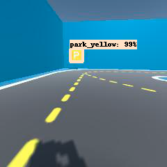
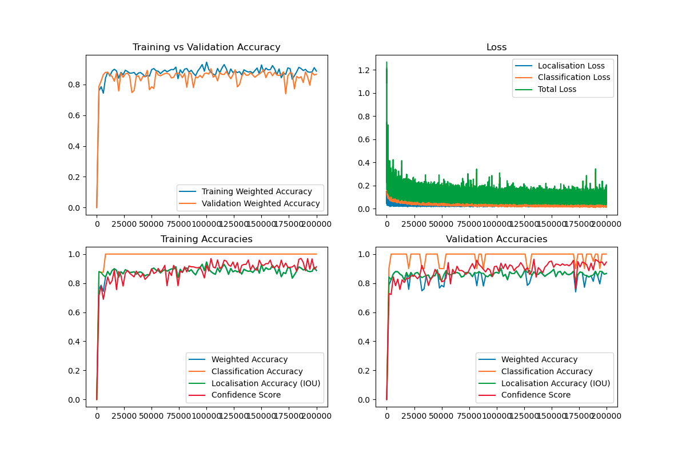
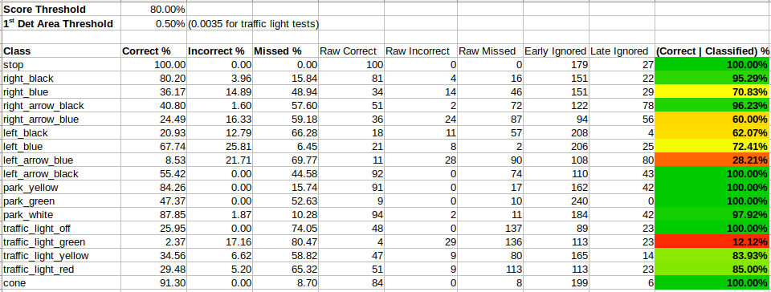
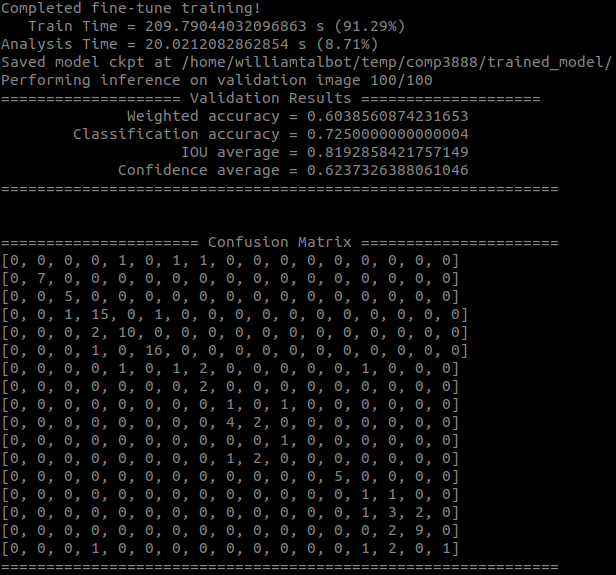

<div class=title_page markdown="1">


<h1 style="text-align: center;" class="toc-h1">Sign Detection Using TensorFlow</h1>

**Group:** COMP3888 T15A Group 4

**Tutor:** Abdallah Lakhdari

**Client:** Cian Byrne (Robotic Masters)

**Date sumbitted:** 29 November 2020

| Contributors    | Unikey   | SID |
|-----------------| ------   |-----|
| Manfred Ai      | | 470421015 |
| Calum Baird     | cbai5778 |460362054 |
| Benjamin Lilley | | 480353056 |
| Jarod Reynolds  | jrey9389 | 460325222 |
| William Talbot  | | 460299923 |
| Zhaobo Wang     | | 480526926 |

TODO contributions and signatures?


<h1 class="toc-h1">Executive Summary</h1>

Project Title: CP32 - Implement Sign Detection using TensorFlow

Group members: Ben Lilley, Calum Baird, Jarod Reynolds, Manfred Ai, William Talbot, Zhaobo Wang.

Project goals:
Simulator goals: new track environments Track1 & Track2, new road signs (12), left, right, stop, park, blue, black, arrow, new F1 Tracks Track3 & Track4, new F1 Mercedes W11 (2020) model car, random placement of cones.

Tensorflow goals: Car detects all signs, Car reacts appropriately to signs, Car detects traffic lights, Car reacts appropriately to traffic lights,

Major achievements:
Car detects all signs with high reliability with very few exceptions.
Car reacts appropriately to all sings correctly detected.
Have excellent test results shown by our confusion matrix.
New F1 Tracks Track3 & Track4 modelled with spline & height & terrain.
Fast method of creating new tracks using SplineMesh.
Random placement of Cones..

Acknowledgements:
Client: Cian Byrne (Robotic Masters)
Donkey Car: a self driving AI that can drive robotic autonomous model cars.
https://github.com/autorope/DonkeyCar
Simulator: OpenAI Gym Environments for Donkey Car.
https://github.com/tawnkramer/gym-donkeycar
Unity Simulator: a 3d graphical simulator you can model driving environments and run donkeycar in.
https://github.com/tawnkramer/sdsandbox
TensorFlow: a machine learning platform
https://www.tensorflow.org
SplineMesh: a tool for building splines in Unity, This was used to build the F1 tracks.
https://assetstore.unity.com/packages/tools/modeling/splinemesh-104989

TrafficLight: Team CP31-17A5 did excellent work on a Traffic light Unity prefab that we use and slightly modified. We did not build a traffic light. We put it in 1 scene and use it to test that we can detect traffic lights. Was provided by our client.

Traffic Signs: We are not using them, they are not shown in our scenes but the files in Assets/Traffic Signs are Team CP31-17A5's. Was provided by our client.

The signs that we built and use are shown in our Scenes are in Assets/Prefabs/Signs and are displayed in SampleScene.

[^test reference]

<h1 class="toc-h1">Table of Contents</h1>

[TOC]

# 1. Introduction

Problem Statement: **Implementing Sign Detection using TensorFlow**, to detect and correctly identify and react to a set of road traffic signs and objects in a simulated world. Originally was also to be in the real world, but COVID19 prevented that. Our object detector system can be applied to real world image stream. and can train it with more real data images.

The overall goal of this project was for us to develop a virtual sign detection and reaction system, building on an existing virtual car & simulator projects. The higher vision of this project is for this to be a step towards ultimately realising an autonomous car that can detect and react to real road signs in the real world.

This report will detail the major achievements of this project, which can be summarised as follows:
* Car detects all signs with high reliability with very few exceptions.
* Car reacts appropriately to all signs correctly detected.
* Obtained excellent model accuracy results as discussed in Section 2.2 and 4a.
* Total of four new simulator tracks created, include two F1 Tracks modelled with splines, variable height and terrain.
* 12 new traffic sign assets created.
* Fast method of creating new tracks using SplineMesh documented and implemented.
* New functionality of random cone placement on tracks.


The key stakeholders are our client Cian Byrne RoboticMasters our Tutor Abdallah Lakhdari our Team, the DonkeyCar project developers the Simulator project developers, our Course Coordinator our Faculty our School our University. In the future there could be more stakeholders like the robotic industry, the autonomous car industry, the public, purchases and passengers or autonomous cars. These stakeholders interacted with the project in the following ways:
* Our Client directs the project.
* Our Team interacts with our Client in online chat and video meetings.
* Our Team interacts with our Tutor in online chat and video meetings.
* Our Client and our Tutor and our Course Coordinator support our Team.
* Our Client interacts with our Tutor in online chat and video meetings.
* Our Client interacts with the DonkeyCar project developers in online chat and video meetings.
* Our Client interacts with the Simulator project developers in online chat and video meetings.
* Our Tutor interacts with our Course Coordinator in online chat and video meetings.

The project our team has completed is CP32 - Implementing Sign Detection using TensorFlow. We trained Neural Network (NN) object detection model to identify real road signs and traffic objects on the roadside. Our object reaction algorithms were designed to respond and act autonomously and appropriately to these detections. For example, when our car detects a left turn sign, the car will turn left immediately. We used [Tensorflow 2](https://www.tensorflow.org), a machine learning API, to process our recorded vision data, train our object detector NN model, and run that detection model on a live image stream.

This project depends on several, actively developed projects, most notably [donkeycar](http://docs.donkeycar.com) and [sdsandbox](https://github.com/tawnkramer/sdsandbox):
* `donkeycar` is a self driving AI toolbox for training and driving autonomous robotic car models.
* `sdsandbox` is a 3D simulator based on the Unity graphical game engine where you can model driving environments and use the  donkeycar software.

We have be built functionalities for both donkeycar and sdsandbox as part of this project. For donkeycar, we implemented our new object detector NN as an attachable car "part" and added our object reactor algorithms. In sdsandbox, we have modelled new tracks and created new traffic sign assets so that we could test our donkeycar object detection and reaction algorithms. We trained and developed many NN models as part of this project before settling on our final highly accurate model, and gradually more and more reaction algorithms were added to account for all 17 of the detectable objects. This included turning algorithms, stopping algorithms, a parking algorithm and a traffic cone collision avoidance algorithm.

For simulator development, we modelled a simple track (Track 1) and challenge track (Track 2) for testing our algorithms, as well as Formula 1 tracks based on the real Circuit of Americas GP in Texas (Track 3), and the Circuit de Spa-Francorchamps in Belgium (Track 4). As will be discussed in this report and is detailed in the technical documentation, this was achieved by using Splines in Unity. Splines were built using the freely available SplineMesh tool and reference images of the real F1 tracks obtained from our client and Google Earth. Once the tracks were modelled on a flat plane we used height data to add matching height to our model. The terrain was also created with Unity's terrain toolbox to make the ground match the height of the tracks.

We have also modelled a new F1 Mercedes W11 (2020) car model using Autodesk and integrated it into the simulator.

We have demonstrated that our driving AI responds and acts autonomously and appropriately to the road signs it encounters in the simulated world. Unfortunately there are just a few road signs that are not presently detected reliably. We also demonstrated our model's viability in the real world through training experiments with two real world datasets. With sufficient training image data from a real donkeycar camera, our object detector could be trained to detect road signs in donkeycar competitions.

Now that this project has been completed, others can build on it to ultimately realise an autonomous car that can detect and react accurately to road signs and objects in the real worl.

The resources used for this project are summarised as follows:
* Donkey Car: a self driving AI that can drive robotic autonomous model cars.
https://github.com/autorope/DonkeyCar
* Gym-DonkeyCar Simulator: OpenAI Gym Environments for the Donkey Car.
https://github.com/tawnkramer/gym-donkeycar
* SdSandbox & Unity Game Engine: a 3d graphical simulator you can model driving environments and run donkeycar in.
https://github.com/tawnkramer/sdsandbox
* TensorFlow: a machine learning platform
https://www.tensorflow.org, including use of forums and tutorials
* Unity Manual and Resources
* Blender Manual & Resources
* Discord & YouTube for sharing tutorials and resources between teams

The risks of this project are summarised as follows:
* COVID19 prevented face to face meeting and real world testing, as well as posing a health risk to all. In the case of one team member, it did delay work and affect productivity.
* Bugs in existing projects hindering our ability to develop functionalities.
* System incompatibilities are a big risk, since our team all has different hardware and software capabilities, and our project is dependent on many tools.
* Insufficient hardware, such as old graphics cards were a big risk since we needed to develop with the cutting edge TensorFlow 2 API and use graphical game engines.

# 2. System Specification and Design
## 2.1. Overview

In this project, "User Stories" are used to describe at a high-level the functionalities desired by each user group and why. Under the extreme programming and agile paradigms, these user stories have a concise, fixed structure that clearly communicates what the new functionality is, who specifically it is targeted for, and why that user desired this feature. In the creation of these user stories, the project requirements, set explicitly in a scope document from the client, had to be broken down into bite-sized and estimable deliverable functionalities that met client's expectations and could be acceptance tested upon their completion. The system overview will be described in terms of these user stories.

### User Stories

The following user stories have been completed throughout the duration of the project. These stories have been developed with one of the four user types targeted in this project; users of the DonkeyCar Simulator, DonkeyCar Simulator developers, machine learning developers, and developers in the autonomous car industry. Each of the user stories has been generated directly from details in the project scope and outline document provided by the client, so each story represents a feature the client has requested to be implemented. Acceptance criteria was also developed for each user story, as described in the Testing and Evaluation section below.

#### Users of the DonkeyCar Simulator

**Track Additions in the DonkeyCar Simulator**
As a user of the DonkeyCar simulator, I want four new track layouts including two Robotic Masters tracks and two F1 tracks incorporated into the simulator, so that I have more environments for driving and testing additional software.

**Automated Driving**
As a user of DonkeyCar simulator, I want to have a driving model trained on the new tracks using the donkeycar software package so that the car can drive around the tracks autonomously.

**Creation of Traffic Sign Objects for the DonkeyCar Simulator**
As a user of the DonkeyCar simulator, I want traffic sign objects created with Unity and Blender and incorporated into the simulator, so that the environments I drive in are more realistic and facilitate testing of sign detection software.

**TensorFlow Sign Detection Inference**
As a user of the DonkeyCar simulator, I want the car to use TensorFlow to accurately detect and report common traffic signs and objects, so that I can time the initiation of corresponding autonomous behaviours.

**Simple Action Responses to Traffic Signs**
As a user of the DonkeyCar simulator, I want the model car to perform simple reactions upon reaching certain traffic signs in the simulator, including stopping at a stop sign, turning left at a left sign and right at a right sign, so that the car can exhibit autonomous behaviour.

**Autonomous Parking Response to Park Sign**
As a user of the DonkeyCar simulator, I want the model car to perform a simple parking routine when it encounters a park sign in the simulator, so that the car exhibits autonomous behaviour.

**Simple Collision Avoidance Response to Traffic Cones**
As a user of the DonkeyCar simulator, I want the model car to drive around orange traffic cones, without collision, when it encounters them in the simulator, so that the car exhibits autonomous behaviour.

**Traffic Light Responses**
As a user of the DonkeyCar simulator, I want the model car to react by stopping or slowing to standard red-yellow-green traffic lights when it encounters them in the simulator, so that the car exhibits autonomous behaviour.

**Random Traffic Cone Placement**
As a user of the DonkeyCar simulator, I want to be able to drive in an environment where traffic cones are randomly distributed on the track, so that I can test the performance of autonomous collision avoidance behaviours.

**Model New Donkey Car**
As a user of the DonkeyCar simulator, I want to be able to drive a new Donkey Car model in the simulator, so that I have more variety and options when using the simulator.

All four new tracks were successfully created and added to the simulator, including the more complex Circuit of Americas and Circuit de Spa-Francorchamps. More detail regarding the creation of these tracks can be found below in the DonkeyCar Simulator developers user stories.

Neural network models were trained for the tracks early in the project. The models were trained by using the simulator's in-built recording functionality to save frames and control data while the car was being manually driven. These collections of data, known as tubs, were then used to train the driver using the DonkeyCar simulator's driver deep learning model. Once trained, these models drove the cars autonomously around the tracks and allowed the team to test the car's responses to signs and objects as they were being developed. Some examples of the drivers trained have been posted to the [videos](https://bitbucket.org/jarodreynolds/comp3888_t15a_group4/wiki/Videos) page on the wiki.

All 12 signs were created by the team in Unity. The traffic lights were incorporated into the simulator using CP31-17A5 team's prefabs and C# script. Traffic cones were present in the existing simulator previous to the start the of the project, however the live cone avoidance while driving was a feature implemented by this team.


Once these objects were created, a labelled collection of frames from the simulator containing the objects was obtained for the dataset on which the detection model was trained. This model was able to detect and correctly identify each object with a high degree of accuracy. Some examples of detections while driving in the simulator are included below.


Response actions were programmed for each object detected. This includes turning, stopping (at both stop signs and red traffic lights) and parking. These responses are demonstrated in a video [here](https://youtu.be/he2C0U8GPdk).

Random cone placement was implemented by creating a series of "spawn points" along each track. When requested, the cones would spawn at a random distance offset from a random selection of the points. This functionality was implemented within a C# script, [ConesRandom.cs](https://bitbucket.org/jarodreynolds/comp3888_t15a_group4/src/MercedesCar_ConesRandom/sdsandbox/sdsim/Assets/Scripts/ConesRandom.cs).

#### DonkeyCar Simulator developers

**Faster Track Importation**
As a DonkeyCar simulation developer, I want an improved and well-documented way to create new interesting tracks for the simulator, so that it takes less effort to create and improve simulation environments in the future.

An improved method was discovered and implemented in collaboration with the other Robotics Masters teams which utilised Unity's spline tool (the recorded session has been posted [here](https://www.youtube.com/watch?v=dI-CaKepWIA&feature=youtu.be)). By creating nodes along the path, the tracks could be twisted and tilted to more accurately represent the changes in altitude in the real-world tracks. This enabled the additional, much more complex tracks to be created with ease.


#### Machine learning developers

**TensorFlow Sign Detection Training**
As a machine learning developer, I want to be ability to train my neural network on both simulated and real datasets of any reasonable size, so that the trained detection model can be easily adapted to have satisfactory performance on new data sources.

**TensorFlow Sign Detection Data Collection**
As a machine learning developer, I want to be able to collect image datasets from the simulated camera in the DonkeyCar simulator and have access to an efficient, documented labelling tool, so that I can train neural network detection models.

Datasets were collected and tagged using the LabelImg image annotation tool. This enabled the tagging of a dataset large enough to train a model with very high accuracy for most of the signs and objects requried. This software produces a single XML file for each image in a standard Pascal VOC format that is commonly used in deep learning models. Our model has been developed to accept images with label files of this format, therefore it can be trained using any dataset, simulated or real-world.

 This labelling method has been [documented](https://bitbucket.org/jarodreynolds/comp3888_t15a_group4/wiki/dataset_labelling) on the team's wiki.


#### Developers in the autonomous car industry

**Real World Sign Detection**
As a developer in the autonomous car industry, I want to be able to run the traffic sign detection software, developed for this project, on datasets seen by a real Donkey car, so that I can observe real world capabilities.

We found significant success early in the project when we trained our model on the German Benchmark dataset. The results can be found on the [German Benchmark Results Wiki Page](https://bitbucket.org/jarodreynolds/comp3888_t15a_group4/wiki/training_results/german_dataset_results). This demonstrated the viability of our model in the real world.

Later in the project, we tested our simulator-trained model on a real-world dataset provided by the client, containing images captured by the real DonkeyCar driving around an indoor track. The results can be found at the [Shenzhen Results Wiki Page](https://bitbucket.org/jarodreynolds/comp3888_t15a_group4/wiki/training_results/shenzhen_results). These were unsurprisingly mixed because the model was not trained on this data, however some degree of generalisation and our German dataset experiment demonstrates that our model would work well in a real world setting.

These are discussed in more detail in Section 2.2.

## 2.2. Details

## TensorFlow Training and Inference

We were very proud of our success in the training and performance of our traffic sign and object neural network detection model. We used TensorFlow 2 to develop our training pipeline, retraining the last layers of a classic detection network Resnet-50 on our 17 classes, including 12 colour and shape variants of traffic signs, four activation states of a traffic light and traffic cones. To facilitate this, we set up our code as a complete module which can be found [here](https://bitbucket.org/jarodreynolds/comp3888_t15a_group4/src/master/tf_sign_detector/) which is easily installable as described in our [Installation Instructions](https://bitbucket.org/jarodreynolds/comp3888_t15a_group4/wiki/Installation_Full).

The training and inference scripts that use the functions we developed were easily configurable and documented within the code (see [train.py](https://bitbucket.org/jarodreynolds/comp3888_t15a_group4/src/master/tf_sign_detector/detector/train.py) and [inference_batch.py](https://bitbucket.org/jarodreynolds/comp3888_t15a_group4/src/master/tf_sign_detector/detector/inference_batch.py)) so that future machine learning developers can easily use our code in their systems.

The progression in our models was documented on the [Simulator Results Wiki Page](https://bitbucket.org/jarodreynolds/comp3888_t15a_group4/wiki/training_results/simulator_results). In our final model, we obtained almost perfect (over 99%) offline classification accuracy on our validation dataset, and a localisation accuracy over 85%. A localisation accuracy refers to the intersection-over-union, or IoU, score, which is simply a ratio of the intersection against union areas of the ground truth and inference images. With longer train times, we found that model's internal confidence improved greatly. We also demonstrated the model's live accuracy through simulator testing. The test cases and procedure are explained in detail in Section 4a.

Here are some videos illustrating the successful live inference of the final model:

* [Challenge Track Live Inference Pt 2](https://youtu.be/yrV5rQhDvbE)
* [Track 1 Detection Testing](https://youtu.be/OoC4VuRQB_k)
* [Live Testing Framework - Mixed](https://youtu.be/3kv6uZQXP-8)
* [Live Testing Framework - Cones](https://youtu.be/cWIwcmPLtag)
* [Challenge Track Live Inference Pt 1](https://youtu.be/GKouCiEgEnA)

  

## Real World Dataset Training and Inference

We performed training and inference on two real world models. Early in the project we trained our model on the German Benchmark dataset and the results can be found on the [German Benchmark Results Wiki Page](https://bitbucket.org/jarodreynolds/comp3888_t15a_group4/wiki/training_results/german_dataset_results). We found that the last model we trained on this data had an accuracy of over 90% when we performed inference on this data, and you can see some of the results in the image below.


Towards the end of the project, we were given a real world dataset by our client from a real donkeycar. While there wasn't enough data to label and retrain our model, we did experimentally run our simulator model on this data. The results can be found at the [Shenzhen Results Wiki Page](https://bitbucket.org/jarodreynolds/comp3888_t15a_group4/wiki/training_results/shenzhen_results).

Unsurprisingly, the model did not perform well in several of the tests. Shown below are two examples, one with a correct detection with high accuracy, and another which has both false positive and false negative detections. While these results don't look promising, they are to be expected as a result of the simulated dataset that the model was trained on, which lacked variation and influences from external factors (such as changes in lighting, reflection, warping due to wide-angle lenses) which were present in the real-world dataset. This could be overcome by simply tagging the real dataset and adding this to the existing simulation dataset and retraining.


## Automated driving

A trained neural network driver, is important for testing our driving algorithms. The driver was trained using [existing methodologies](https://docs.donkeycar.com/guide/train_autopilot/) on our custom tracks. Evidence of our automated driver can be found [here](https://youtu.be/7bjNEyh7YsE?t=936).

## Simulator reaction algorithms


The simulator takes in the existing driving directions (wheel direction and acceleration) as well as a list of objects (including their accuracy and size) as detected by our detection model. A series of algorithms then calculate an approximate distance each sign is away and makes a decision on how the car should react.


To determine the distance a sign is away we use some basic geometry. One height and distance from the sign was determined experimentally. By using similar triangles we extrapolated all posible distances:

```math
\frac{\text{distance}}{4.1} = \frac{\text{height of sign}}{0.0749}
```
```math
\therefore \text{distance} = 4.1 \frac{\text{height of sign}}{0.0749}
```

Note the height of the image is between 0 and 1 and the distance is in Unity units. This methodology isnt perfect, though many signs are the same height many, like the traffic lights, are different. The distances are not accurate for signs of a different height. The required stopping distance can still be calulated for other signs by trial and error, however a database of sign heights would be necessary to provide accurate sign distances in unity units, for all signs.

The code for these reactions is located [here](https://bitbucket.org/jarodreynolds/comp3888_t15a_group4/src/master/tf_sign_detector/reactor/sign_reactor.py). The following sections describe the algorithms used for each relevant user story in more detail.

### Simple Action Responses to Traffic Signs

To stop at a stop sign, when the car detects a the stop sign less than 1.5 units away the brakes are applied and the car stops for 3 seconds. The brakes were not originally built into the DonkeyCar simulator, diving into the source code of relevant packages meant we were able to fix the brakes in the simulator. Our findings were shared with our client and other groups.

In future, a more complicated braking algorithm would need to be applied to ensure comfort and tyre traction are maintained. 100% braking was sufficient for the low velocities our vehicle was travelling at.

To ensure our algorithm scales to different speeds, corner sharpness and angle we needed a more complicated methodology. Our design involves using a Neural Network (NN) driver, which proceeds straight at intersections. When a turn sign is detected, within a set distance, a weighted average between the direction determined by the NN driver and -1 or 1, (depending on wether its a left or right sign) is taken.
This means that when a turn sign is detected, our driver is nudged in the direction of the turning sign. A decent NN driver will recognise if we are veering toward the edge of the road, compensating for shallower corners and differing speeds.

Again, this algorithm is a proof of concept. A stronger NN driver and more tuning will improve this algorithms ability to scale.

Stop sign and turning sign reaction evidence can be seen [here](https://youtu.be/7bjNEyh7YsE?t=959)

### Traffic Light Responses

The traffic light responses are very similar to the response of a stop sign. When a red or orange traffic light are a certain distance away, the car will come to a stop. Instead of proceeding after 3 seconds, the car will stay there until it detects a green traffic light.

Due to the less accurate detection of traffic lights, a time out system was also integrated. If no traffic light of any colour is seen for 5 seconds, the car will proceed.

Evidence of our working reaction can be seen [here](https://youtu.be/7bjNEyh7YsE?t=1027).

### Autonomous Parking Response to Park Sign

Another user story was parking at a park sign. Rather than providing an extensible algorithm, like many of our others, our client requested a simple hard coded response. Following this, our algorithm consisted of stopping at a set distance from the sign and performing a set of manouvers to get into the parking space. Evidence of our software working can be seen [here](https://youtu.be/7bjNEyh7YsE?t=1003).

### Simple Collision Avoidance Response to Traffic Cones

Avoiding traffic cones required a fairly different algorithm to those described above. Our algorithm looks at all the traffic cones in it's field of view and finds the closest. If the closest cone is less than 1.2 units away and within a certain angle, the car will turn left or right to avoid it.

Like many of the other algorithms, a smoother turn would be necessary in industrial applications, however our bang bang controller is more than sufficient for our relatively low velocities in our proof of concept situation.

Our cone avoidance algorithm is exhibited [here](https://youtu.be/7bjNEyh7YsE?t=1056)

## Unity and Simulator Developments

### Model New Donkey Car

To model a new donkey car for the  simulator, we introduce another useful tool, Autodesk 3D Max, which is able to modelling a curved surface very well. After following a tutorial about [car modeling](https://www.youtube.com/watch?v=sBxH-f4ERK4) we were able to make our own car from and image of the F1 Mercedes W11 (2020) model car.


### Importing the Car into the Simulator

The existing donkey car model is a prefab bounded with camera and controller model. Therefore, we can make a use of it to simplify our new car implementation. First, we made a copy of the donkey prefab and replace the physical parts with our new car. And then, we adjusted the position of the wheels to match our new car.


Finally, we changed the car selection in the car spawner of the tracks to our new model.

## Key Changes and Discarded User Stories

Throughout the project there were some key changes to the project scope and requirements requested by the client. Following the first client demo in week 7, the team received an [updated project scope document](https://bytebucket.org/jarodreynolds/comp3888_t15a_group4/wiki/CP31%20and%20CP32%20-%20Further%20Scope%20Information%20for%20Simulator.pdf?token=772fe9b06575e008faeeda5170c2f7316146007d&rev=be33faf810e15750df077a944fb403121bc623d8), detailing some amendments to the existing project requirements.

One significant change was to the simulator improvement requirement which was originally to implement automatic track generation from PNG or JPG images for flat tracks, including the automatic generation of two given tracks (One-way Circuit and Alber Park). After the initial demo, the client revised this requirement and instead requested we develop and document a faster, improved method of importing tracks. Two real-world tracks were specified and requested to be implemented to both develop and test this new method (Circuit of Americas and Circuit de Spa-Francorchamps, as outlined above). These modifications to the project scope were reflected in the updated user stories, and through collaboration with the other Robotics Masters teams, the requirements were fulfilled. As described above, the teams worked together to develop an efficient technique to incorporate the real-world track's varying altitude using Unity's spline tool and made the environment look more realistic through the addition of environmental assest such as trees and use of Unity's terrain tool.

The team was able to complete all the required user stories to at least an acceptable standard, however due to time constraints towards the final stages of the project, there were two "advanced" user stories that the team was unable to complete. These stories included the ability to detect speed signs and report the detected speed to the console and detect other cars while driving within the simulator. Both features were marked as "advanced" and were thus only to be implemented after the team had completed and demonstrated all other signs both in the simulator and real-world environment. After the team completed all the necessary user stories late in the semester, the decision was made to focus on tidying up and optimising the existing functionality in time for the final demo and client deployment, rather than attempt to implement the advanced functionality. This decision was made clear to the client, who agreed that this was the best course of action.

# 3. System Structure Overview


Our project contains 2 major interacting subsystems, the DonkeyCar and Simulator, as illustrated above. Both of these have multiple components. The DonkeyCar is composed of an AI Driver, Object Detector, Object Reactor. The AI Driver is the automatic driver that can be trained to follow the road. The Object Detector is the TensorFlow Neural Network model that is trained to find and identify objects in an image stream. Finally the Object Reactor are the algorithms that given detections, chooses the closest in range to react to and directs the cars response behaviour.

Simulator also has 3 core components, the race tracks and simulator environments, 3D car model, and traffic signs assets. The tracks are scenes which can be selectively by the Simulator for the car to drive in, and the car and traffic signs are rendered in the Simulator environment.


The simulator streams image data from the perspective where a real camera would be, to the donkeycar software which in turn responses driving direction and throttle values.

# 4a. Evaluation and Quality of Work
## 4a.1. Testing Details
### Overview

Testing, client interaction and team evaluation are essential ingredients to assure high quality of work in this project. To achieve this, the functionalities we implement each week follow the development pipeline shown in the diagram below. The implementation of the feature is driven by acceptance and usability tests, with unit and integration tests being written first if possible. Iterations on the feature occur through team evaluation, including code review and discussion, and the client's satisfaction with a tested feature is required to complete the task.


Each of this project's user stories are unique in some way, and so will require the application of different testing techniques. The main forms of testing available to us are as follows:

* _Unit Testing_ - This involves writing test functions that explicitly tests a function, script, or other small piece of functionality, by passing in a set of inputs and comparing the outputs to expected values.
* _Integration Testing_ - Like unit tests, these involve passing inputs and comparing outputs, however operates on two or more functions, modules or applications working together.
* _Regression Testing_ - Upon changing functions, architectures or pipelines, regression testing helps ensure that the new and old functionality are still compatible and operate appropriately. Regression testing often involves creating new unit and integration tests that specifically target the new way old and new functionality interact.
* _Acceptance Testing_ - These are the final tests performed to assess whether or not a functionality or system of functionalities meet the requirements of the user story functionality.
* _Usability Testing_ - These are the final tests performed to assess whether or not a functionality or system of functionalities is easily usable and visible as part of the greater system.

Our plan for testing is shown in the diagram below. User stories, specifications, acceptance and usability tests were developed at the start of the project, however were reevaluated over the course of the project, particularly following the first client deployment. Unit, regression and integration tests are developed at the time of implementation.


In this project, the tools used, such as the simulation environment, simulation creation tools and TensorFlow API, lend themselves to particular kinds of testing. For example when new simulation assets are created in Blender and Unity, there is no viable or productive unit testing techniques that can be applied, however acceptance and usability testing become very important. Because of the nature of this work, demonstrating functionality visually through weekly videos became an effective means of acceptance testing (see [Videos Wiki](https://bitbucket.org/jarodreynolds/comp3888_t15a_group4/wiki/Videos)). Having fellow team members test out newly developed simulator functionalities on their independent machines was another useful means of ensuring quality of work for this area of development.

By contrast, the testing approach when training neural networks contrasts greatly. The idea of "unit testing" is modified from the class function input/output tests to the use of evaluation scripts and functions. These come in the form of accuracy and loss graphs during training, confusion matrices to assess the classification properties of TensorFlow models. This is a very important phase before integration testing with the simulator module, which were also unusual, taking the form of live testing frameworks and evaluation python scripts. Finally acceptance and usability testing within a complete system were essential for client satisfaction and project completion, and weekly demonstration videos to the client let us complete these user stories.

In order to obtain satisfactory test coverage, it is important to be cognisant of the category of input one is testing. This is often broken down into the following categories:

* _Normal_ - This involves testing the functionality for its expected, or correct inputs, and ensuring that the output produced fulfills its desired functionality.
* _Boundary_ - This involves testing functionality with input that is "just" valid, ensuring that this input can be processed correctly.
* _Abnormal/Erroneous_ - This is the testing of functionality with invalid, incorrect, or out-of-bounds input and ensuring that such input is appropriately handled, which can clean termination and/or error logs for the user.

In most cases, because of the nature of this project's requirements, the tests fall into the normal category. To clearly indicate the nature of the tests, they are labelled "(N)" for normal, "(B)" for boundary and "(A)" for abnormal in the acceptance and usability tables.

### Acceptance Tests

| Requirement | Relevant User Story | Acceptance Test | Status |
|-------------|---------------------|---------------------------|--------|
| Four new client-specified track environments must be added to the DonkeyCar simulator. | Track Additions in the DonkeyCar Simulator | 1. (N) At least three people including the client can drive around in each of the new environments. | COMPLETE |
| The simulated car must be able to drive around the new tracks autonomously. | Automated Driving | 1. (N) The trained model or models should be able to drive at least three laps autonomously without crashing. | COMPLETE |
| A neural network must be able to be trained and then saved for later use, given training images and ground truth data. | TensorFlow Sign Detection Training | 1. (N) A saved model is produced by a training script when pointed to a directory of training data. | COMPLETE |
| The car must be able to accurately detect the required traffic signs and objects. | TensorFlow Sign Detection Inference | 1. (N) Used a live testing framework to measure the model's accuracy for each traffic sign and object in a controlled, repeatable way. Their accuracy meets the client's target accuracies. | COMPLETE |
| New client-specified traffic object assets must be created and placed at specified locations in the new tracks. | Creation of Traffic Sign Objects for the DonkeyCar Simulator | 1. (N) The user drives around and into each new asset in each new track, ensuring the objects meet the expected demands for appearance and collision as per client specifications. | COMPLETE |
| The car should stop at stop signs and turn appropriately at left and right signs. | Simple Action Responses to Traffic Signs | 1. (N) The car stops at stop signs during a period of autonomous driving with at least client-specified accuracy. | COMPLETE |
| | | 2. (N) The car turns left at corresponding left signs during a period of autonomous driving with at least client-specified accuracy. | COMPLETE |
| | | 3. (N) The car turns right at corresponding right signs during a period of autonomous driving with at least client-specified accuracy. | COMPLETE |
| The car should perform a predetermined parking sequence at a park sign. | Autonomous Parking Response to Park Sign | 1. (N) The car performs an expected parking manoeuvre in an appropriate parking region when it encounters a park sign with sufficient client-specified accuracy. | COMPLETE |
| Camera data with traffic signs must be able to be obtained from the simulator while driving, which must be able to be tagged in an efficient way. | TensorFlow Sign Detection Data Collection | 1. (N) User can collect datasets from the simulator. | COMPLETE |
| | | 2. (N) User can efficiently label the dataset according to easily understandable documentation. | COMPLETE |
| The car should drive around traffic cones whenever it detects them in their way. | Simple Collision Avoidance Response to Traffic Cones | 1. (N) The car does not collide with the traffic cones through means of active avoidance whenever they block normal motion with sufficiently high client-specified accuracy. | COMPLETE |
| The car shall perform the appropriate actions when it detects a traffic light. When approaching a traffic light, it should slow down to a stop if the light is yellow or red, retaining the light within its field of view, and go when the light is green. | Traffic Light Responses | 1. (N) The car slows down to a stop if the detected light is yellow or red. | COMPLETE |
| | | 2. (N) The car goes when the light is green. | COMPLETE |
| | | 3. (N) If the car stops, it retains the traffic light within its field of view. | COMPLETE |
| Traffic cones must be able to be automatically and randomly distributed along the track with random variation each time the simulator is run. | Random Traffic Cone Placement | 1. (N) Simulator is run multiple times and the user observes a random arrangement of cones along the track each time. | COMPLETE |
| A new car should be modelled and be drivable in the simulator. | Model New Donkey Car | 1. (N) Car is driven on several old tracks as well as each of the new tracks. | COMPLETE |
| Easing and automating the track creation process should be investigated and feasible improvements implemented. | Track and Object Import Automation Improvements | 1. (N) At least one simulator improvement or automation feature implemented/documented. | COMPLETE |
| The sign detection algorithms developed for this project shall be tested on a real Donkey car dataset and the results should demonstrate some degree of accuracy. | Real World Sign Detection | 1. (N) The software is run on data collected by a real Donkey car. Some positive level of accuracy is observed indicating efficacy in real world applications. | COMPLETE |

### Usability Tests

| Requirement | Relevant User Story | Usability Test | Status |
|-------------|---------------------|---------------------------|--------|
| New tracks must be easily accessible to simulation users. | Track Additions in the DonkeyCar Simulator | 1. (N) The user must be able to enter the two Robotic Masters tracks by clicking a well-formatted button in the main menu of the simulator. | COMPLETE |
| | | 2. (N) The user must be able to launch the Robotic Masters and F1 tracks by specifying their name in the configuration script of the donkeycar interface. | COMPLETE |
| When a neural network is trained, it shall provide useful summary information to the user. | TensorFlow Sign Detection Training | 1. (N) Basic summary information about the training is provided as terminal output to the user. | COMPLETE |
| | | 2. (N) Losses, testing and validation accuracies over the training time must be produced as a plot. | COMPLETE |
| | | 3. (N) A confusion matrix must be produced at the end of training. | COMPLETE |
| The simulator must report specified object detections to the user while driving, including signs, traffic lights and other objects specified by the client. | TensorFlow Sign Detection Inference | 1. (N) The simulator's camera stream output is augmented with labelled detections. | COMPLETE |
| | | 2. (N) All detections are printed to the terminal. | COMPLETE |
| Ground truth label text files shall be easily readable, parsable and associated with the images in their datasets. | TensorFlow Sign Detection Data Collection | 1. (N) A python function is accessible to the user to read ground truth label text files into appropriate data structures for the training of a neural network with TensorFlow. | COMPLETE |
| | | 2. (N) The generated data structures are accurate in relation to the text file. | COMPLETE |
| | | 3. (N) The ground truth text files are human-readable. | COMPLETE |
| | | 4. (A) Incomplete or erroneous files are reported to the user through the terminal in an error message. | COMPLETE |

### Test Details and Results

Here we discuss some of the most interesting details and results from these tests at a high level and reference evidence and further information located in Appendices 3-5.

**TensorFlow 2 Training and Inference**

* In replacement of "unit tests", we developed evaluation tools for quantitatively measuring and visualising the quality of a trained model. This included its training and validation accuracy graphs, loss graphs, separated classification and localisation accuracies, and a confusion matrix. The development of these tools and a chronological study of our results can be found at the [Simulator Results Wiki Page](https://bitbucket.org/jarodreynolds/comp3888_t15a_group4/wiki/training_results/simulator_results). Some examples are shown in Appendix 4.

* We directly visualised our models' inferences onto the images as an effective sanity check of the quantitative graphed results. This was our primary method of testing our real-world viability on the unlabelled Shenzhen dataset (results for this shown at the [Shenzhen Results Wiki Page](https://bitbucket.org/jarodreynolds/comp3888_t15a_group4/wiki/training_results/shenzhen_results)) and assisted in our testing of the German Benchmark dataset trained model (results at [German Benchmark Results Wiki Page](https://bitbucket.org/jarodreynolds/comp3888_t15a_group4/wiki/training_results/german_dataset_results)). Examples are shown in Appendix 3.

* Human-readable training summary information during and after training was another form of useful low-level testing and assessment. An example off this is shown in Appendix 5.

* Developed a live testing framework for testing the performance in the simulator with automatic python evaluation scripts. Here are several videos links (also found on our [Videos Wiki Page](https://bitbucket.org/jarodreynolds/comp3888_t15a_group4/wiki/Videos)) demonstrating this framework. The results were tabulated and are shown in Appendix 4.

[Live Testing Framework Mixed](https://youtu.be/3kv6uZQXP-8)

[Live Testing Framework for Cones](https://youtu.be/cWIwcmPLtag)

* Documented configurability in the training and inference scripts for future users. This can be seen directly in the code of the detection module found at [train.py](https://bitbucket.org/jarodreynolds/comp3888_t15a_group4/src/master/tf_sign_detector/detector/train.py) and [inference_batch.py](https://bitbucket.org/jarodreynolds/comp3888_t15a_group4/src/master/tf_sign_detector/detector/inference_batch.py).

* Code explanation and review sessions with team members. This happened in several Zoom calls during the project and assisted with team understanding, however the exact process was not documented. It did lead to improvements to the [TensorFlow Wiki](https://bitbucket.org/jarodreynolds/comp3888_t15a_group4/wiki/Tensorflow).

* Comparison to existing community codebases, and refactoring based on my findings. Documentation of this, such as instructions and links to tutorials were kept on the [TensorFlow Wiki](https://bitbucket.org/jarodreynolds/comp3888_t15a_group4/wiki/Tensorflow).

**Reaction and Driving Algorithms**

* Function-based unit tests were not possible for evaluating our reaction and driving algorithms. Instead, these algorithms were each tested within the simulator and our weekly demonstration videos to the client served as the medium through which the client would assess these tests. Each was tested rigorously by multiple members of the team, and a show real of each can be seen in the following video:

[Midpoint Demo/Presentation](https://youtu.be/cF6CEsoTzik)

Some more demonstration videos and a link to the code are provided here:

* [Stop sign](https://youtu.be/7bjNEyh7YsE?t=959)
* [Turning signs](https://youtu.be/7bjNEyh7YsE?t=983)
* [Traffic lights](https://youtu.be/7bjNEyh7YsE?t=1027).
* [Park sign](https://youtu.be/7bjNEyh7YsE?t=1003).
* [Cone Collision Avoidance](https://youtu.be/7bjNEyh7YsE?t=1056)
* [NN driver code](https://bitbucket.org/jarodreynolds/comp3888_t15a_group4/src/master/tf_sign_detector/reactor/sign_reactor.py)

**Unity and Simulator Development**

* Weekly videos and screenshots sent to the client and to the team. The majority of these were uploaded to YouTube to be easily accessible. This enabled a feedback loop of continuous improvement and tweaking of assets, like we saw with the Traffic sign assets above. The links for these videos are on the wiki at the [Videos Wiki Page](https://bitbucket.org/jarodreynolds/comp3888_t15a_group4/wiki/Videos).

* "Pair testing", which involved requesting a team member to checkout out a new functionality branch, and check that the newly developed functionality worked on their independent machine in the same way. This not only helped us catch some minor missing asset and linkage bugs in Unity, but also was an excellent mechanism for feedback and feature improvement. Some examples of the missing asset bugs we caught using this pair testing method are detailed in Appendix 3.

**All Development**

* Three weekly Zoom meetings where we would watch the weekly videos and offer feedback. This was especially useful for codeless simulator-based developments. The client was also in these meetings to provide important feedback. For more information, see this section's Overview.

## 4a.2. Conclusions

Our team has transformed the client's expectations and project scope originating from the [Project Scope Document](https://bitbucket.org/jarodreynolds/comp3888_t15a_group4/wiki/CP31%20and%20CP32%20-%20Further%20Scope%20Information%20for%20Simulator.pdf) into bite-sized user stories and requirements. From these, the acceptance and usability tests have been created, and so reflect the end-user final product goals. This is both a strength in that it focuses the team on the high-level goals that are to be achieved, but is also limited in communicating _how_ they ought to be achieved. While modularity, extensibility and coherent structure are natural foundations of software development, it is not always feasible or even possible to communicate in these tests some of the granular details of what is required. For this, regular client meetings, weekly demonstration [Videos](https://bitbucket.org/jarodreynolds/comp3888_t15a_group4/wiki/Videos), extreme programming practices like pair programming, and code review were useful tools that helped the team pass tests in the best way for the client.

There are also external limitations imposed on this project which will affect how we completed the tests described above. In this project we worked with an actively developed simulator and as such our improvements and new features had to be compatible with its associated repositories. This fundamentally and significantly limited our implementation, however in some instances also sped up development where pipelines were already implemented. Working within these project limitations was crucial to the team's success and our client's satisfaction with our work.

# 4b. Tools

### Administrative tools

- [Git](https://git-scm.com/) was our chosen version control system. Our entire group was already familiar with its use and thus made the most sense to integrate into our project.
- [Bitbucket](https://bitbucket.org) was used to host [our git repository](https://bitbucket.org/jarodreynolds/comp3888_t15a_group4). We used this software as it was reccomended by course coordinators, and many of our group were already familiar with its use.
- [Slack](https://slack.com/intl/en-au/) was used as our main method of communication. We selected slack as most of our group was familiar with its use. Other reasons included the ability to have threads many separate channel.
- [Discord](https://discord.com/) was used for some of our interactions with the client as well as with other groups and donkeycar developers. This method of communication was chosen by our client, and provided a useful platform to engage with other groups and the donkeycar developers.
- [Zoom](https://zoom.us) was used for all our video conferencing between group members and with our client. Zoom was selected because many of us were familiar with its use and this was the chosen method of communication by our client.
- [YouTube](https://www.youtube.com/) was used to host many of our videos. We selected youtube because it provides an easy method for uploading videos and our client requested some of our videos be hosted in this way.

### Simulation tools

- [Unity](https://unity.com/) was an essential tool in building and simulating the worlds. Unity was used because it was the standard way of integrating with the the [Donkey Simulator](https://docs.donkeycar.com/guide/simulator/), the platform our software was built on.
    - The [SplineMesh](https://assetstore.unity.com/packages/tools/modeling/splinemesh-104989) plugin, from the Unity Asset Store, played an important role in building the path of our tracks in the unity environment. This tool was chosen as it vastly simplified the process of creating paths and its usage was well documented.
    - The inbuilt [Unity Terrain Toolbox](https://learn.unity.com/tutorial/working-with-the-terrain-toolbox) deserves its own mention as it allowed significant customisation of the maps. This included adding trees and mountains in the two F1 tracks we modelled. This tool was used as it was built into unity and widely used to perform these kinds of tasks.
- When graphical tools weren't available, [C#](https://docs.microsoft.com/en-us/dotnet/csharp/) was used to write and modify scripts in the Donkey Simulator. C# is the main language used by Unity, we had little choice over which language we used to perform these tasks.
- [Blender](https://www.blender.org/) played an important role in building complex meshes of many objects in the simulator, including the traffic signs. We selected this tool because some of our group members had used it before and it is a widely used piece of open source software for performing these kinds of tasks.
- [Autodesk](https://www.autodesk.com/) was important for modelling the Mercedes F1 car. Autodesk is widely used and made the most sense to perform this task.
- [Google Earth](https://www.google.com/earth/) played an important role in track creation as well. From google earth, positions, altitudes and scenery were gathered to improve the realism of the tracks re-generated. Google Earth was used as it provided the easiest way to get detailed information about these environments.

### Machine Learning

- [Tensorflow](https://www.tensorflow.org/) was the core platform we built our sign detection model on. Tensorflow is a widely used, heavily maintained and full featured platform for machine learning. Tensorflow was chosen by our client as the tool he wanted us to use to perform sign detections.
- The vast majority of our software was written in [Python](https://www.python.org/). The Python API for Tensorflow is widely used and well documented and Python is language donkeycar is written in. These reasons, and the fact we were all familiar with Python, meant we used Python for our development.
    - [Jupyter](https://jupyter.org/) was useful in the prototyping stage of the project. We used Jupyter to prototype pieces of Tensorflow code, and meant we could easily share our work between team members.
    - [Conda](https://docs.conda.io/en/latest/), a package management system, proved useful for managing the many dependencies of donkeycar and tensorflow. With many changing dpendencies throughout the project, including moving from Tensorflow 1 to Tensorflow 2 and Donkey 3 to Donkey 4, Conda allowed us to better manage the changing packages.
- [LabelImg](https://github.com/tzutalin/labelImg) was used to tag images from the simulator. The fact it was easy to use, built on Python and well documented were the main reasons it was chosen.
- Our client provided a machine with extensive computing power to speed up training. [TeamViewer](https://www.teamviewer.com/en/) allowed us to connect and control that computer. We used this tool as it was chosen by our client.

# 4c. Information Search and Application of Discipline Knowledge

Our team has a varied background in computer science, software engineering, robotics, and other scientific disciplines like physics and cyber security. While some aspects of this project we were already experienced in, like programming in , version control with Bitbucket, agile workflows and modular programming practices. However this project presented us with a wide array of complex new tools that we had to acquire new knowledge about.

## Donkeycar Simulator
The usage of the donkeycar simulator in this project is to implement new AI driving algorithms. Part of donkeycar is `gym-donkeycar`, a self driving AI library written in python. In order to use the donkeycar simulator, our group had to research in the preliminary stages of the project using available documentation. This is available at [donkeycar simulator](https://docs.donkeycar.com/guide/simulator/). Interactions between Unity and the donkeycar simulator have been necessary, with group members experimenting and attaining a method to load an executable from Unity to be run as the simulator.

## Unity
The project required us to utilise the Unity game engine to create new tracks to use in the donkeycar simulator. As such, we all learnt how to use the system, using tutorials and different manuals.

[Unity 101](https://learn.unity.com/tutorial/join-your-first-game-jam-1#)

[Unity Interface Tutorial](https://learn.unity.com/tutorial/using-the-unity-interface#)

[Unity User Manual](https://docs.unity3d.com/Manual/UnityOverview.html)

[Unity User Testing](https://www.raywenderlich.com/9454-introduction-to-unity-unit-testing)

Blender is another tool we used as part of our simulator work, particularly in the modelling of traffic signs meshes to make prefabs in Unity.

[Blender Tutorial](https://www.youtube.com/watch?v=n6t3tehdsHU)

## Autodesk 3D Max
3D Max is used for creating a new car model, which is one of our crucial deliverables. The 3D Max is a professional animation software and we searhed online to use it efficiently.

[3D Max car modeling](https://www.youtube.com/watch?v=sBxH-f4ERK4)

## Tensorflow
Tensorflow is the main tool used in this project to process recorded visual data. Tensorflow is used for image classification, for sign detection, and is used in hand with the donkeycar simulator. In order to explore the usage of tensorflow, our group was required to install tensorflow and undertake tutorials for image classification and on the API. We were able to view the ability of tensorflow quite easily on a Colab.

[Tensorflow GPU Installation](https://medium.com/@iitbguha/tensorflow-with-gpu-installation-made-easy-659f88c0309b)

[Tensorflow Tutorial](https://www.tensorflow.org/tutorials/images/classification)

[Tensorflow Training](https://github.com/wallarug/tensorflow-training-ground)

[Tensorflow API Blog](https://blog.tensorflow.org/2020/07/tensorflow-2-meets-object-detection-api.html)

[Tensorflow Colab](https://www.tensorflow.org/hub/tutorials/tf2_object_detection)

For more accurate classification, we decided to use a complicated Neural Network, the Resnet. We searhed on the open library hub of TensorFlow and find a useful Object Detection API and the resnet50_v1_fpn_640x640 model.

[TensorFlow API](https://github.com/tensorflow/models/tree/master/research/object_detection)

[Resnet model](https://tfhub.dev/tensorflow/retinanet/resnet50_v1_fpn_640x640/1)

[API Tutorial](https://tensorflow-object-detection-api-tutorial.readthedocs.io/en/latest/index.html)

### Machine Learning Datasets

We were also able to find several publicly available traffic sign detection datasets as part of our research. Links and information about the datasets found is listed in the [Datasets Wiki](https://bitbucket.org/jarodreynolds/comp3888_t15a_group4/wiki/Datasets). The most usable and relevant find was the [German Traffic Sign Detection Benchmark](http://benchmark.ini.rub.de/?section=gtsdb&subsection=dataset), which consists of 1213 ground-truth labelled traffic signs of 43 different types including stop signs, left and right turn signs, within 900 images. This dataset was used in the retraining of ResNet-50 as part of our training a traffic sign detection network task.

## Bitbucket (git)
In this project, we utilised git as our version control system, through BitBucket. We used command line to execute git commands for most commands, and researched the methods necessary to perform any specific actions through the wide array of resources that can be found online.

# 5. Group Processes, Reflections and Conclusions

### Reflections


### Risk Analysis

**Challenges**

One of the main complications within this project was our differing working environments. Most of us used Linux as our main OS, however we also had Windows and Mac users. As such, transferring some knowledge about the systems required for specific software such as Unity proved difficult at times. However, with detailed instructions on the wiki, all group members were nevertheless able to figure out the necessities. Furthermore, adapting to online learning during this pandemic has been difficult, with all our meetings and joint work sessions taking place online via Zoom.

As discussed previously, another huge challenge was the new array of tools we had to use to realise success in this project. None of us had any real experience with Unity, Blender, Autodesk, SplineMesh or TensorFlow, and some of us were new to some of the administrative tools like Trello and Bitbucket wiki. The steep learning curves for some of these meant that development was particularly slow in the early stages of the project, however through resource sharing and online tutorials, we were able to overcome this challenge.

**Risks**

We identified several risks when this project started, both technologial and physical. COVID19 prevented face to face meeting and real world testing, as well as posing a health risk to all. Risks of mental wellbeing from isolation and changing working environments was something we all had to deal with in this project. In the case of one team member, it did delay work and affect productivity.

On the technological side, we were aware that there may be bugs in existing software we had to use, which would hinder our ability to develop functionalities. In particular, we were involved in a transition period from the 3rd to 4th version of the donkeycar simulator, which introduced many issues, however through independent environments were were able to mitigate this risk. Furthermore, insufficient hardware, such as old graphics cards were a big risk since we needed to develop with the cutting edge TensorFlow 2 API and use graphical game engines. Fortunately, some members of our group had access to GPUs, and our client made a GPU server called "Brut" available to us.

Our project's main aim was to detect and react to traffic signs and objects using tensorflow. We were aware that our software may potentially be implemented on autonomous driving systems. Since collisions and accidents are always possible in a real scenario, we were aware that hidden bugs in our code could lead to risks down the line.

### Project Strengths

All group members had a wide array of experience despite similar degrees and disciplines, however this put us in good stead to tackle the challenges and new tools of this project. Both the artificial intelligence skills and simulator developements skills required for this project were albe to be met by all team members, and this made it easier for everybody to get to grips the project tools and thus succeed in our endeavours.

During this project, we used the Donkey Simulator and Tensorflow to formulate and test traffic sign detection. Because tools were simple enough to use initially, we were able to guide each other with any difficulties. Additionally, the tools we worked with like Tensorflow, an open-source machine learning API and Unity, a popular game engine, meant that resources were widely available for us to utilise and there were answers to almost all issues we had developing with these tools.

### Project Limitations

Although simple to use initially, the Donkeycar Simulator had certain limitations that posed difficulties. Occasionally we would run into bugs with the system when we upgraded, and thus we had to keep a mix of downgraded local versions in our development toolchain. Furthermore, keeping track of local changes within the sdsandbox module was difficult from a version control standpoint since our client did not want us to work directly with the sdsandbox repository. The development process therefore had to be sufficiently documented in order for us not to be confused. Furthermore, the project aimed to develop a system which can be eventually utilised in real life. However, this project widely utilised simulations and tests within simulated environments, which are of course not wholly representative of the real world.

### Programming Practices

**Extreme Programming**
Our team followed multiple facets of Extreme Programming, such as communication, team feedback, and efficient meetings (see [Meeting Minutes](https://bitbucket.org/jarodreynolds/comp3888_t15a_group4/wiki/browse/minutes)). At the beginning of the project, we researched what it meant to develop under the extreme programming paradigm, understood XP roles, and documented this at [XP Notes](https://bitbucket.org/jarodreynolds/comp3888_t15a_group4/wiki/XP%20Notes). Through our [user stories](https://bitbucket.org/jarodreynolds/comp3888_t15a_group4/wiki/User%20Stories), we were able to clarify and formulate 'user requirements', which helped us achieve develop acceptance and usability tests, and ultimately complete the necessary milestones in our project. All group members communicated effectively online and within team meetings, and gave suggestions and feedback on each others' work.

**Applying Version Control and Issue/Task Tracking**
We used git for our version control in this project, via BitBucket. Given our prior experience with git, this system was not difficult for us to understand, and we were able to utilise the repository successfully throughout the semester, including using descriptive commit messages and feature branches which could be tested before being merged into `master`. For issue tracking and task management, the group used Trello. After every meeting, we assigned any actionable tasks for the following week on Trello, and were able to divide them into smaller tasks for each individual or sub-group. With BitBucket and Trello, our group was able to work efficiently and effectively. In addition, in Section 4a we gave a detailed overview of our testing and weekly quality of work pipelines diagramatically which were extremely effective in ensuring the efficient completion of our project.


**Group Aspects and Processes**
Our team was able to have consistent meetings with the client this semester via Zoom every Monday and Thursday, as well as meet for tutorials on Tuesdays. Our communication this project was primarily via Slack, which most of us had used before, however we also utilised Discord set up by our client for inter-team communication and resource sharing, such as the [Unity and Track Generation Live Workshop](https://www.youtube.com/watch?v=dI-CaKepWIA&feature=youtu.be) we did. Within Slack we had multiple channels for each essential part of the project. Furthermore, we ended up all specialising in certain areas of the project, which sped up our whole efficiency as a team. Finally, throughout the project, we took [minutes](https://bitbucket.org/jarodreynolds/comp3888_t15a_group4/wiki/browse/minutes)) throughout our meetings, as well as submitting [weekly group status reports](https://bitbucket.org/jarodreynolds/comp3888_t15a_group4/wiki/browse/progress_status_reports).


# 6. Individual Contributions

## Contribution Table

| Category | Contribution | Contributor | Brief Description |
|----------|--------------|-------------|-------------------|
| Report | Tools | Calum | Outline of technical and non-technical tools used in the project. |
| Technical | New Tracks Modeled into Simulator | Benjamin, William, Manfred | Making the required tracks with Unity |
| Technical | Turning Sign Detection | Calum, Jarod, Zhaobo | Working out ways to do the image classification with TF |
| Technical | Jupyter Notebook | Calum | Set up jupyter notebook for the team to use, particularly for tensorflow work |
| Technical | Training Self-Driving Car | ALL | Training a neural network to drive the DonkeyCar using simulator. |
| Technical | Retraining ResNet-50 Detector Network | William | Using TensorFlow 2 and python to retrain ResNet-50 on German sign dataset. |
| Technical | Blender/Unity Asset Creation (Traffic Sign + Walls) | William | Creation and placement in tracks of four new traffic sign assets and track walls, with documentation. |
| Technical | PoC object detector | Calum, Jarod, Ben | Integrating an existing COCO model into donkeycar to identify objects |
| Technical | Integrating Sign Classifier | William, Jarod | Integrating the sign classifier into a DonkeyCar part. |
| Technical | Display bounding box | Calum | Display a bounding box of the detected object in the web controller and a percentage accuracy in the console |
| Technical | Integrate brake into Donkeycar | Calum | Modify the Donkey Simulator so the car can brake in the simulator, including sharing this knowledge with client and other groups. |
| Technical | Create Python package | Calum | Create python package format for the detection and reaction code so the client can easily install our software. |
| Technical | Client deployment | Calum | Deploy our software with client on his machine as our final acceptance test. |
| Technical | React to traffic signs | Calum | Stop at stop sign and red traffic lights, turn at turn sign, park at park sign |
| Technical | Donkeycar Load new tracks | Benjamin | Patched donkeycar so it could load new tracks automatically in simulator. |
| Technical | Added desired driving path | Benjamin | Added desired driving path for new track in simulator |
| Technical | Simulator Menu Load new tracks | Benjamin | Added buttons to menu so can open new tracks |
| Information Search | Research Tensorflow | All | Research Tensorflow & tutorials. |
| Information Search | Research Object Detection | All | Research Object Detection. |
| Information Search | Research Unity | All | Research Unity & tutorials. |
| Information Search | Research Sign Datasets | William | Research into labelled sign datasets publicly available. |
| Information Search | Research 3D Max | Zhaobo Wang | Research 3D Max modeling. |
| Documentation | Automated docs | Calum | Create automated documentation from docstrings for our additions to the donkey car framework |
| Documentation | Document final installation process | Calum | Wrote documentation for the final installation process for our project |
| Non-Technical | Managers | William, Calum, Jarod, Benjamin | |
| Non-Technical | Trackers | William, Manfred, Zhaobo, Jarod | |
| Non-Technical | Client Liaison | Calum | |


## Individual Reports

* [William Talbot Individual Report](../individual_reports_final/william_talbot_individual_report_final.md)

# Appendix

| Contributors | SID |
|--------------|-----|
| Manfred Ai | 470421015 |
| Calum Baird | 460362054 |
| Benjamin Lilley | 480353056 |
| Jarod Reynolds | 460325222 |
| William Talbot | 460299923 |
| Zhaobo Wang | 480526926 |

**Tutor:** Abdallah Lakhdari

**Client:** Cian Byrne (Robotic Masters)

## A1. User Stories

**Track Additions in the DonkeyCar Simulator**
As a user of the DonkeyCar simulator, I want four new track layouts including two Robotic Masters tracks and two F1 tracks incorporated into the simulator, so that I have more environments for driving and testing additional software.

**Automated Driving**
As a user of DonkeyCar simulator, I want to have a driving model trained on the new tracks using the donkeycar software package so that the car can drive around the tracks autonomously.

**Creation of Traffic Sign Objects for the DonkeyCar Simulator**
As a user of the DonkeyCar simulator, I want traffic sign objects created with Unity and Blender and incorporated into the simulator, so that the environments I drive in are more realistic and facilitate testing of sign detection software.

**TensorFlow Sign Detection Inference**
As a user of the DonkeyCar simulator, I want the car to use TensorFlow to accurately detect and report common traffic signs and objects, so that I can time the initiation of corresponding autonomous behaviours.

**Simple Action Responses to Traffic Signs**
As a user of the DonkeyCar simulator, I want the model car to perform simple reactions upon reaching certain traffic signs in the simulator, including stopping at a stop sign, turning left at a left sign and right at a right sign, so that the car can exhibit autonomous behaviour.

**Autonomous Parking Response to Park Sign**
As a user of the DonkeyCar simulator, I want the model car to perform a simple parking routine when it encounters a park sign in the simulator, so that the car exhibits autonomous behaviour.

**Simple Collision Avoidance Response to Traffic Cones**
As a user of the DonkeyCar simulator, I want the model car to drive around orange traffic cones, without collision, when it encounters them in the simulator, so that the car exhibits autonomous behaviour.

**Traffic Light Responses**
As a user of the DonkeyCar simulator, I want the model car to react by stopping or slowing to standard red-yellow-green traffic lights when it encounters them in the simulator, so that the car exhibits autonomous behaviour.

**Random Traffic Cone Placement**
As a user of the DonkeyCar simulator, I want to be able to drive in an environment where traffic cones are randomly distributed on the track, so that I can test the performance of autonomous collision avoidance behaviours.

**Model New Donkey Car**
As a user of the DonkeyCar simulator, I want to be able to drive a new Donkey Car model in the simulator, so that I have more variety and options when using the simulator.

**Faster Track Importation**
As a DonkeyCar simulation developer, I want an improved and well-documented way to create new interesting tracks for the simulator, so that it takes less effort to create and improve simulation environments in the future.

**TensorFlow Sign Detection Training**
As a machine learning developer, I want to be ability to train my neural network on both simulated and real datasets of any reasonable size, so that the trained detection model can be easily adapted to have satisfactory performance on new data sources.

**TensorFlow Sign Detection Data Collection**
As a machine learning developer, I want to be able to collect image datasets from the simulated camera in the DonkeyCar simulator and have access to an efficient, documented labelling tool, so that I can train neural network detection models.

**Real World Sign Detection**
As a developer in the autonomous car industry, I want to be able to run the traffic sign detection software, developed for this project, on datasets seen by a real Donkey car, so that I can observe real world capabilities.

## A2. Research, Studies of Similar Systems

## A3. Unit Testing

Here we provide links and images referenced by the body of the report.

**TensorFlow 2 Training and Inference**


**Unity and Simulator Development**

As shown in the screenshot below, when Ben loaded the new Track 2 that Will had populated, the sign objects had a "missing prefab" error which resulted in the sign heads not appearing in the simulation.


Another example where team testing resolved hidden bugs was in the development of the Circuit of Americas F1 track. A mistake with the location and linkage of some assets for the environment was made by Will, and when Ben tested this environment, he found that he was unable to load it properly. This is evidenced in the screenshot below, and this simulator testing methodology was extremely effective and ensuring consitent high quality environments.


## A4. Acceptance Testing

Here we provide links and images referenced by the body of the report.

**TensorFlow 2 Training and Inference**






## A5. Usability Testing

Here we provide links and images referenced by the body of the report.

**TensorFlow 2 Training and Inference**



## A6. Documentation

## A7. Scope and Requirements Documents

Links to the Scope and Requirements documents are provided below:
* [Project Scope Document](https://bitbucket.org/jarodreynolds/comp3888_t15a_group4/wiki/CP32%20-%20Scope%20and%20Requirements%20Document%20September%202020.pdf)
* [Further Scope Information (Update)](https://bitbucket.org/jarodreynolds/comp3888_t15a_group4/wiki/CP31%20and%20CP32%20-%20Further%20Scope%20Information%20for%20Simulator.pdf)

# References

///Footnotes Go Here///

[^test reference]: who, what, <https://where>
