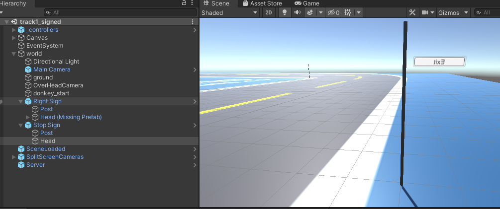
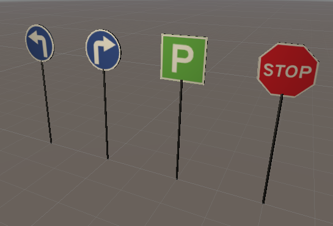

# CP32 - Implement Sign Detection using TensorFlow

## Individual Report - Benjamin Lilley

COMP3888_T15A_Group4_480353056

**Tutor:** Abdallah Lakhdari

**Client:** Cian Byrne (Robotic Masters)

# Table of Contents

[TOC]

### Week 2 intended and contributed
Group Contract
Contact Zahobo
Status Report
Review XP material
Resolve Disk Space issues

### Week 3 intended and contributed
Setup Donkeycar & simulator
Unity Installation
Unity Tutorial
Diagnose and Resolve Unity Crash [fixed unity crash](https://bitbucket.org/jarodreynolds/comp3888_t15a_group4/wiki/guides/guide_to_fix_unity_crash.md)
New Tracks modelled into simulator	commit 0e31a37

### Week 4 intended and contributed
Tensorflow Installation
Research Tensorflow
Tensorflow Tutorial
Train Neural Network to drive in new track	see video	commit 66e0d0f
Added the desired driving path for track1 into the unity sandbox	commit c249238
Wrote [guide to fix unity crash](https://bitbucket.org/jarodreynolds/comp3888_t15a_group4/wiki/guides/guide_to_fix_unity_crash.md)
Assisted Calum with his Unity Crash	[assisted Calum](https://bitbucket.org/jarodreynolds/comp3888_t15a_group4/wiki/guides/guide_to_fix_unity_crash.md)
Simulator Menu Load new tracks	commit 9c29bda, d11ccd7
Donkeycar Load new tracks   commit d11ccd7
Update Simulator to latest Roboleague Version		commit d11ccd7
Renamed repository folder structure to match other repos	commit e2c90f8

### Week 5 intended and contributed
Research Object Detection
PoC object detector,	Integrating an existing COCO model into donkeycar to identify objects		assisted Calum
Determine how to take control of the car with the Tensorflow part over the Neural Network		assisted Calum
Get Tensorflow inference custom "part" into the simulator    assisted Calum
Wrote Wiki for [adding new Tracks to Simulator](https://bitbucket.org/jarodreynolds/comp3888_t15a_group4/wiki/Simulator.md)	commit 6f85cfb
Wrote [Guide to install Object Detection](https://bitbucket.org/jarodreynolds/comp3888_t15a_group4/wiki/guides/guide_to_setting_up_object_detection.md)
Added signed tracks to simulator    commit 37d0700
Fixed menu resize bug   commit b2f31b1
Write User Stories in the Wiki	commit fd62665
Rename wiki minutes date format	commit 0dbee80

### Week 6 intended and contributed
Group Report commits e694c89,c68746c,7d18a65,a90b834,fd62665,1d0c9bd,eefc411
[Video Presentation](https://youtu.be/cF6CEsoTzik)
Personal Reports
Client Demo
Peer Evaluation
Meeting minutes	commit 4cb540b

Sources Trello, Bitbucket, Slack

### Donkeycar to Load new tracks

An important and vital task that I completed was to get Donkeycar to Load new tracks. see [adding a track to the simulator](https://bitbucket.org/jarodreynolds/comp3888_t15a_group4/wiki/Simulator.md) so its loadable from the terminal with an environment variable, this is more complicated than it sounds, I discovered that the existing design of this is more complicated. I found that to add a track to the simulator requires editing 5 files, adding a few lines to each file. That's a complicated existing design. I also merged our code with the new roboleague version of the simulator	commit d11ccd7.

> in wiki/simulator.md - adding a track to the simulator
> the existing design of it is very complicated
donkey uses a registry class
an environment variable value is registered with an entry point with a coded class.
it calls its superclass with its coded level
Later
it indexes an array by the level
it uses the scene_name of the array item to call a function of a class
the function calls a scene to be loaded by its id defined in unity build settings.
Presently there are more scenes than there are environment variables
eg the main menu scene
so level <> id. just be aware.
also some names are mismatching there is a scene called small_looping_course, but its enviro class is GeneratedTrackEnv
very similar to GeneratedRoadsEnv
so a scene is referenced by an environment variable value, a class, a level, a scene_name, an array index (=level), a function name and its id in unity.
:)

# Quality of Technical Work Done

A good method to ensure quality is to use automated unit testing. unfortunately due to the nature and composition of this project especially its AI and Simulator nature that is not feasible to implement user testing for this project.

To ensure work quality we work as pairs we do this through zoom and screen sharing. This way the code gets a review before its committed. eg as a pair Manfred and I collaborated to model the new tracks in the simulator. As a group I assisted Calum and Jarod in a zoom meeting to integrate an existing COCO model into donkeycar to identify objects.

When we finish a task. we test it. we commit it to the repository, we advise the rest of the team, we advise instructions, we document the changes in the wiki. We request that they test it and advise any issues, and then after they follow instruction and test it, they advise that it passes our tests.

If a test fails we advise the programmer who committed it, so they can fix it if they need help they can ask and we will assist. We post images or videos of work done and tests passing to the team and our client. We are doing user acceptance testing. this keeps the high quality of our work.

# Other Contribution to Group

### Raising ideas

When I have good ideas I advise the team. To explain the quoted message, coco is an object detector, you pass it an image and it detects where in the image it detects objects and what they are. we want to detect signs and react to them when they are close.

>Ben  Sep 22nd at 10:01 PM
I was thinking, the coco detector returns bounding coordinates for objects detected so we can use that to check the size of it as a measure of how close it is, when it is big enough it indicates that it is nearby and then we can do the signed action (stop, left, right, park)

## In the group in a Manager Role

I requested that we change the date format we use for the minutes file name in future to ISO YYYY-MM-DD and renamed the the existing minutes files in the wiki so that they were easily sortable by time. commit 0dbee80

I changed the project folder structure, to make it easier for the team to import team changes into all other required repositories locally. see the following section. commit e2c90f8

Recorded the specific commits of other repositories that we build on for future reference.

>Ben  Sep 20th
Repo Date commit Id
sdsandbox, 2020-09-15, baf9c7669f095a40694dd5650958dee6e0d8ca25
gym-donkeycar,  2020-09-01, ea92be3b8d3a74b4e0de0ded6dbec6b4e8c44d33

### changing project folder structure

To have subfolders in it corresponding to each other repository donkeycar, sdsandbox etc. commit e2c90f8

> Ben Sep 19th at 6:28 PM
... I think it would be much better if we renamed "comp3888_unity" to "sdsim" and put it in "sdsandbox" I may have to do this to save you all pain loading my next commit.

>Calum  Sep 19th
what was your plan for the directory structure for the project?  We should probably talk to Cian about what he wants as the end product but my suspicion is we will be providing a stripped back version of sdsandbox and donkey simulator.

>Ben  Sep 19th
to have subfolders in it corresponding to each other repos
presently need
sdsandbox
gym-donkeycar

>Calum  Sep 19th
sounds good. We will just need to clarify with Cian whether he wants those to be our own copies of them or forks of the real repos. Probably one of the main things we will want to discuss with him Monday.

>Ben  Sep 20th
I didn't duplicate all of their repos only the few files that were necessary to change,
just using same structure so easy to update files in place needed

### Advising of committed work and requesting pull and test with important instructions

Advising I've committed and my instructions for the team, they need to merge our code locally into other repositories folders. and test.

>Ben  Sep 26th 9:24 AM
Committed Unity changes please pull my latest commit
and merge the sdsandbox folder with your local projects/sdsandbox folder
and merge the gym-donkeycar with your local projects/sdsandbox folder
Please test in Unity
Advise if you see any bugs.
If looks good can compile and do some donkey driving.

## In the group as a Tester Role

### Advising of Success of testing own work

###### also giving advice to team

The 1st time it took a long time to compile the simulator, advising team that if you recompile it in the same location it can recompile very fast.
and to advise to backup the previous version, so can continue using that previous version if the recompile failed. instead of the old version being overwritten and lost.

>Ben Sep 26th 9:38 AM
verify load bug fixed, see image. (Screenshot from 2020-09-26 09-31-51.png)
If you rebuild the Unity project in the same place with the same name using the same data folder
It reuses all the data and doesn't have to rebuild everything
so it can compiled very fast. like 2 minutes.
you can backup the previous build elsewhere (optional), and rename before or after.

### Advising of failure during testing team members work

The road signs was broken, due to a missing file, a prefabrication or prefab, its only showing the poles, not the signs. there's a 2nd pole in the distance. It was broken due an incompatible blender file, unity couldn't read the blender file because I didn't have blender installed. but a solution is to export it from blender into a format unity can read.

>Ben  Sep 24th at 4:09 PM
Hi Will,
When I pull in your new signed tracks
I copied all sdsandbox
The signs are missing their tops, the signs, missing prefabs.
on Track2 I can't see the wall and I can run right off the track.

### Advising of Success of testing team members work

The road signs were visible, showing signs on the poles.

>William Talbot  Sep 24th
@Ben I’ve pushed a commit to try fix this issue, would you be able to copy the park and right signs in the latest commit over and see if it works :)

>Ben  Sep 24th
Yes, looks good, nice

## In the group as a Tracker Role

Asking the team how they are progressing for progress report

>Ben Sep 25th 3:15 PM
How are you going with Object Detection?

# Reflection
Reflections on version control, coding styles, XP; challenges met so far in the project, how these were tackled.
Your role in the group and as a software engineer
How project work and team has gone so far, how could imrove improve and thoughts on how you intend to move forward with links to relevant evidence and planning documents on bitbucket wiki

We have been using git version control with bitbucket, but we are rarely using branches for different tasks, each task should use a different branch, I started with that methodology but thought it wasn't necessary after all other team members weren't using branches. I recommend we have a test branch that tasks should be tested in 1st before they are merged into master also we should use pull requests to pull completed tasks from Test branch into Master after they have been tested.

A challenge for me was I had issues running the Unity tutorial it kept crashing Unity and sometimes my System. A few times it crashed within 10 minutes. I submitted multiple crash reports to Unity. I researched the error but was only able to find instructions that could have done more damage to my system. Eventually Unity support replied me with some info that helped. Eventually I was able to upgrade a package in Unity that the improved on the older version. and that resolved my crash Issue. Later Calum said he had crash issues too so I wrote a [guide to fix unity crash](https://bitbucket.org/jarodreynolds/comp3888_t15a_group4/wiki/guides/guide_to_fix_unity_crash.md) for the team. With my guide Calum was able to resolve his crash issues quickly.

A challenge for me was that Tensorflow kept crashing. I learned that it requires a NVIDIA graphics card with a CUDA level of > 3.5 but that mine is only CUDA 3. the CUDA level is limited by the hardware, it is not possible to increase my laptop's CUDA level without a newer NVIDIA graphics card. So I had to configure Tensorflow to use my CPU instead of my GPU. So I can use Tensorflow now, and resolve this issue but its slower. I wrote a [guide to downgrade to tensorflow cpu mode](https://bitbucket.org/jarodreynolds/comp3888_t15a_group4/wiki/guides/guide_to_downgrade_to_tensorflow_cpu_mode.md) for the team.

A challenge for me was that when I test recorded a video for our presentation despite there being no loud noise and the laptop seemingly quiet there was very loud background noise in the recording. With Calum's advice and links I implemented a method of noise cancelling using an ALSA loopback device (ALSA = Advanced Linux Sound Architecture). and was able to get a much clearer recording.

### Role as a Software engineer

I have used my Software engineering skills, problem solving skills, debugging skills, diagnosis skills, coding skills & communication skills.

We have a challenge presently to make the donkeycar stop at a stop sign this is rather harder than it sounds because in donkeycar it doesn't have the **current velocity** of the car only throttle and steering vectors, I have raised this with the client. if you don't have the current velocity you don't know how much to reverse throttle is needed to stop and you don't know that you have stopped or not. The reverse throttle required to stop is directly related to the current velocity, also must consider reversing throttle over time, in the real world we can't stop instantly and doing so can cause injury. We may have to write a patch to both donkeycar and the simulator, for the simulator to send the current velocity to donkeycar and for donkeycar to receive it and allow its components access to it, to resolve this issue. A patch like that i think is essential.

Similarly current velocity is vital for how much we turn in response to a turn sign.

### How Team is going

We are a good team we are working well together. I respect my teammates. I'm happy to be working with them. I have been assisted by my teammates on many occasions and they have given good advice. I have been able to assist most of my teammates on other occasions too. We have shared the work and shared resources and links and shared what we have learned and documented in the wiki which has been very helpful. I have been responsive to teammates most of the time, most times during the week.
I have attended all meetings as shown in the meeting [minutes](https://bitbucket.org/jarodreynolds/comp3888_t15a_group4/wiki/browse/minutes/).

We will move forward with our test driven development plan [testing plan section](https://bitbucket.org/jarodreynolds/comp3888_t15a_group4/wiki/group_report_1/Group_Report_1) and discuss issues and progress in our 3 meetings a week. We will meet our clients milestones as listed in the [Project Scope Document](https://bitbucket.org/jarodreynolds/comp3888_t15a_group4/wiki/CP32%20-%20Scope%20and%20Requirements%20Document%20September%202020.pdf).
