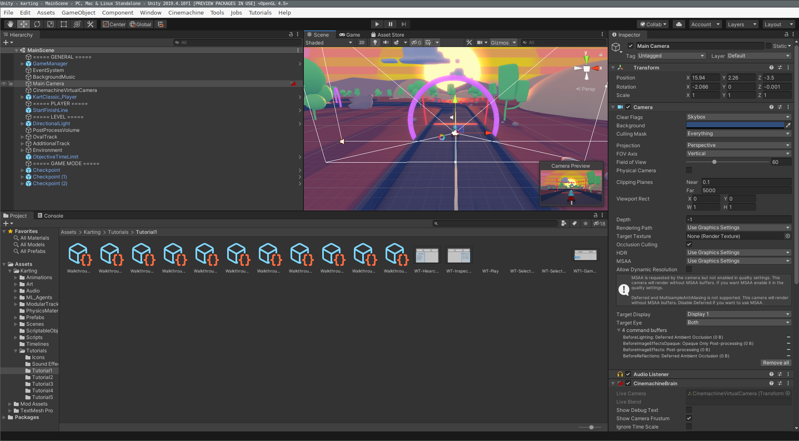

# Individual Report - Calum Baird

This is the individual report for cbai5778  for the First Report due October 4, 2020.

# Major contributions

- Point of contact with client for entire semester
- Did initial research into TensorFlow object classification
- Developed proof of concept of object detection
- Refined and documented object detection and reaction capability
- Made car react to stop sign

# Breakdown and extent of contributions

## Week 2

- create slack
- research Extreme Programming (XP)
- contact with client
- group leader

The first week mainly consisted of administrative tasks. I took responsibility to be the point of contact with our client, Cian (Robotics Masters). This responsibility meant relaying any queries the team had to our client and information Cian provided us to our team. I also coordinated with Cian to set up regular meeting times; twice a week, at his request.

As the point of contact with the client, especially given this week's tasks were mainly administrative, it made to sense to also take the responsibility of Group Leader. I led conversations about delegating the various administrative tasks that needed to be completed before we dug into project. I also setup our slack workspace with various slack channels for relevant parts of our project. I made sure to research and discuss methods for integrating XP practices into our project. Particularly, pair programming (where possible) and collective code ownership. 

## Week 3

- turn sign categorisation with TF
- setting up donkey simulator on my machine

This week was key to giving our team a good foundation in the technologies required for the semester. 
I took responsibility for working out the basics of TensorFlow and, using images provided by our client, developed software to categorise left and right turning signs correctly. This included thoroughly documenting the code with comments so other group members could easily follow the steps to reproduce.

Another task, allocated to our entire group, for this week was setting up the donkey simulator in our environment. This included training a Neural Network (NN) for the car to follow a road, based on the image stream.

## Week 4

- testing NN driving in new tracks
- unity tutorials
- creating Jupyter Server page
- Getting Xbox controller to manouver the car

To provide more support to my team, I set up a jupyter notebook on a server for my team to access. I transferred my sign classification code from week 3 onto the notebook so everyone could work with it.
This gave my team a convenient platform to practice with TensorFlow and prototype code with the advantage of saved memory, so small sections of code can be easily rerun and tested.

This week I completed several tutorials for the Unity editor. This put me in a better position to test and support improvements other group had made on constructing our custom tracks.

With some fundamental knowledge of unity, I was able to load our new tracks into the simulator and train a NN driver to autonomously navigate the tracks. This ensured the components, that the rest of my group had created, worked and were well tested. I also managed to get an Xbox controller to successfully drive the car around the track. This allows for better control when training autonomous drivers.

## Week 5

- Proof of concept, controlling the car with a custom donkeycar part
- Testing the proof of concept with our custom map with stop signs
- Console output and bounding boxes for detected signs
- Stopping when a stop sign is detected

The major technical challenge this week was creating software to integrate with donkeycar which could detect stop signs and perform an action. To achieve this I followed a [tensorflow object detection tutorial](https://github.com/tensorflow/hub/blob/master/examples/colab/tf2_object_detection.ipynb). With other group members watching and picking up mistakes and bugs, I constructed a proof concept piece of software which would detect objects and save an image of the detection with a bounding box. This code forms the backbone of our key outcome for this semester. A video of this proof of concept can be seen [here](https://youtu.be/bTRXHhLhcH4).

Once the rest of the group got across the code (including refactoring it), I then implemented several key improvements. I integrated bounding boxes into the web client, console output displaying the percentage accuracy and made the car stop for 3 seconds when it identified a stop sign. These improvements meant we were able to demonstrate a minimum product for our client. All future work this semester will build off this core code. A video of this functioning, and my commentary, can be seen [here](https://youtu.be/3ioIAphQEqQ).

## Week 6

- Documentation of key software
- Report Tools, edits and documentation
- Create demonstration videos of our current achievements

I took a large role putting together the report and demonstration video. In the report I wrote our section describing the tools we used throughout the semester. I set up a google slide document for our team to use for our presentation and recorded videos demonstrating the key achievements we have made in the semester.

A critical component of developing software for a client is documenting it for future use and maintainability. This week I wrote docstrings for our key deliverable pieces of software and utilised [pdoc3](https://pdoc3.github.io/pdoc/) to generate automated documentation for it. Documentation for our sign classifier can be found [here](https://bitbucket.org/jarodreynolds/comp3888_t15a_group4/wiki/sign_classifier.md).

# Quality of work

To increase the productivity and quality of our work, we have aimed to utilise several Extreme Programming practices. For several parts of the software I have participated in pair programming, primarily being the developer. Similarly we have aimed for group code ownership, this has meant rotating roles. Some weeks I tested large parts of the simulator and others I developed TensorFlow software for sign detection.

Another important consideration for quality is documentation. I have made an effort to start creating automated documentation, using python docstrings and pdoc3. This means our client will be able to easily understand, use and maintain the software we deliver at the end of the project.

# Other contributions

As our groups point of contact with client, it has been my responsibility to ensure our group is aware of all communication with the client and any queries from my group have are answered by the client.
I've effectively ensured we have a professional and friendly relationship with our client, we have achieved all his expectations sufficiently and he has a clear idea of our outputs for the remainder of the semester.

# Reflection

One large challenge, in a group of 6, is coordinating the entire group to contribute evenly to the project. It is a challenge we need to tackle so we can continue to deliver large amounts of high quality work for our client. One possible way to solve this is break into smaller sub teams, where the responsibility falls on three teams rather than three people.

Another problem is our source control management. We are storing our key files in git, however, because we are editing many repositories, we currently copy our changes between our repository and the dependencies. We have pointed this problem out to our client, and we will be discussing the final format of our software and deliverables in the near future.
