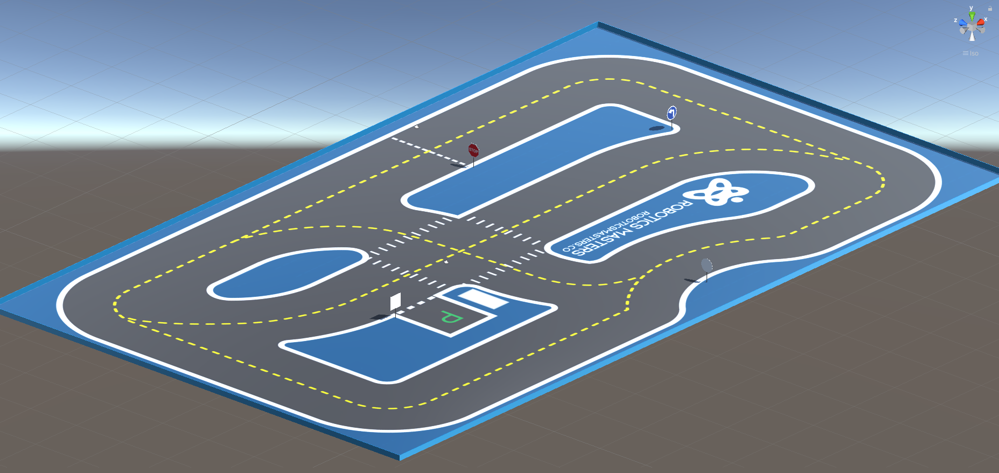
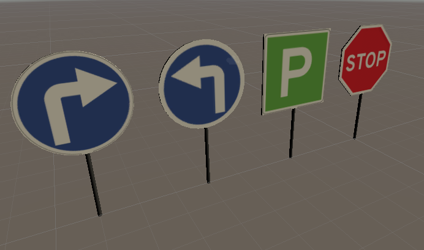
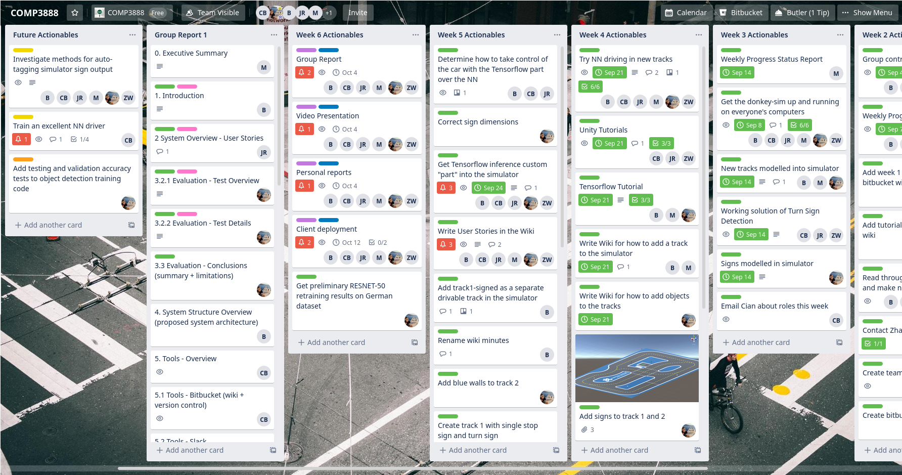

# Traffic Sign Detection With TensorFlow

## William Talbot - Individual Report 1

| Group Members | SID |
|--------------|-----|
| Manfred Ai | 470421015 |
| Calum Baird | 460362054 |
| Benjamin Lilley | 480353056 |
| Jarod Reynolds | 460325222 |
| **William Talbot** | **460299923** |
| Zhaobo Wang | 480526926 |

**Tutor:** Abdallah Lakhdari

**Client:** Cian Byrne (Robotic Masters)

# Table of Contents

[TOC]

# XP Roles and Contributions

In the beginning of the project, the tracker and manager XP roles were distributed to all six group members as the team became acquainted with the project, client and each other. The initial roles were assigned in the [Group Contract](https://bytebucket.org/jarodreynolds/comp3888_t15a_group4/wiki/Group%20Contract.pdf?token=a131a82864e618203491d9bb481c12cc7657d7c3&rev=0a2551d440b986a0c738e15432c84a3b881402a7). My roles over the first half of the project are tabulated below.

| Week | XP Roles | Additional Notes |
|------|----------|------------------|
| Week 1 | Manager, Tracker | In the first week preceding our client meeting and first tutorial, I took responsibility for organising a first meeting, taking meeting minutes and delegating administration tasks that had to occur. This is evidenced in the meeting minutes from that time: [Meeting-Minutes-2020-08-30.docx](https://bitbucket.org/jarodreynolds/comp3888_t15a_group4/wiki/minutes/Meeting-Minutes-2020-08-30.docx), [Meeting-Minutes-2020-09-01.docx](https://bitbucket.org/jarodreynolds/comp3888_t15a_group4/wiki/minutes/Meeting-Minutes-2020-09-01.docx). |
| Week 2 | Tracker, Programmer | In this week I continued in the role of tracker, maintaining meeting minutes for our initial client meeting ([Meeting-Minutes-2020-09-03.docx](https://bitbucket.org/jarodreynolds/comp3888_t15a_group4/wiki/minutes/Meeting-Minutes-2020-09-03.docx)). During this week the whole team were programmers with a common purpose to getting the simulator, Unity and TensorFlow operating on our systems. |
| Week 3 | Programmer, (Tracker) | I assisted in the maintaining of the minutes in the tuesday tutorial ([Meeting-Minutes-2020-09-07.docx](https://bitbucket.org/jarodreynolds/comp3888_t15a_group4/wiki/minutes/Meeting-Minutes-2020-09-07.docx)). During this week we were mostly able to resolve issues with getting the required software operating on our systems and begin working on user story tasks, described in the technical contributions below. |
| Week 4 | Programmer | During this week I operated in only a programming role, continuing on technical contributions. |
| Week 5 | Manager, Programmer | In this week, concluding the XP-role rotations, I stepped back into a managerial role in addition to making technical contributions in a programming capacity. This managerial role took the form of leading task creation and delegation during our weekly meetings through the Trello task management system which we have used exclusively (evidenced later in the report). |
| Week 6 | Manager, Programmer | Continued in the same roles as the previous week. |

As part of these XP roles, in particular programmer, manager and tracker, I have made significant contributions to the project in both a technical and non-technical capacity. These are briefly summarised in the table below and later detailed.

| Category | Weeks | Contribution | Brief |
|----------|-------|--------------|-------|
| Technical | 5, 6 | Retraining ResNet-50 Detector Network | Using TensorFlow 2 and python to retrain ResNet-50 on German sign dataset. |
| Technical | 3, 5 | Blender/Unity Asset Creation (Traffic Sign + Walls) | Creation and placement in tracks of four new traffic sign assets and track walls, with documentation. |
| Technical | 5 | Integrating Sign Classifier | Integrating the sign classifier into a DonkeyCar part. |
| Technical | 4 | Training Self-Driving Car | Training a neural network to drive the DonkeyCar using simulator. |
| Information Search | 5 | Research Sign Datasets | Research into labelled sign datasets publicly available, with documentation. |
| Non-Technical | 6 | Acceptance & Usability Tests | Creation of acceptance and usability test tables and descriptions.
| Non-Technical | 4 | User Stories | Creation of about 6 new stories and realignment others with project requirements. |
| Group Processes | 2-6 | Trello Expert and Maintainer | Task creation and delegation to team members through Trello on at least bi-weekly basis. |
| Group Processes | 1-3 | Meeting Minutes | Outlined and evidenced in the XP roles table previously. |

Apart from these main contributions, I will add the following tasks that were completed in early weeks that were necessary precursors to the contributions made, however are not contributions to the project in a direct sense.

| Category | Weeks | Task | Brief |
|----------|-------|------|-------|
| Technical | 2, 3 | DonkeyCar Simulator Working | Each member of the group had to install the DonkeyCar simulator environment and repositories, and try both manual and neural network trained driving. This task is evidenced by the [Simulator Documentation Wiki](https://bitbucket.org/jarodreynolds/comp3888_t15a_group4/wiki/Simulator) as well as by the existence of the "Training Self-Driving Car" contribution. |
| Technical | 3 | Unity Tutorials | In this week, I completed the [Karting Microgame](https://learn.unity.com/project/karting-template) tutorial to learn the ropes of the Unity game engine. I documented my learning process at the [Unity Documentation Wiki](https://bitbucket.org/jarodreynolds/comp3888_t15a_group4/wiki/Unity) and it was essential for future tasks. |
| Technical | 4 | TensorFlow Tutorial | In this week, I completed the [TensorFlow 2 object classification tutorial](https://www.tensorflow.org/tutorials/images/classification). Some documentation went onto the [TensorFlow Documentation Wiki](https://bitbucket.org/jarodreynolds/comp3888_t15a_group4/wiki/Tensorflow) at this stage, however underlying issues with my system did not arise until the "Retraining ResNet-50 Detector Network" contribution in weeks 5-6.

The tasks in the previous table do not require additional details, but the main contributions to the project are now detailed in their own subsections.

### Retraining ResNet-50 Detector Network

Retraining the ResNet-50 object detection network is one of my main contributions to the project so far, and is still ongoing. The goal of the task is to produce an object detection network that can identify a few of the common sign types required for this project. The dataset I used for this task was the [German Traffic Sign Detection Benchmark](http://benchmark.ini.rub.de/?section=gtsdb&subsection=dataset) (see "Research Sign Datasets" contribution), and I working on adapting the [Few Shot Training Tutorial](https://github.com/tensorflow/models/blob/master/research/object_detection/colab_tutorials/eager_few_shot_od_training_tf2_colab.ipynb) for this dataset.

This involved the following subtasks:

* Implementing python functions to read a custom ground truth text file containing 1213 sign bounding boxes and class ids
* Adapting the TensorFlow data structures from the tutorial to match the dataset
* Setting up the training, loss function and validation inference
* Performing preliminary trains using different images, batches, epochs and learning rates.

The best model I was able to train had reasonable success with a small number of images however did not generalise well, and there is certainly much more work to be done to properly train, test and validate the model. However it was a successful demonstration of what is possible and provides a code framework for further contributions in the remainder of the project. The following image shows a comparison between the ground truth and inference results. Further evidence of this work is shown in the `object_detection` directory of the main repository [here](https://bitbucket.org/jarodreynolds/comp3888_t15a_group4/src/master/object_detection/), with some notes on the process in the [TensorFlow Documentation Wiki](https://bitbucket.org/jarodreynolds/comp3888_t15a_group4/wiki/Tensorflow).

Out of all my tasks and contributions, I faced the most challenges and issues with this one. The first major problem was incompatibility between the version of CUDA (NVidia parallel computing platform) on my computer, my GPU, the TensorFlow 2 object detection API dependencies and the DonkeyCar simulator python virtual environment. This was finally able to be resolved by reinstalling CUDA and working on a TensorFlow 2 compatible branch of the DonkeyCar simulator. I extensively documented my issues and solution on the [TensorFlow Documentation Wiki](https://bitbucket.org/jarodreynolds/comp3888_t15a_group4/wiki/Tensorflow).

Further challenges have been software and theory related, including the absence of clear TensorFlow 2 documentation, the steep learning curve of the underlying principles, and tackling bugs related to these challenges. One example of these bugs was that I was incorrectly creating the "one-hot tensors" (ground truth column vectors) for the dataset's classes, so that the network was being trained to classify every sign as the very first class.

### Blender/Unity Asset Creation (Traffic Sign + Walls)

The creation of new traffic sign and wall assets using the Blender modelling tool and Unity game engine framework has been my other major contribution to the project thus far. This goal of this task was to create new "Prefab" (a group of `GameObjects` containing meshes, materials and physics among others) objects for the following:

* Stop sign
* Park sign
* Left-turn sign
* Right-turn sign
* Walls to surround Track 2

After learning the basics of Unity and blender, in week 3 I was able to create the four traffic sign objects with my interpretation of realistic dimensions, shown below. While the turn signs and park sign were composed of primitive 3D objects, the stop sign required an octagonal prism head, which required mesh manipulation in blender. This took several iterations to perfect. Initially I faced an issue where the sign material would map to both sides of the signs, however this was eventually corrected by UV-mapping in Blender. The process of sign creation was documented in detail in the [Unity Documentation Wiki](https://bitbucket.org/jarodreynolds/comp3888_t15a_group4/wiki/Unity).

These were placed within the tracks as you can see in the in this video: [Signs in Track 2 VIDEO](https://youtu.be/j-k8CbKAq98).

In week 5, the client provided us with some specifications for sign dimensions, and indicated that a wall should be placed around track 2. The signs were adjusted to the more exaggerated dimensions and the wall assets were created. The images below shown the updated sign assets and the following video is a timelapse of the wall creation and placement process: [Wall Creation (Sped Up) VIDEO](https://youtu.be/_ns9IZGTs3A). The wall's height was later adjusted to 1 metre at the client's request.

### Integrating Sign Classifier

The goal of this task was to integrate the left and right sign classifier that Calum had trained the week prior into the DonkeyCar simulator. Due to the structure of the simulator repositories and our unfamiliarity with it, this task was tackled as a pair programming exercise with Jarod through Zoom. The task involved the following steps:

* Adding "save model" functionality to Calum's [sign classifier python script](https://bitbucket.org/jarodreynolds/comp3888_t15a_group4/src/master/image_classification/classify.py)
* Creating a new DonkeyCar "part" (the DonkeyCar simulator vehicle is attached with any number of "parts") which loads this saved model upon initiation, and then performs real-time inference on the camera stream. These changes can be found in this commit of [sign classifier class](https://bitbucket.org/jarodreynolds/comp3888_t15a_group4/src/8f1ba150519b87b065bf34cea5fb171bbe92a4c5/donkeycar/donkeycar/parts/object_detector/sign_classifier.py?at=master)
* Printing out the user the classification of the frame in the terminal

The sign classifier proved unsuccessful which was not entirely surprising. The model was trained to classify the entire camera frame, however while using the simulator, the sign makes up only a small portion of this image. Learning from this, we decided to focus on retaining detection networks, which lead to the ResNet-50 retaining contribution.

### Training Self-Driving Car

In order to progress on many of the deliverable functionalities for this project, all members of the team had to become familiar with the simulator and training a neural network to drive the car autonomously. While only one excellent model will need to be trained on the new tracks for further testing in the rest of the project, we all produced a trained model for track 1. This video shows my trained model driving around track 1: [Trained Neural Network Driver VIDEO](https://youtu.be/1AtFxSgmkso).

### Research Sign Datasets

While we were given some datasets by the client for training a left and right sign full-frame classifier as discussed previously, the project requires other more substantial and multi-class datasets to train detection networks on. I did some research for publicly available real world datasets, and was able to find several of varying degrees of accessibility and quality. I documented these on the [Datasets Wiki](https://bitbucket.org/jarodreynolds/comp3888_t15a_group4/wiki/Datasets). [German Traffic Sign Detection Benchmark](http://benchmark.ini.rub.de/?section=gtsdb&subsection=dataset) seemed to be the best find in terms of both accessibility and quality, and so it was used for the ResNet-50 retraining the following week.

### Acceptance & Usability Tests

My main contribution to the group report has been the creation of acceptance and usability tests for this project. These were derived from requirements that were in turn derived from both the user stories and the client's [Project Scope Document](https://bitbucket.org/jarodreynolds/comp3888_t15a_group4/wiki/CP32%20-%20Scope%20and%20Requirements%20Document%20September%202020.pdf). These tables and their details can be found in [Group Report 1](https://bitbucket.org/jarodreynolds/comp3888_t15a_group4/wiki/group_report_1/Group_Report_1).

### User Stories

I took an active role in helping to develop the projects user stories around week 4, in order to align them with our project scope (as per the Client's provided [Project Scope Document](https://bitbucket.org/jarodreynolds/comp3888_t15a_group4/wiki/CP32%20-%20Scope%20and%20Requirements%20Document%20September%202020.pdf)), which involved the creation of half a dozen new stories, the removal of two and the rewording of others. These changes were made directly to the [User Stories Wiki](https://bitbucket.org/jarodreynolds/comp3888_t15a_group4/wiki/User%20Stories) and evidenced in the history of the page.

### Trello Expert and Maintainer

I have been able to contribute my Trello expertise to this project when acting in a managerial role. As discussed previously, this involves taking the outcomes from meetings and converting them to modular tasks that can be assigned to a single (or multiple people in rare cases). Based on our weekly meetings, I assign these tasks to group members and often add due dates, links, attachments and checklists to the tasks where appropriate. I have also added so-called "Butler Rules" to our board, so that tasks are sorted by their urgency.

### Meeting Minutes

As discussed and evidenced previously, I was responsible for meeting minutes in weeks 1, 2 and partly 3.

# Quality of Work

Ensuring that the quality of completed technical work is high has not been as simple a task as it might be for a conventional unit-testable, function-focussed project, however we have found strategies to help ensure quality.

One method has been to tackle complex, unknown tasks in a pair or small group through a Zoom meeting, with one person writing the code through screen-sharing. I was able to employ this with Jarod for the "Integrating Sign Classifier" task as mentioned above. This enabled us to discover the simulator code structure together, ask each other questions and ultimately check the logical flow of the new code against our common understanding.

When developing simulation environments and assets, the main method for checking work quality was to share new environments with the team, request that they drive around in the environments and confirm that everyone works as expected. This was, for example, invaluable in resolving a bug in the way object meshes were loaded on different machines. As shown in the screenshot below, when Ben loaded the new Track 2, the sign objects had a "missing prefab" error which resulted in the sign heads not appearing in the simulation. We were able to resolve by converting the meshes to a more native format for Unity, thus demonstrating the effectiveness of the method for ensuring quality for these sort of tasks.

We have also done some internal code review and refactoring, where other team members have read through and made changes to other people's code in order to correct bugs, improve readability or add documentation. Some example of this can be seen in the history of the [sign classifier class](https://bitbucket.org/jarodreynolds/comp3888_t15a_group4/src/fd17657dee3315a554a4b89884d58d3abf5efe58/donkeycar/donkeycar/parts/object_detector/sign_classifier.py?at=master) and [sign classifier training script](https://bitbucket.org/jarodreynolds/comp3888_t15a_group4/src/fd17657dee3315a554a4b89884d58d3abf5efe58/image_classification/classify.py?at=master).

The ultimate measure of quality, however, has been showing videos and screenshots every week to the client. This allows for direct feedback from the client, and shows all members of the team the progress made that week on all tasks. One example of where this process directly improved work quality was in the refactoring of the traffic sign assets. Originally the dimensions were scaled to reflect a regular sign, however as highlighted by the client were inappropriate for the scale of the DonkeyCar and the neural networks we were wishing to train.

# Reflections

At this point in the project, I believe the team and I have made progress that has met many of the expectations set by ourselves and our client. We have actively utilised the tools required, and maintained close and consistent contact with the client. There are, however, aspects of the project that can be improved to order to complete the project to its full potential. There have been challenges which we can reflect upon that highlight what can be improved moving forward.

One aspect that I believe can be improved is our utilisation of Bitbucket. While the commit history of the project has been clean, we have not used some of the more powerful features available to us through version control, such as branches and pull requests. This has not yet presented problems for us, however as we increasing work in similar areas of the code base, we may run into incompatibility or integration issues on the master branch. This is of course not desirable. Instead we will look to use branches and regular merges with the master branch to ensure that the features we develop are isolated until it is appropriate to integrate them. Furthermore, I believe we can use the BitBucket Wiki pages more than we have so far to document our own code developments.

Reflecting upon the XP within the project, I have noticed that some things have worked very well while others have not. XP promotes a pair programming and rapid, small feature development approach (as I documented in the [XP Notes Wiki](https://bitbucket.org/jarodreynolds/comp3888_t15a_group4/wiki/XP%20Notes) earlier in the early weeks of the project). We have taken both of these philosophies on board, and have had several successful pair programming sessions through Zoom to implement new modular features. XP also breaks down contributors into specific roles, and while we were able to fulfill our roles well during the first four weeks, when they were in explicit rotation, I have found that because the roles haven't been made explicit in weeks 5 and 6, we have adjusted into our roles implicitly. Since we all share the programmer and tester roles, our contributions in those roles have not been affected, however I have found that I have taken on a more managerial role in task organisation and delegation. The main issue with implicit roles has been the role of tracker. As a result the person taking the minutes is assigned at last minute, and unfortunately group progress status reports have been late (although their content has been preset in the Trello board). This is something we are looking to improve in the second half of the project by designating an explicit tracker.

In terms of technical challenges and in my programming role, I believe we have been able to cope well due to the varied knowledge base of the group. I have often been able to get advice and help from my fellow teammates when facing an issue or bug on new functionality. In addition, we have been able to gather technical resources, tips and troubleshooting in our Slack "#resources" channel as well as in our Wiki, such as [Conda Wiki](https://bitbucket.org/jarodreynolds/comp3888_t15a_group4/wiki/Conda), [TensorFlow Wiki](https://bitbucket.org/jarodreynolds/comp3888_t15a_group4/wiki/Tensorflow), [Unity Wiki](https://bitbucket.org/jarodreynolds/comp3888_t15a_group4/wiki/Unity), [Simulation Wiki](https://bitbucket.org/jarodreynolds/comp3888_t15a_group4/wiki/Simulator) and others. Our wiki and Slack communications have been invaluable in communicating shared knowledge and resources between us, and I believe we can continue this for the remainder of the project.

Moving forward, we will continue to meet with the client on a biweekly basis, and use the [Group Report Acceptance/Usability Test Tables](https://bitbucket.org/jarodreynolds/comp3888_t15a_group4/wiki/group_report_1/Group_Report_1) to help drive our high-level focuses. In terms of planning for the future, we will be meeting the project milestones as per the client's request, as detailed in the [Project Scope Document](https://bitbucket.org/jarodreynolds/comp3888_t15a_group4/wiki/CP32%20-%20Scope%20and%20Requirements%20Document%20September%202020.pdf).
