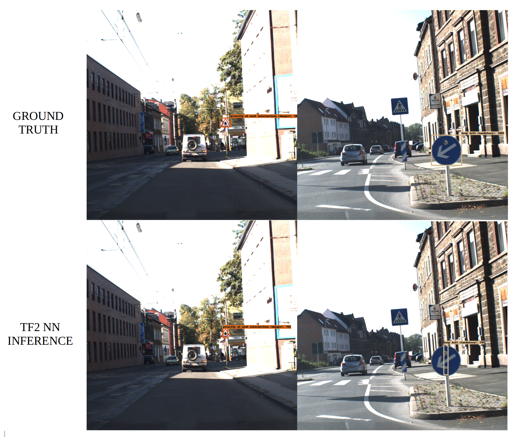

# German Benchmark Dataset Results

## Final Results

After resolving several bugs within the training pipeline, we were able to greatly improve upon our initial model. I have put some images below of the last model we trained on the German dataset.

## Initial Results

Just before the mid-project milestone, we have been able to get some promising results after training our model on the German Benchmark dataset. A comparison image between ground truth and inference is shown below. We will keep working on our model to get better localisation and classification accuracy.

