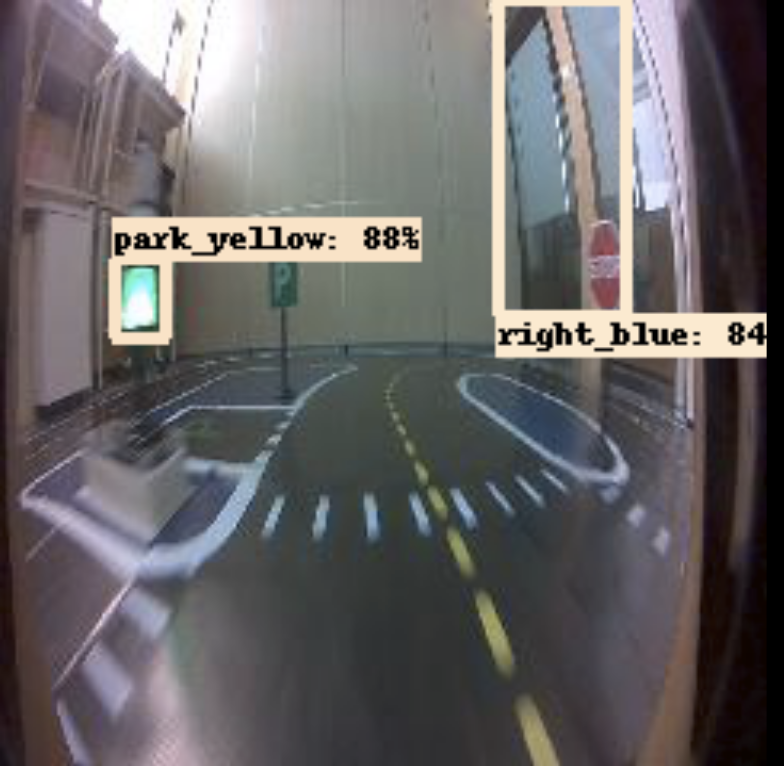

# Shenzhen Dataset Results

We got access to the Shenzhen real donkeycar dataset towards the end of the project. We did NOT train our model on this data, but ran an experiment to see how well our simulator model would work on this data.

Overall, we could tell that to get really good performance, you would need to label and train on this dataset, however we still found some really great results.

Here are some examples of our model working well:

Here is an example where it has confused a tall person for a traffic sign, indicating that our model has generalised tall shapes with colours like this as traffic lights:

There were also some instances where it was completely wrong, which is to be expected:

