# Simulator Training Results

## Final Trained Model

This page will show the results of trained TensorFlow 2 models in reverse chronological order. We obtained almost perfect offline accuracy in our final model by training over a few hundred thousand epochs with a learning rate of 0.01 and small batch size of 8. Higher batch sizes could not be handled by the GPU on the Brut server.

Here are some example videos of the offline inference our model achieved:

[Simple Track Live Inference Video](https://youtu.be/OoC4VuRQB_k)

[Challenge Track Live Inference Video](https://youtu.be/yrV5rQhDvbE)

[Slightly Older Model in Challenge Track](https://youtu.be/GKouCiEgEnA)

These were the training graphs and the confusion matrix for this model. You can see that the accuracy is close to perfect on this static image dataset.

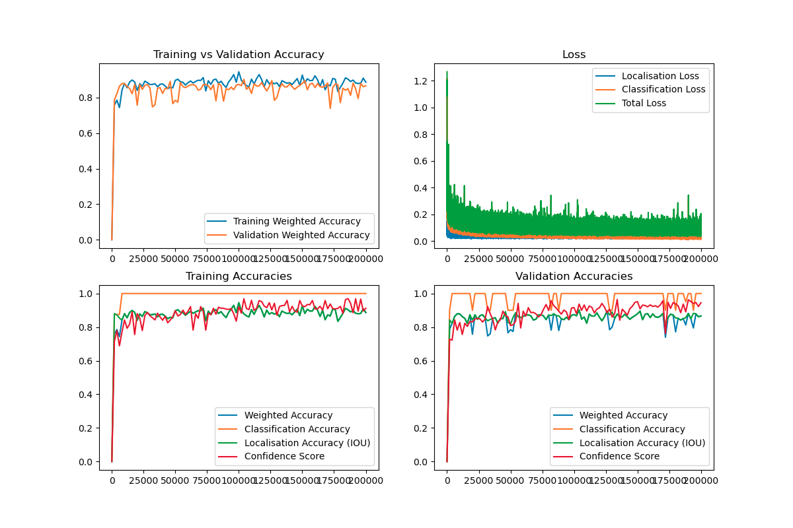

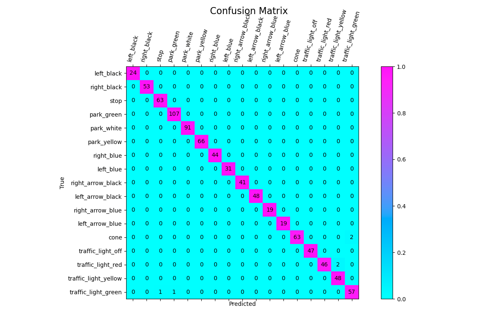

We developed a live testing framework to assess the accuracy of our model in the simulator as it drives around. This involved driving past each and every sign and recording the number of misses, correct and incorrect detections. Here are videos showing what that framework looks like:

[Live Testing Framework Mixed](https://youtu.be/3kv6uZQXP-8)

[Live Testing Framework for Cones](https://youtu.be/cWIwcmPLtag)

We tabulated our results in excel:

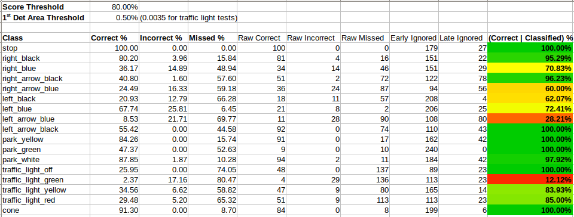

## Approaching Final Trained Model

Once all our signs had been developed, we created a new dataset with all of them included, and now trained on the full 17 class dataset. We were now able to get pretty impressive results for pretty much all signs. Here are some example inference images and the training graph.

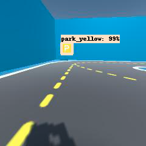
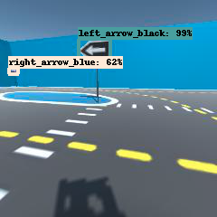
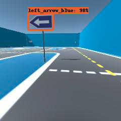

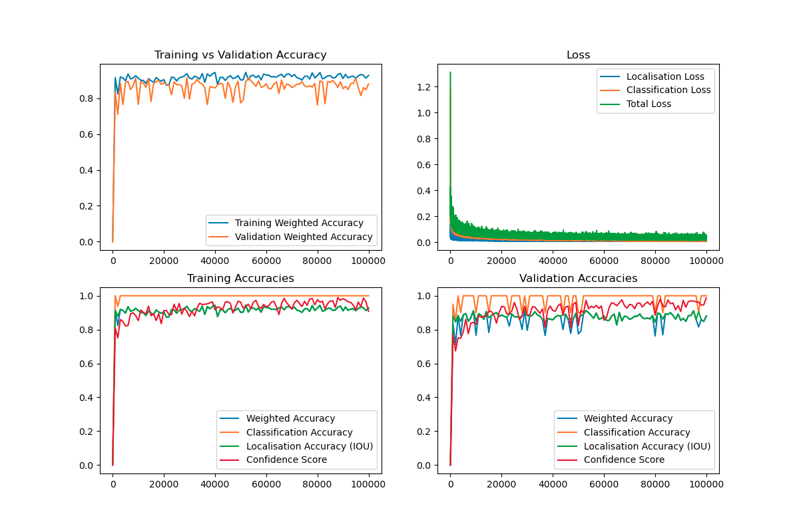

## Second Trained Model

We were pretty quickly able to tweak hyperparameters and train for longer, leading to much much better results:

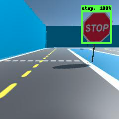
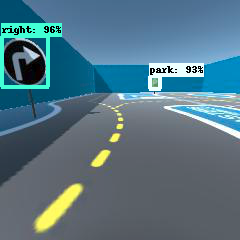

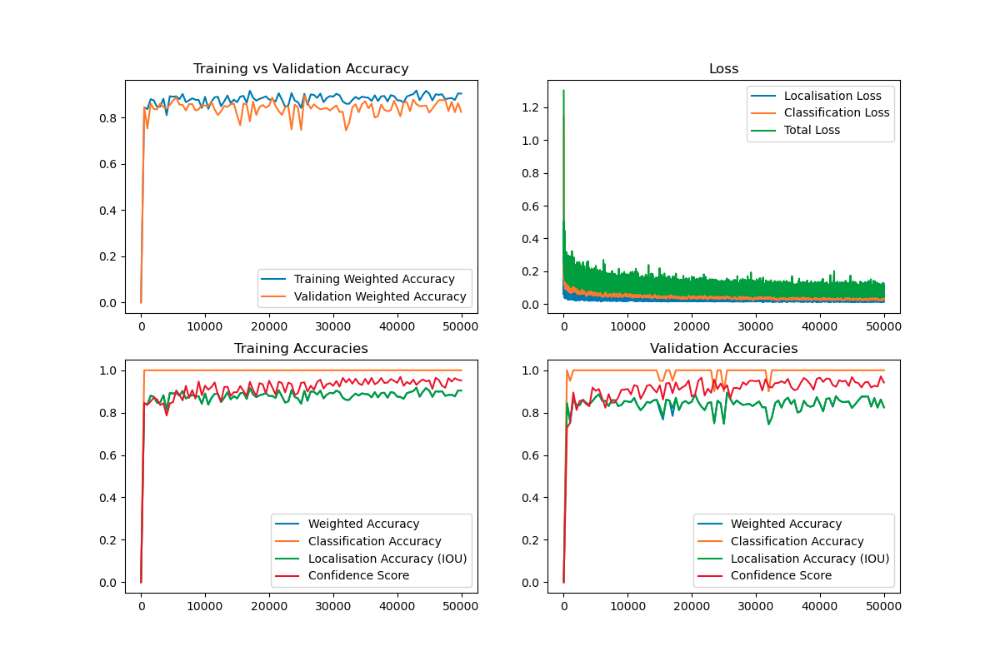

## First Trained Model

We got some surprising good results just from our first model, which was only trained on a total of four sign classes. We were still able to see some non-ideal results, such as the somewhat low model confidence and the detection of the back of the stop sign. We also produced a graph modelling the training and validation losses over time.

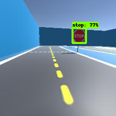
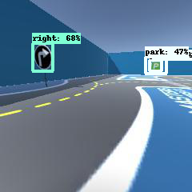
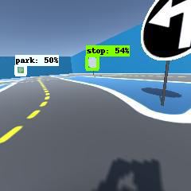

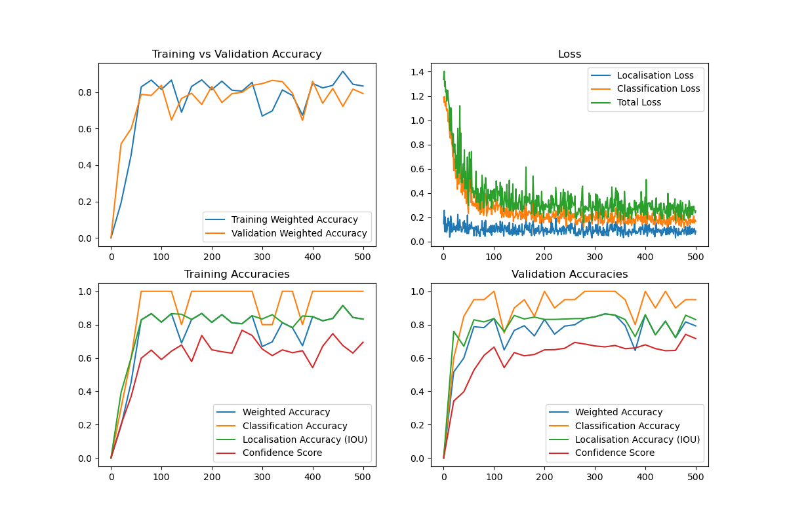
