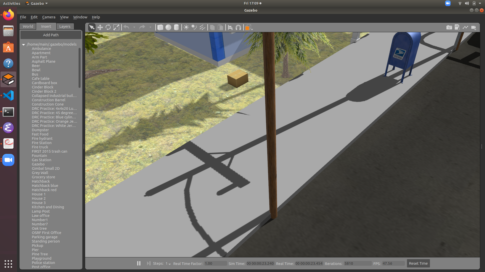
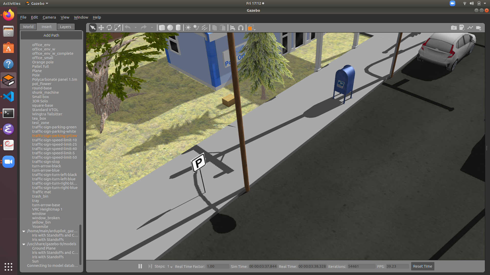
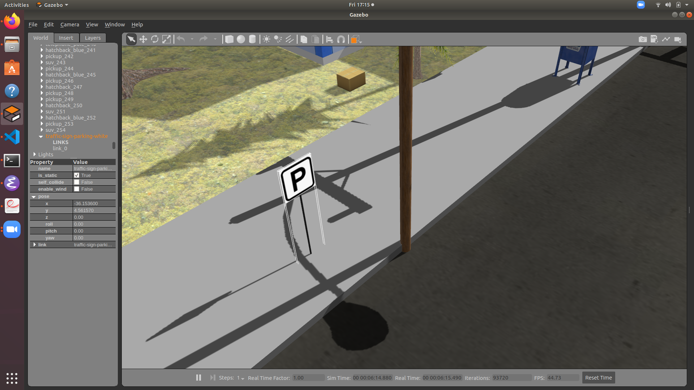
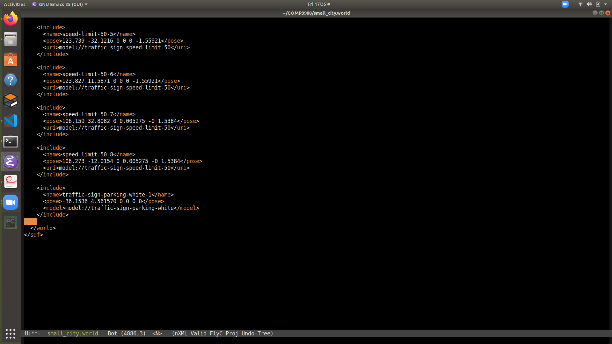

# Add model to Gazebo #

Adding model to Gazebo is easy by using Gazebo GUI.
However, using Gazebo along has the potential to mess up the world file.
The preferred way to add models into the world is documented as follow.

In general, we are adding the model by putting models inside Gazebo, adjust it to the preferred position and coordinate.
After that, we record the position and coordinates of the model and use the value to edit the world file.

**Warning** Do not use Gazebo's save the world / save the world as. It will mess up the world file.

 - Find the model in insert menu


 - Drag and drop model into Gazebo


 - Find the coordinates

The cooridinates of the model is six values under pose.

 - Edit the world File


Then you need to edit the world file.
Append the following line to the end of the `<world>` section.
The six values in the `<pose>` section is the coordinates you found in the Gazebo GUI.
The `<model>` section should be a uri to the model.
The models should present in the model folders in your `GAZEBO_MODEL_PATH` folders.

```{xml}
<include>
  <name>traffic-sign-parking-white-1</name>
  <pose>-36.1536 4.561570 0 0 0 0</pose>
  <model>model://traffic-sign-parking-white</model>
</include>
```
