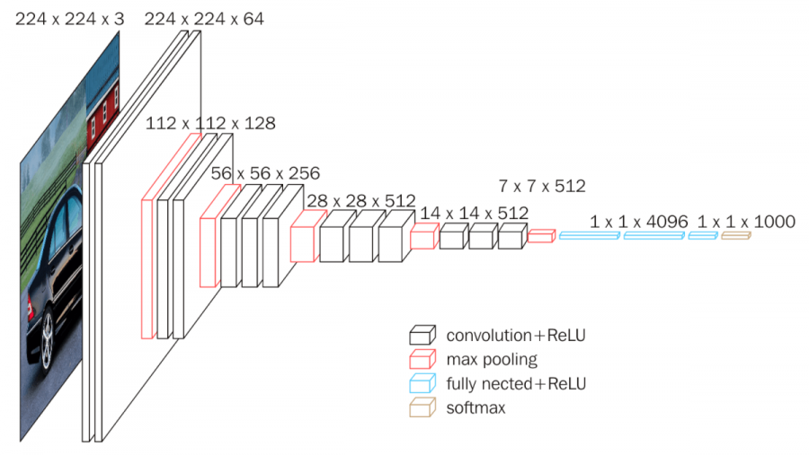

# Report 1 -- Objection Detection for Simulated Drones

## CP33 T17B Group 5 ##

**Tutor**: Frank Fu

[Cover Page](https://bitbucket.org/zson5784/comp3988_t17b_group_5/raw/1039f93be6e6b9488ffcdbf48446428fd1469edb/misc/assignment_sheet_group.pdf)

## Executive Summary ##

The title of the project is Object Detection for Simulated Drones.

The project consists of two main problem components; the first being tasks within the Gazebo simulator, and the second being object detection (traffic signs) using computer vision/TensorFlow.

The goal of the project is to allow simulated drones within the Gazebo simulator to fly autonomously, by flying approximately three meters off the ground, and detecting and responding to traffic signs and directions. This would be done by  first creating a world in Gazebo that resembles a small city, populated by traffic signs. Additional software would be used to spawn a simulated drone which can be controlled with Python code and which also has a camera/video feed. This feed would be used as input to a pre-trained neural network which would detect the presence of traffic signs, and predict which particular sign it is, and respond accordingly through autonomous flight. Through six weeks of collaborative efforts, a simulated world has been successfully built and integration of an initial object classification framework has been achieved. 

---

## Table of Contents ##

1. Introduction
1. Overview of System (User Perspective)
1. System Structure Overview
1. Evaluation
1. Tools Used
    1. Technical
    1. Non-Technical
1. Information Search
1. Reflection on Group Work
1. Individual Contributions

---

## Introduction ##

Autonomous drones are projected to play a significant role in the future of delivery, surveillance and exploration. With a drastically increased volume of drones in the sky, it is vital that they are capable of avoiding collisions between one another and with the environment through adhering to traffic signs and signals in an automated manner. The goal of this project is thus, to implement object detection in order to perform the appropriate action for a designated set of traffic signs within a simulated drone environment.

The project consists of two major problem components - building a simulated city with the ability to control the drone using way-points, and object detection using computer vision and neural networks. The first component deals with controlling a drone within a world built using the Gazebo simulator with the designated signs modelled and added in. The autonomous drone is run on PX4 firmware and controlled using MAVSDK. The second component deals with the detection and identification of buildings, vehicles and traffic signs using the fundamentals of both computer vision through OpenCV and convolutional neural networks through TensorFlow.

The two components are handled in parallel, with members of the team being designated to the simulator, computer vision and neural network sub components. Ultimately, the three sub components will be integrated to produce a robust framework capable of detecting and responding to all traffic signs and avoiding all obstacles within a designated flight path in the simulated environment.

With a few different components at play and being complex in nature, one of the major challenges will be the integration process and ensuring each component is compatible with one another. Therefore, effective version control and documentation practices are necessary to ensure that the final product can be set up and run on a real world drone. A effective outcome would subsequently benefit drone manufacturers, delivery companies and all civilians who receive services from these companies. 

---

## Overview of System (User Perspective)

In this section we provide, in terms of user stories, an overview of our system from the perspective of the user. The main "users" considered for this project are the client and the drone itself. This is because the drone is intended to move in an automated way, so for much of the intended functionality it has been most natural to write user stories from the perspective of the drone.

### Completed User Stories

Below is a list of user stories that have already been completed.

* As the client, I need to be able to fly drones in the simulator, so I can make sure the simulator is up to standard.
* As the client, I need to be able to see traffic signs in the simulator, so I can detect the signs and act accordingly to obey traffic laws.
* As the client, I need to be able to see a simple city with some buildings and trees in the simulator, so I can test my drone in a realistic simulated environment.
* As the client, I need to be able to see working traffic lights in the simulator, so I can ensure that the traffic lights reflect real-world behavior.
* As the client, I need an easy way to start the simulation, so I can deploy the simulator and also quickly ensure it works.
* As a drone, I need to be able to turn precisely, so the drone will follow the intended path exactly and not collide with other objects.

### Incomplete User Stories

Below is a list of incomplete user stories. Some of these are currently being worked on by members of the team while the others will be focused on in the near future.

The overall functionality that we hope to achieve over the next two weeks is as follows: the drone should be able to fly around inside the simulator, detect traffic signs and obstacles, and respond to each detected object with an appropriate action, such as stopping or turning. The below user stories capture in small pieces the different tasks that the drone needs to be able to complete in order for this to be possible.

* As a drone, I need to be able to move precisely, so the drone will follow the intended path exactly and not collide with other objects.
* As a drone, I need to be able to fly around at an altitude of 3m, so I do not collide with humans/cars as well as not interfere with other aerial vehicles (helicopters and planes).
* As a drone, I need to be able to detect obstacles (buildings, trees, fountains), so I can avoid the obstacles and not collide with them.
* As a drone, I need to be able to change my course to avoid collision with obstacles when an obstacle is detected, so I do not collide with the obstacle and cause damage to the drone.
* As a drone, I need to be able to detect traffic signs, so I can obey the traffic laws.
* As a drone, I need to be able to report the number on a speed limit sign when one is detected, so I can follow the speed limit and not break the traffic laws as well as fly too fast to cause collisions.
* As a drone, I need to stop and park when a parking sign is detected, so I can drop off packages or return to the landing/takeoff site.
* As a drone, I need to turn in the appropriate direction when a turning sign is detected, so I can follow the flow of the traffic and not collide with incoming traffic.
* As a drone, I need to be able to stop when a stop sign is detected, so I obey the traffic laws and stop to allow other vehicles to detect me before moving.
* As a drone, I need to be able to stop when traffic lights are detected if the light is currently red, so the drone will follow the intended path exactly and not collide with other objects.

In order to implement these incomplete user stories, the high level plan is as follows. We will use TensorFlow in order to build image classification models for all of the different traffic signs and obstacles that could be encountered in the simulator. The data used to train this model will come from pre-existing traffic sign datasets as well as frames collected from the simulator using OpenCV. For further information on TensorFlow models, see the corresponding subsection in the Information Search section of the report.

In order for the drone to be able to detect traffic signs and obstacles while it is flying around, frames from the drone's camera collected using OpenCV will be fed as input into the TensorFlow models produced, which will output a classification of the object currently in frame (possibly no object). MAVSDK will then be used in order to control the drone, getting it to perform the appropriate action based on which object was detected.

---

## System Structure Overview ##

The simulated drone system comprises a number of key elements, mainly including Gazebo, Ardupilot, PX4 environments and a computer system running Ubuntu 18.04. First, we load the world and drone together into the simulator, we then control the drone by either typing commands in the terminal or in the case of the final product, run pre-written scripts. The drone we are using has a built-in camera, which can capture a POV video stream within the simulator and be displayed on the monitor. This allows the user to send further commands to manipulate the drone in case of crashing into obstacles. In order to automate the flying process, we employ object detection and classification technologies in the form of OpenCV and TensorFlow. Essentially, we use OpenCV to capture each frame of the video stream by recording the flight data. The OpenCV script would then detect possible regions of interest which forms the base of object detection. These frames can also be extracted and use to pre-train the object classification model using TensorFlow.. Once the model has been successfully trained, we can import the saved training weights back into the simulator and run a back-end testing script for real time classification. The output of the classification would then trigger the corresponding movement designated by the control script.

Details of components of the system structure are as follows:

Gazebo:

* Simulating populations of drones in different environments

* Creating assets of all outlined signs and objects

Ardupilot and PX4:

* Controlling drones in the Gazebo simulator

* Receiving flight instructions from the terminal

* Sending live video streams to the user screen

* Recording flight data for future model training

Computer:

* Housing the simulator

* Exhibiting video streams received from the drone camera

* Sending flight instructions through the terminal

* Receiving feedback from the drone

OpenCV:

* Detection of objects within the camera feed

TensorFlow

* Training the sign classification models

* Real time classification of camera frame images

The interaction between the various components can be visualised as shown in Figure 1.

*Fig 1. Overall system structure*

---

## Evaluation ##

### Testing Introduction

Given the nature of our system and design, it is difficult to test the framework as it runs in real time making it hard to test in compile time via unit testing. Furthermore, there are multiple external dependencies built from other organisations. Consequently, our testing practices involve acceptance and integration testing.

### Acceptance Tests

For the majority of our testing so far, we have conducted build acceptance where we verify in run time that components of the system work individually. Additionally, we also have tested such components by giving it basic inputs. Specifically, we have tested the simulator by verifying that it can run on our machines, we can add models and edit the world, and move the drone. We also tested PX4 by sending commands to control the drone and comparing it to the expected behaviour.

In addition to the build acceptance test, we have conducted user acceptance testing. To aid with this, we have utilised user stories to determine the client expectations and verify our solution works according to specifications. Based on the client’s specifications documents as well as regular catch-ups, we have continually refined our user stories to depict general scenarios that overall define the behaviour of the system. From this, we can ensure that our system operates as intended and described by the client.

### Integration Tests

Another component of our testing is ensuring that our software components are able to run together without issues. This poses the largest risk to our development as incompatible components will result in both the system not functioning and a loss in time resources as we will be required to use another component. 

Integration testing was the most important during the initial development as without it, if a component did not integrate with other components, it could introduce a large amount of technical debt. This has been particularly successful for us as we discovered in the early stages that ArduPilot, an alternative to PX4, was not compatible with our systems design as it could not be integrated with video streaming.

### Testing for Classification

For the classification component of our project, using TensorFlow, unit tests are appropriate in order to test classifiers in an isolated sense. We have so far developed a small collection of unit tests for our classifiers, containing both positive and negative cases, to test whether our classifiers can successfully identify whether or not a given object is present in an image.

Going forward, we will need to conduct acceptance tests for classification to test whether the drone can correctly detect objects and respond appropriately. This links directly to the incomplete user stories outlined in the user stories section of the report above.

### Overall Assessment

Despite it being difficult to test our system, we have managed to verify the behaviour and compatibility of our system. We have successfully used integration testing to ensure that the system can operate in tandem without errors. We also utilised user stories to define our requirements and structured our development around meeting the client’s specifications. 

We would need to continue our efforts with testing and create more documents as evidence of our testing. This overall demonstrates that the system can be fragile due to the multiple dependencies. However, we have overcome this by incorporating integration testing and acceptance testing.

---

## Tools used ##

### OpenCV ###
OpenCV-Python is a library of Python bindings designed to solve computer vision problems. The idea is to use OpenCV to detect regions of interest in frames from the video feed, and then use these frames as input to the neural network to predict which traffic sign is in that frame. For now, we are using a pure TensorFlow implementation, which OpenCV to be integrated later.

### TensorFlow ###
TensorFlow is a framework designed to ease the implementation and operation of machine learning workloads. Our back-end object detection models are written using Python 3 with the TensorFlow library and trained on image datasets retrieved both externally and from image captures within the simulator. The training weights are then loaded back into the simulator for real time image classification.

### PX4 ###

PX4 is the firmware for the drones we are controlling and provides the autopilot functions. The external PX4 project is shipped with a Gazebo plugin which is required by our project. It includes Gstreammer, which is a streaming plugin used for capturing a live stream from the drone and a MAVLink interface plugin for controlling the drone.

### Gazebo ###

Gazebo is the simulator we use for simulation. Gazebo itself is written in C++ and can be extended via plugins which can extend its features including the ability to mutate the texture of various models. A traffic light controller plugin was also written externally which controls traffic light models.
The Gazebo simulator is also shipped with some models that are useful for our project such as the traffic light model itself, which is supplied by Gazebo, allowing us save time on modelling.

### MAVLink ###

MAVLink or Micro Air Vehicle Link is a communication protocol between ground control stations with either unmanned air vehicles (UAV) or unmanned copter vehicles (UCV) such as the drone in our project.
This protocol is defined for the remote control of drones with a Ground station.It is necessary because the advanced tool does not have all the features we need.

### MAVSDK-Python ###

MAVSDK is an application programming interface (API) for MAVLink. MAVSDK itself is a C++ interface and MAVSDK-Python is python binding auto generated by the MAVSDK C++ interface. This python module utilises the asyncio framework of python, which allows us to precisely control the altitude and movement of the drone.

### Blender ###

Blender is a 3D modelling tool that we used for modelling the traffic signs.
The simulator does not ship with any traffic signs that are required by our project and therefore we had to build our own.

## Other Tools ##

### Bitbucket ###

We use Bitbucket as a version control system and issue tracking system.

### Trello ###
All user stories are managed on Trello.

### Discord ###

Our client has a discord server with all capstone groups related to drone simulation.
This channel is also the preferred method for informal communication with out client.

### Messenger ###

Our group has a messenger group for informal, instant contact.

### Slack ###

Slack is used for formal group discussion on project related topics.

### Google Docs ###

Our group uses Google Docs for collaborative document writing. The completed document then gets transferred to our Bitbucket wiki.

---

## Information Search ##

### Gazebo and PX4 ###

This project is fairly research oriented due to the facts that the drone industry is relatively new - all tools are still currently under development and the documentation for these tools are poor. Additionally,  APIs are often unstable and insufficient.
In the setup-stage of the project we used the following documentations.

 - https://dev.px4.io/master/en/setup/config_initial.html
 - http://gazebosim.org/tutorials?tut=install_ubuntu&cat=install

We encountered many issues following these instructions. Therefore, several members wrote setup guides upon successfully installing the development software.
We also had to research the source code for PX4 to load their drone to our customised world.
An automated script was then written to automate this process.

Examples from the Gazebo project are very comprehensive. The traffic light controller is inspired by a plugin in an example world (https://github.com/osrf/citysim). Models of traffic signs are also inspired by Gazebo builtin models (https://github.com/osrf/gazebo_models).

### MAVSDK-Python ###

MAVSDK-Python does not have a adequate documentation. However, because MAVSDK-Python itself is generated from the C++ library which is well documented, we can refer to C++ documentation when developing with MAVSDK-Python. Additionally, MAVSDK does not provide a distance sensor interface, which is critical for obstacle avoidance. We are thus currently researching how to utilise MAVSDK’s core, MAVLink to read values from a distance sensor.

### TensorFlow Models ###

The initial model is a simple image classification model consisting of three convolution layers with a max pooling layer after each one and a fully connected layer at the end. Each layer is activated by a rectified linear unit activation function. This model is not tuned to a high degree of accuracy, however it provides a working pipeline to test the integration process and validity of training data. A run through of this model is provided as a TensorFlow tutorial (https://www.tensorflow.org/tutorials/images/classification). Upon success in integration, the model will be switched to a more accurate VGGNet architecture.

The VGGNet architecture consists of 13 convolutional layers, five max pooling layers and three fully connected layers. Each layer is activated by a rectified linear unit activation function except for the final layer which uses a softmax function for classification. The architecture is visualised in Figure 2.

*Fig 2. Visualisation of VGGNet architecture*

---

## Reflection on Group Work ##

### Challenge and Risks ###
The challenges posed include the difficulty in testing as well as training the neural networks. We aim to overcome the challenges by progressively testing in accordance with the user stories. Although this poses a risk to our system as one faulty software component can break the whole system, we regularly run integration tests before merging code changes. We could improve our current status by including test evidence on the wiki before we make changes.

One of the more significant challenges lies in the tuning of the neural networks which determines the overall performance of the project. The performance of the model is highly volatile depending on input parameters and the quality and quantity of training data. Extensive care is required when examining external documentation to ensure that the various implementations neural network models are properly tuned to fit our data. Additionally, the completion of an accurate model may potentially require a large amount of guesswork which is highly time consuming. Therefore, we must ensure that our training attempts are well documented so that we can collectively make forward progress.

### Limitations in functionality ###
The functionality of simulated drones is limited so far, we can get the drone flying around the world in the simulator and detect certain things like a fountain, but we haven’t trained a model to detect signs and objects required in our project document. However, we will start doing so in the latter half of the project.

### Extreme Programming ###
This is the first time for us to work as an XP team, we don’t have a good understanding of the principles of XP. Therefore, on a  weekly basis, we would occasionally complete tasks individually and forget to take the responsibilities of XP roles. Due to the nature of this project, we didn’t have any code to write in the first few weeks, so it was hard for us to implement coding and testing in a XP life cycle.

### Version Control and issue tracking ###
The main tasks we completed in the first few weeks were primarily following the guides on wiki and setting up different kinds of environment, so we didn’t commit as much as what we did to our repository. When we encountered difficulties, we were more likely to seek help on Facebook messenger or discord, so we didn’t document our issues effectively either.

We have utilised git and Bitbucket for code collaboration as well as documentation for our software. We can improve by using this more often and involving everyone in the team in the discussion of pull requests and issues.

---

## Individual Contributions ##

### Individual Reports ###

 - [Yexin Mao](https://bitbucket.org/zson5784/comp3988_t17b_group_5/wiki/reports/individual/Yexin%20Mao.md)
 - [Martin Chai](https://bitbucket.org/zson5784/comp3988_t17b_group_5/wiki/reports/individual/Martin%20Chai.md)
 - [Zhiyi Song](https://bitbucket.org/zson5784/comp3988_t17b_group_5/wiki/reports/individual/Zhiyi%20Song.md)
 - [Boswell Lin](https://bitbucket.org/zson5784/comp3988_t17b_group_5/wiki/reports/individual/Boswell%20Lin.md)
 - [Gio Picones](https://bitbucket.org/zson5784/comp3988_t17b_group_5/wiki/reports/individual/Gio%20Picones.md)
 - [Steven Condell](https://bitbucket.org/zson5784/comp3988_t17b_group_5/wiki/reports/individual/Steven%20Condell.md)

# Appendices #

## A1. [User stories](https://trello.com/b/Y8qWmnWG/user-story)

## A2. Documentation for modules
 - [Traffic Light Controller](https://bitbucket.org/zson5784/comp3988_t17b_group_5/wiki/docs/Traffic%20Light%20Control%20Plugin.md)
 - [Start up script](https://bitbucket.org/zson5784/comp3988_t17b_group_5/wiki/docs/Start%20Simulation.md)