# Executive Summary {-}

---

# Introduction #

Autonomous drones are projected to play a significant role in the future of the delivery,
surveillance and exploration industries by decreasing travel times and the need for human
labour to reach from point A to point B while also increasing maneuverability due to their size
and ability to travel in three dimensions.
With a drastically increased volume of drones in the sky,
it is vital that they are capable of avoiding collisions with the environment and one another by maintaining
a system of order through adherence to traffic laws.
The goal of this project provided to us by our client, Cian Byrne from Robotics Master Limited,
is thus to implement object detection for drones within a simulated environment so that they are able to
recognise certain traffic signs along their flight path and perform the required action to adhere to traffic laws.
A successful outcome would ideally translate to real world application to benefit drone manufacturers,
service providers and their customers, and contribute towards the body of knowledge among all developers and education providers,
like Robotics Masters Limited, that are helping to build an autonomous future.

The project consists of two major problem components - building a simulated city with the ability to
control the drone using either manual control or scripted way-points,
and implementing object detection using computer vision and neural networks.
The first component deals with controlling a drone within a world built using the Gazebo
simulator with a range of designated traffic signs modelled at a one to one scale and added in.
The autonomous drone is run on PX4 firmware and controlled using MAVSDK.
The second component deals with the detection and identification of buildings, vehicles and traffic
signs using the fundamentals of both computer vision through OpenCV and convolutional neural
networks through TensorFlow.
The two components were handled in parallel, with members of the team being designated to the simulator,
computer vision and neural network sub components.
Ultimately, the three sub components were integrated to produce a robust framework that is capable of
detecting and classifying all traffic signs along its flight path.

The initial goal of the project was to implement detection for 12 unique traffic signs and objects.
These include stop signs, turning signs, parking signs, speed limit signs, traffic lights, buildings and vehicles.
In addition to the detection and recognition of these objects in the simulator, the drone is expected to perform
the action as indicated by the sign, such as stopping at a stop sign for five seconds or turning at a turn sign.
However, the complexity of the components required coupled with a lack of online documentation for the simulator
components and lack of prior domain knowledge for the object detection components made the integration process highly challenging.
With limited time remaining, it became clear to both our team and our client that the original project scope would be too demanding.
Thus, through mutual consensus, the updated project scope is to implement object detection for just the stop,
turning and parking signs with the object detection and drone control components to be implemented separately.


---

# System Specification and Design #

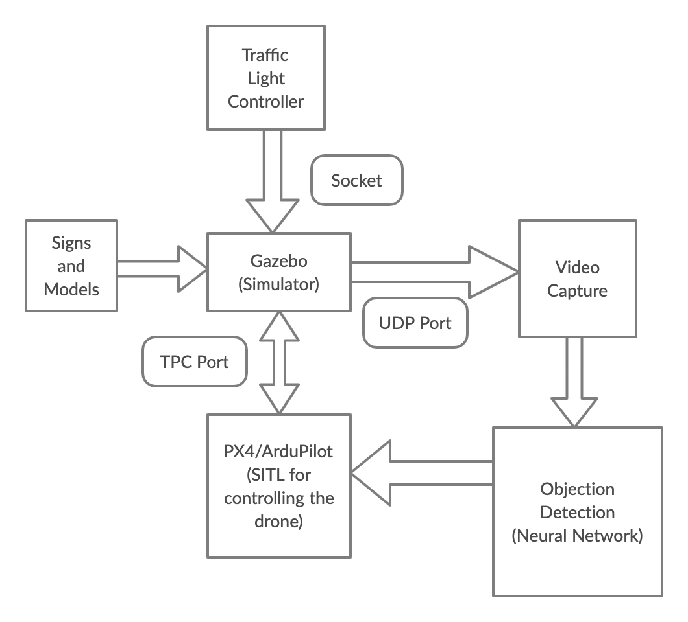

The drone simulation and object detection system consists of several key components,
mainly including Gazebo, PX4 and our neural network set up on a computer system running Ubuntu 18.04.
In addition to this, we have a traffic light controlled plugin for the simulated world to
automatically change the traffic lights in the simulated world.
We have built our system in accordance to our client specifications in which we have translated into user stories.


Our primary objective was to detect signs in a simulated environment and as such,
our user stories revolved around use cases in the perspective of the user as well as other stakeholders.
From the user’s point of view, we wanted to ensure we are reading the signs correctly as well as observing other objects.
This was to be done in a simulated environment for testing purposes.
We also needed to implement changes in the traffic lights to simulate real-world traffic light systems in which our drone can detect changes.

Another consideration was the control of the drone in the simulator in which we can both gather training data and perform testing.
We needed to build a simulator world which matched the client’s description and we inserted signs
throughout the world so that we had variety in testing and training.

The drone we used and built was a preset from PX4 with an inbuilt camera which allowed us to capture a POV
video stream from within the simulator and stream it via a UDP stream.
We then designed a subscriber in Python to receive the stream and feed it into OpenCV.
The design was to then use OpenCV to detect outlines of the signs through bounding boxes which crops the video frame to the sign.
This is then fed into the TensorFlow neural network which classifies the sign.
The purpose of cropping the images is to reduce background noise which results in higher accuracy.
Then from the classification output, we can determine what the drone should do based on the classification
such as stop when detecting a stop sign.

In addition to this, we had training for the neural networks based on a training data set provided by the client
as well as images snapped from the simulator when manually flying the drone around.
This would output a set of training weights which we saved to use in the simulator for testing and demonstration.

The overall requirements of user stories for this project can be defined by the interpretability and degree of
interaction between the client and the simulator, as well as the accuracy of autonomous behaviour of the drone.
Thus, the user stories are written in the perspective of the client as well as the drone.
Client based user stories focus more on the simulator.
For example, as a client, I need to be able to deploy a drone in the simulator so I can observe its autonomous behaviour.
I also need to be able to see the city and the traffic signs at a 1 to 1 scale, so the observed object detection
and movements can simulate a real world.
The fulfillment for these requirements are tested through visual inspection of the simulator.

As for the drone, the requirements are defined by its ability to accurately detect and classify traffic
signs and since it acts autonomously, the user stories are defined from the point of view of the drone itself.
For example, as I drone, I need to detect and recognise the traffic sign in front of me, so I can follow its
required action and obey traffic laws.
I must also fly at 3 metres above the ground and accurately along my given flight path, so I don’t interfere
with humans and other vehicles on the ground.
Once again, the fulfillment of these requirements can be monitored through visual inspection of the drone’s
behaviour and the accuracy of detection are monitored through unit tests and integration tests.

Most implemented user stories agree with the project scope and meet the client requirements.
For the simulator part, we successfully built a simulated city environment in Gazebo and created assets of all
the signs and objects into the simulator.
We also had PX4 drone configured in the simulator and were able to manual control it and capture frames inside
the built world.
We used both OpenCV and Tensorflow for sign detection and all outlined signs and objects were detected.
However, the sign detection accuracy was not 100% , we could detect signs but also had many false positives.

Due to the huge workload of this project and limit of time, our client recognised that the full scope would
be too difficult to implement in one semester, so he reduced the requirements for the sign detection component.
We still need to show him the detection of major signs like stop, parking and left, right turn, but we are not
required to work on speed limit signs, traffic lights and buildings.
We still use openCV and tensor flow for sign detection, but with reduced workload, we are able to produce high
quality detection by using better filters in openCV, fit model in Tensorflow.

Another key change is that the drone is not required to fly autonomously, we can use a keyboard to control to
drone, so we implement drone control using python.
If we type wasd or other keys in terminal, we can control the altitude and movement of the drone, we can
capture video in gazebo as well.

---

# System Sturcture and Architecture #

Our project contains the following 6 main parts:

  1. Gazebo Simulator.
  1. Px4 Auto pilot
  1. Mavsdk and python
  1. Our mission script
  1. OpenCV
  1. TensorFlow

The Gazebo Simulator is the physic engine for the world file as well as the drone.
Px4 Auto-pilot is drone's Operation System, in our project, it runs in a simulated mode.
The px4 itself can also be flashed into a physical drone, but it is out of the scope of our project.

For this project, we are using a drone model `typhoon_h480` from the px4 project, because it supports all features
required for our mission script. `typhoon_h480` is a drone model with streaming and distance sensor support
both are the most critical features we required for our project.
Video streaming for traffic sign classification and distance sensor for object avoidance.

Px4 establishes connection with Gazebo by a plugin included in the px4 project.
The video capability is enabled by a Gstreamer based plugin shipped with the px4 project,
it will create a UDP video stream on local network.


The simulated world is an open-sourced project we found on GitHub.
We modified it by populating traffic we modelled and enable real time traffic controller by a C++ Gazebo Plugin.
The traffic light controller plugin in Gazebo is a TCP server listens on local network.
This allows us to use external controlling scripts to control all traffic light in the simulator.

Mavsdk is the middleware between px4 and our mission script.
It is based on Mavlink protocol. The Mavlink is a drone controlling protocol,
it defines the standard message formats for communicate between grand station and drones.
The mavsdk is using Remote Process Call (RPC) on top of a TCP connection in local network during the simulation
to establish connection between our mission script and px4.


We are using two tools for image processing and classification in this project, OpenCV and TensorFlow.
OpenCV is a computer vision library, it has a rich set of interfaces for image processing.
This allows us to apply different image filters to the video captured inside of the Gazebo Simulator
and crop region of interests based on the finds.

TensorFlow is a neutral network library, for training models and use of this model to classify images.
We are using TensorFlow at the end of the image processing pipeline for classifying images into different
categories, aka different signs or noise.

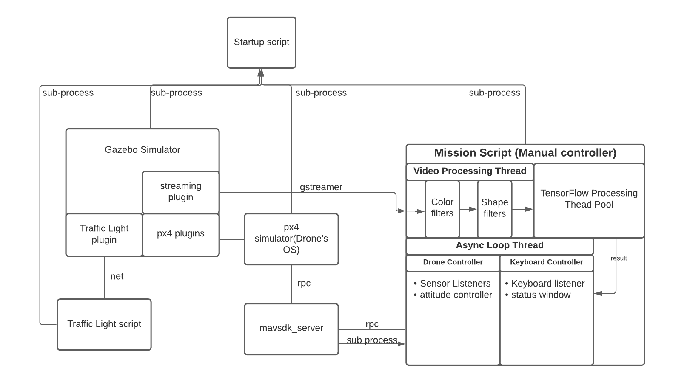

As there are multiple modules involved, all with different setting required.
And modules must be started in particular order.
Therefore, in order to reduce the need for setting for each module,
we are using a start-up script, which will bring up all modules in correct order with correct setting.

The start-up script will start the Gazebo Simulator first, followed by px4, traffic light controlling script,
and the mission script, manual controller at the last.

At the beginning the project, we are using TensorFlow alone to classified image captured from the video stream
mentioned above. We found it is insufficient and inaccurate, as the traffic signs usually only take up only a
small part in an image. In which the background noise dominates TensorFlow's prediction.
This result in an unacceptable accuracy rate.

As a result, we decide to use OpenCV to pre-process the images first.
During the simulation, the drone will extract and crop all regions of interests by using OpenCV first,
then feed those regions of interests to TensorFlow model for further classification.

The approach behind OpenCV is very strait forward, as all traffic signs in our project are some circles or
regular polygon with some noticeable colour, we can find it by apply a colour filter first and then followed by a shape filter.

During implementing the drone controller, we found that,
because the mavsdk-python is an asynchronous library,
in the main event loop, it should not contain any blocking or CPU intensive jobs.
Therefore, we create a dedicated video processing thread.
All OpenCV processing is executed on the video processing thread.

Also, the CPU load for TensorFlow classification code is still quite high even with GPU acceleration,
if we run the TensorFlow classification on the video processing thread as well.
As we have to do a few hundred prediction per second at peak.
The program may be not very responsive during peak load, a thread pool is used to improve the response time.

After TensorFlow classify regions of interests we found by OpenCV, the result will be printed out
on the status window of our manual controller.

---

# Testing #

The full set of actual acceptance tests should be lodged in the repository.
The appendix will give details of how to run acceptance tests.
For usability testing, the full details will be in the Wiki.

All relevant supporting material in appendices should be cross-referenced, cited as appropriate.
(The marker will only read appendices if directed to do so in text body.
Evidence should be hyperlinked to appendices and or bitbucket)

Make sure things are consistent and that there is evidence for all claims you make.

## Neural Net Testing {#sec:testing-neural-network}

The first layer of testing for the neural network component of the object detection is the inbuilt validation testing in tensorflow.
While the model is being trained, it is tested against a validation set every epoch.
From this, we are able to get the validation accuracy and loss, which can be used to judge how many epochs
the model should be trained before it starts to overfit.
In addition, the final testing accuracy against the test set (not the validation set) can be used as a quick
measure of the quality of the model when prototyping different architectures and rapidly training new models.


As an example, we trained a model for 100 epochs and recorded the results.
Here we can see that the validation loss starts to rise after around epoch 10, which suggests overfitting.
We would then retrain the model for 10 epochs.


The second layer of testing is more involved, and is used when fine-tuning the model,
or when comparing multiplemodels that have already been trained.
Essentially, we have a directory of subdirectories (each named after a class that we’re trying to predict),
with images of the relevant class in each.

In the testing script, we have an array of the ‘true’ class labels.
We then generate an array of the ‘predicted’ class labels by running each image through the pre-trained
neural network, each time generating a single prediction on one image.

With these two arrays, we are then able to make a confusion matrix, as shown below.
We can also calculate the unweighted mean F1 score, precision and recall, as well as the F1 score, precision and recall per class.
These are printed to a text log for later inspection. Example output is shown below.


Note that each integer maps to a class.

```
0 = noise
1 = parking-green
2 = speed-10
3 = speed-25
4 = speed-40
5 = speed-5
6 = speed-50
7 = stop
8 = turn-left-blue
9 = turn-right-blue
```

From the confusion matrix, we are able to see specifically which classes are not being predicted well,
and if so, then which class they tend to be predicted to be.
For example, we can see that images of class 8 (turn-left-blue) tend to be predicted as class 7 (stop) and class 0 (noise).
From here we can start to make adjustments to the model or to the data.

Numerical measures of accuracy are also shown below, in the screenshot of the test log.


With this second layer of testing, we are able to identify areas of improvement in the neural network,
even when the testing accuracy may be deceptively high.
For example, if a small subset of classes are not performing well,
but this is hidden in the accuracy measure because the other classes are being predicted well.

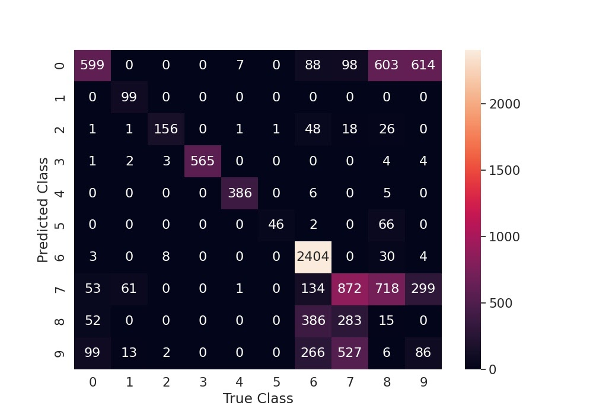

## Integration testing ##

In addition to the testing neural network, we had integration testing for our simulator infrastructure.
The rudimentary integration test we did was testing whether our components were installed correctly and this was
conducted by first trying to start up each individual component separately and see if it would run by itself.
This would output whether any components/dependencies are missing.

The next test was our simulator and traffic light controlled plugin.
This was to ensure that the traffic light controller could send updates to the simulator in order
to change the traffic lights at a set interval.

Another key test that was considered was the sending of frames between the simulator and our frame capture.
However, due to difficulties in setting up OpenCV as well as lack of time, we could not finish
the integration testing for this component.

Our testing was used to ensure that the code we merged was up to standard as we used the tests when reviewing pull requests.
The assigned reviewer would have to checkout the changes and run the integration tests on their set up to
ensure that it was not breaking the system before approving the merge.

Ideally, we would’ve liked to automated this process of continuous integration however we could not
set up a separate Ubuntu machine pre-installed with our components and dependencies such as Gazebo to run the tests.
This is primarily due to a lack of resources as well as limited knowledge of the team in setting continuous integration processes.

---

# Tools Used #

## Programming Languages ##

1. Python

    The majority of this project is using python.
    Libraries including OpenCV and Tensorflow are imported into python programs for sign detection.
    OpenCV-Python is a library of Python bindings designed to solve computer vision problems.
    The idea is to use OpenCV to detect regions of interest in frames from the video feed,
    and then use these frames as input to the neural network to predict which traffic sign is in that frame.
    For now, we are using a pure TensorFlow implementation, which OpenCV to be integrated later.
    TensorFlow is a framework designed to ease the implementation and operation of machine learning workloads.
    Our back-end object detection models are written using Python 3 with the TensorFlow library and trained
    on image datasets retrieved both externally and from image captures within the simulator.
    The training weights are then loaded back into the simulator for real time image classification.

1. OpenCV

    OpenCV-Python is a library of Python bindings designed to solve computer vision problems.
    The idea is to use OpenCV to detect regions of interest in frames from the video feed,
    and then use these frames as input to the neural network to predict which traffic sign is in that frame.
    For now, we are using a pure TensorFlow implementation, which OpenCV to be integrated later.

1. TensorFlow
    TensorFlow is a framework designed to ease the implementation and operation of machine learning workloads.
    Our back-end object detection models are written using Python 3 with the TensorFlow library and trained
    on image datasets retrieved both externally and from image captures within the simulator.
    The training weights are then loaded back into the simulator for real time image classification.


1. Shell

    A number of shell scripts are used to set up the environment and install packages required.
    We also use shell to start up the simulation and control the drone by typing commands in shell.

1. C++

    Gazebo itself is written in C++ and a traffic light controller plugin was also written externally
    in C++ which controls traffic light models.

1. XML

    The world we use in Gazebo is structured by a world file written in XML.


## Database tools ##

Because of the nature of this project, the team does not directly use any database tools.
However, our client provided us a large pool of traffic signs for model training and we combined those
with our own data to train a better model.


## Source code management ##

All source codes developed in this project were managed by Bitbucket, which is a git based hosting and collaboration tool.
The team used this as a version control and issue tracking system.
We also used the extended feature of Bitbucket like Wiki to document our files.

## Other tools ##

1. PX4

    PX4 is the firmware for the drones we are controlling and provides the autopilot functions.
    The external PX4 project is shipped with a Gazebo plugin which is required by our project.
    It includes Gstreammer, which is a streaming plugin used for capturing a live stream from the drone
    and a MAVLink interface plugin for controlling the drone.

1. Gazebo

    Gazebo is the simulator we use for simulation.
    Gazebo itself is written in C++ and can be extended via plugins which can extend its features including the ability to
    mutate the texture of various models.
    A traffic light controller plugin was also written externally which controls traffic light models.
    The Gazebo simulator is also shipped with some models that are useful for our project such as the traffic light model itself,
    which is supplied by Gazebo, allowing us ot save time on modelling.

1. Blender

    Blender is a 3D modelling tool that we used for modelling the traffic signs.
    The simulator does not ship with any traffic signs that are required by our project and therefore we had to build our own.

1. Trello

    We record and update our user stories on Trello.

1. Slack

    Slack is used for formal group discussion on project related topics.

1. Discord

    Our client has a discord server with all capstone groups related to drone simulation.
    This channel is also the preferred method for informal communication with the client.

1. Messenger

    Our group has a messenger group for informal, instant contact.

1. Google documents

    Our group uses Google Docs for collaborative document writing.
    The completed document then gets transferred to our Bitbucket wiki.


# Discipline Knowledge and Information Search #

## Neural Network Architecture ##

The image detection part of the project requires computer science knowledge in neural networks.

It is essentially an image classification problem,
which is a well-studied field, with many algorithms being used to solve it.
In recent years, convolutional neural networks have been used to tackle this non linearly-separable problem, to  great results.

A neural network is a network of connected layers of nodes, with each node holding a randomly initialised weight.
There is an input layer, an output layer, and any number of hidden layers in between, with any number of nodes.
In a nutshell, when the network is trained on one point of data (in this example it is an image),
a prediction is made based on the activation functions of each layer being propagated forward to the output layer.
The activation values of each node in the output layer is compared to the target activation (based on the ‘true’ label of that image),
and the cost function of the difference is used to ‘nudge’ the weights of each node in the right direction.
This is called backpropagation, and is how a neural network learns.

A convolutional neural network is a neural network with convolutional layers.
Convolution is typically used to reduce the size of the image while retaining important features.
In other words, convolution is used to capture the spatial and temporal dependencies in an image through the application of filters [^ref/saha-s].

A filter, or kernel, is defined as a matrix of numerical values.
This kernel moves across the image (which can be thought of as a 2D array of numerical values),
from left to right, going down the rows, until the whole image is traversed.
At each step, a single value is computed based on the values in the kernel and the ‘window’ of the original image.
These values are then put together into a convoluted image, which is then fed forward to the next layer in the neural network.

Knowledge of convolutional layers and neural networks in general is required for this project,
specifically to be able to design the architecture of the neural network,
decide on which activation functions to use for each layer,
and adjust hyperparameters such as the dimensions of the kernel used in convolutional layers.


Existing tools to solve this complex problem include TensorFlow,
which is a Python library which allows for easy and modular implementations of neural networks.
It allowed us to quickly and rapidly prototype and test different neural network architectures.
Note that we set up GPU acceleration, which allowed us to train quickly compared to using only a CPU.

Our final architecture has 3 convolutional layers and 1 fully connected layer, interspersed with pooling layers.
This is somewhat similar to architectures such as LeNet [^ref/wiki/lenet].


## Neural Network Testing ##

As explained in the testing section above, the second layer of testing the neural network involves generating a confusion matrix,
and also calculating the F1 score, precision and recall of each class, as well as the unweighted mean across all classes.

This is a statistical approach to testing, which requires data science knowledge in measures of accuracy and model evaluation.


---

# Group processes #

## Challenge and Risk analysis

The challenges regarding sign detection largely revolved around a lack of domain knowledge in the computer vision department.
The neural network development within the simulator had a long period of unreliable classification results despite the same model
producing acceptable test results on still images.
This was due to the inability to locate a region of interest for the sign within the camera frame of the drone which resulted
in background images having a significant influence in the classification of the sign in the frame.
Due to our lack of experience with openCV, we were unable to judge the complexity of introducing an openCV layer and were
indecisive about whether to learn and program the openCV layer, or to continue with a TensorFlow only approach.
After communicating these issues with our client, he was able to provide us with openCV code produced by other groups,
which we modified and implemented into our framework.

## Limitations in functionality

The drone is capable of being controlled manually using arrow keys or through scripts that give a set list of drone commands.
However, the final product lacks the ability to fly autonomously in response to traffic signs as intended by our original project scope.
This is due to time constraints as we were only able to obtain reliable sign detection and recognition fairly late into the project.
Additionally, the accuracy of the sign detection model within the drone is still under the acceptance level of 80% accuracy to warrant
the addition of autonomous flight as a reliable feature.

The drone is capable of classifying parking signs and speed limit signs reliably but has medium to low accuracy for turning signs and stop signs.
Detection and classification for traffic lights, buildings and vehicles have not been implemented as they have been deemed out of
scope by our team and our supervisor.
The classification accuracy for stop signs and turning signs could be improved by increasing the volume of data and additional image pre-processing.
In order to implement detection for buildings and vehicles, additional firmware such as a proximity sensor
may be required to distinguish between small and large objects at varying distances.
Due to the time constraints we were under and the number of components already present,
it was unfeasible to introduce another component that could have the potential to clash with our existing framework.

## Limitations in structure, design, implementation

The lack of reliability for the detection and classification of some of the signs could be attributed to the simplicity of the framework.
Since the OpenCV layer was introduced quite late into the project,
only a colour filter and shape filter are utilised and not a lot of time could be spent to
fine tune the parameters and add additional layers.
Additional work would need to be done to the OpenCV layer to ensure less false negatives are made so all potential
signs could be detected and fed into the classifier.
One possible method is through the addition of Hough transforms so more detailed features within the signs could be extracted.
The CNN model could also be further improved by increasing the size and balance of the dataset and adding further
image pre-processing techniques and tuning of hyperparameters.


---

# Individual Contributions #


# Appendices # {-}

## A1. [User stories][user-story-trello] {-}

### Client Specifications {-}

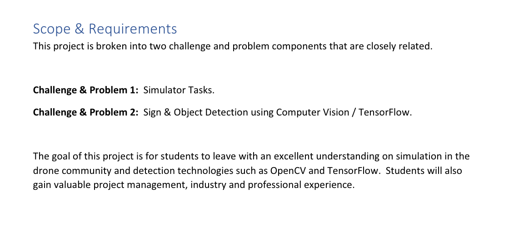
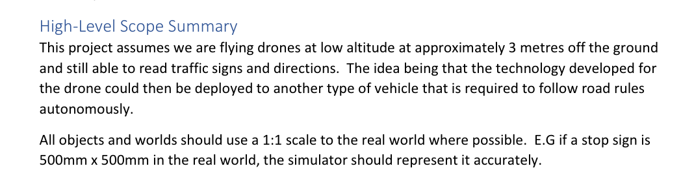
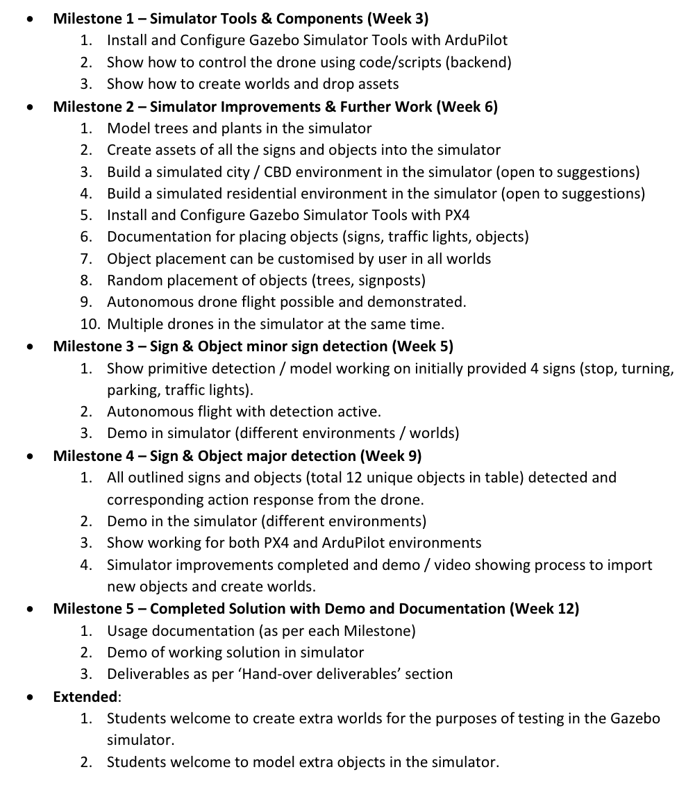

### User stories {-}

Completed:

- As a developer. I need to setup a development environment, so I can work on the project.
- As a drone, I can move precisely so I can follow exactly my intended path and not collide with other objects.
- As a user, we need a world with traffic signs, so that we can test traffic sign detections on drones.
- As a drone, I need to fly around 3m in altitude off the ground, so I do not  hit humans/cars and also not interfere with other aerial vehicles.
- As a traffic light, I want to change color in some intervals, so I can simulate real-world traffic lights and use it to test our traffic light detection.
- As a client, I want to see traffic signs in the simulator, so that sign detection can be done in the simulator and build the detection algorithm.
- As a client, I want all objects and worlds to use a 1:1 scale to the real world where possible, so that we can implement them in the real world.
- As a client, I need a simple city with some buildings, trees, so I can simulate the real world for my drone set up.
- As a client, I need an easy way to start simulation, so I can run the simulation without difficulty and quickly ensure it works.
- As a drone, I can report the number on speed limit signs, so I know what is the legal speed to travel.
- As a drone, I need to detect turning signs, so I can follow the flow of traffic and not collide with other drones/vehicles.

Incomplete:

- As a client, I need 100% object detection rate, so I can clearly know whether the drone should be obeying traffic directions.

Out of Scope:

- As a drone, I need to be able to operate autonomously to improve the efficiency of the control of the drone
- As a drone, I need to stop and park at a parking sign, so I can drop off packages or return to the landing site.
- As a drone, I want to turn in the direction of the sign immediately when i see a sign,
  so I can follow the flow of traffic and not collide with other objects.
- As I drone, I must be able to avoid vehicles and other drones, so I do not collide and cause accidents.
- As a drone, I need to be able to avoid trees and buildings, so I do not collide and cause crashes.
- User is able to define how the drone responds to different signs, so that if traffic laws change, we can also adapt it for our system.
- As a drone, I need to respect traffic lights, so I do not cross into opposing flow of traffic and cause accidents.

## A2. Research, studies of similar systems {-}

### Neural Net theory {-}

This section will be a summary of the knowledge gained from researching into neural networks,
and how the knowledge was applied in the project. It is essentially a condensed version of [section @sec:testing-neural-network] of this report.

Research into how different data can affect the performance of a model was used to compare two different models,
one trained on full-frame images only, and one trained on full-frame images in addition to images containing only signs.
Due to the size of the model weight binaries, the model weights were not committed to git.
As evidence, here we attach two performance graphs, one for each model as explained above.
The first is for the model trained on full-frame images only.

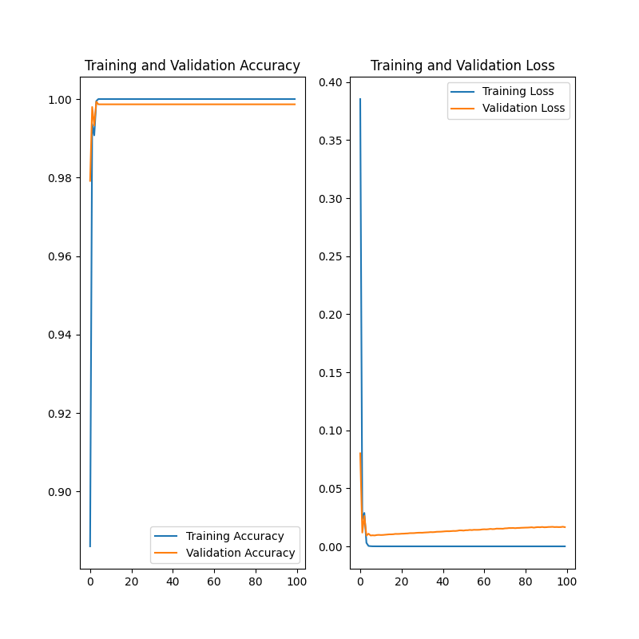
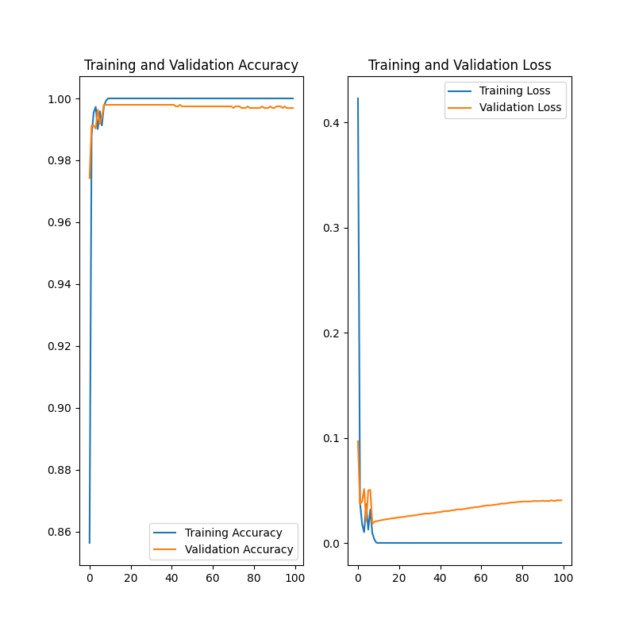

We also researched into the theory behind convolutional neural networks, as explained in [section @sec:testing-neural-network].
One of the important readings is Sumit Saha's article *A Comprehensive Guie to Convolutional Neural Networks — the ELI5 way* [^ref/saha-s].

We also looked into existing architectures such as LeNet[^ref/wiki/lenet] and AlexNet[^ref/wiki/alexnet]

Knowledge gained from this research include learning the effects of tuning parameters to the performance of the model.
These parameters include the number of convolution layers and the size of the filters,
the number of hidden layers and the number of nodes in each one, and the different types of activation functions.

This allowed us to experiment with designing our own architectures.
For the reasons stated above, we did not commit the model weight binaries to git.
As evidence, attached is the performance graph of our own model.

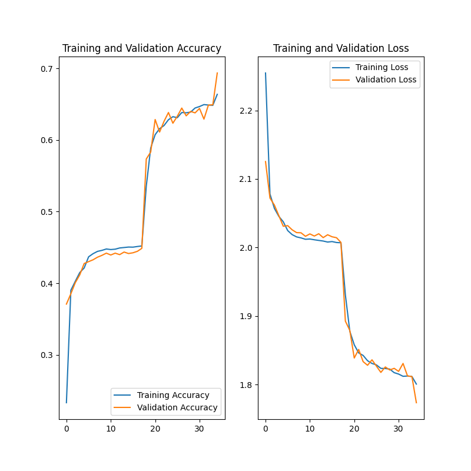

Knowledge of statistical evaluation metrics also allowed us to implement a better way of testing,
details are in the following [section @sec:A3]. This is related in commit [45d3141][45d3141].

## A3. Unit testing summary {#sec:A3 .unnumbered}

### Neural Net test {-}

As discussed in this report and with our tutor and client over the course of the semester,
due to the nature of our project, the classic method of unit testing does not really map well to what we are trying to achieve.


Nevertheless, we did our best to implement some sort of unit testing.
An example that is described in the main report is the testing of the neural network.
In this Appendix section, we attach the test results of our final model.

Note: Due to space constraints, we decided as a team not to commit models to the repo.
The repo will freeze once the 2GB limit is reached,
and this happened once when we were still committing our trained models’ weights binaries,
unaware that the size would quickly accumulate.

The weights binary of the final model can be found [here](https://drive.google.com/drive/folders/1DMvKe5ccxUgHKO4TKUjxAzRSMg9YMGGQ?usp=sharing).

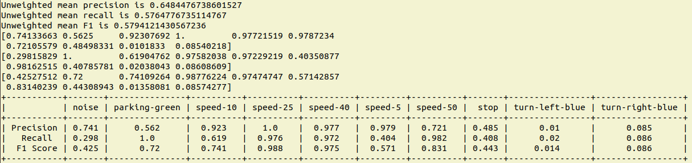


## A4. Acceptance Testing {-}

Before we merge any code into the master branch, it is required to be approved by the reviewer.
We set up rules amongst our team that in order for it to be approved, the reviewer must check out
the code locally and run the integration tests and unit testing for both the simulator and neural network before merging.
This way, we preserved code quality and ensured that our changes did not ‘break’ parts of the project
as well as meet client expectations.

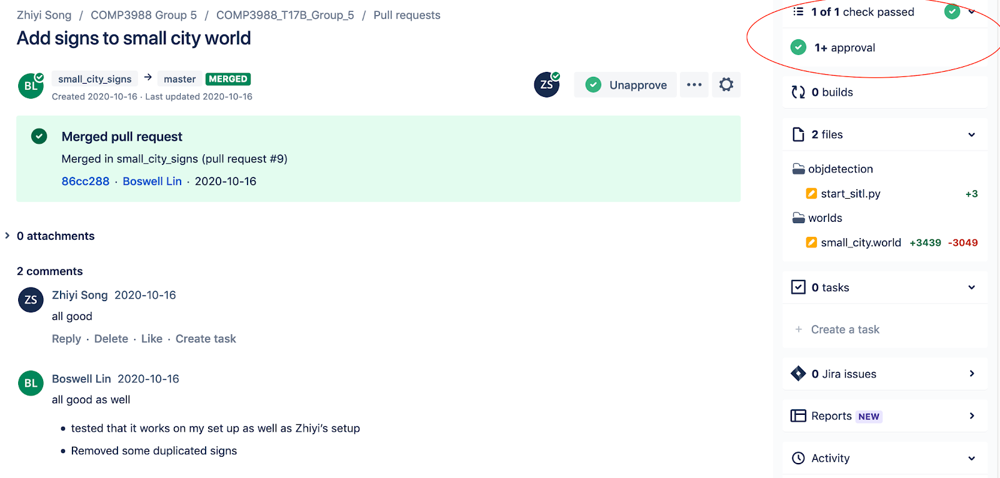

The results from the integration testing script is outputted to the terminal and this can be used to
verify that the changes and the environment set up is correctly configured.

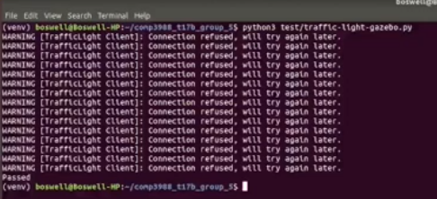
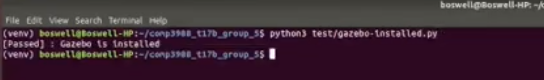

## A6. Documentations {-}

### For User ### {-}

 - **Setup**: [Setting Up Environment][doc/setup]
 - **Run**: [Start Simulation][doc/start-simulation]

### For Developer ### {-}

 - [Setting up TensorFlow GPU][doc/setup-gpu]
 - [Traffic Light Control Plugin][doc/traffic-light-plugin]
 - [Map of Traffic Signs/Lights for Simulator World][doc/map]
 - [Add Model][doc/add-model]
 - [Manual control][doc/manual-control]

## A7. Contribution Tables ## {-}

### Group Contribution tables {-}

#### Technical {-}

| week | Gio | Zhiyi | Boswell | Yexin | Martin | Steven |
|------|-----|-------|---------|-------|--------|--------|
| 3    |     |       |         |       |        |        |
| 4    |     |       |         |       |        |        |

#### None-Technical {-}

#### Zhiyi's Individual Contribution Table #### {-}

| Week | Most Important Task                                                 | Evidence                                                                                                                                                                          |
|------|---------------------------------------------------------------------|-----------------------------------------------------------------------------------------------------------------------------------------------------------------------------------|
| 2    | set up in virtual machine                                           |                                                                                                                                                                                   |
| 3    | install Ubuntu on bare metal, and setup again, Setup Manual in wiki |                                                                                                                                                                                   |
| 4    | Modelled all traffic signs                                          | [268deb9][268deb9]                                                                                                                                                                |
| 5    | Traffic Light Controller                                            | [41864fa][41864fa], [Documentation of Controller][doc/traffic-light-plugin]                                                                                                       |
| 6    | Video capture, startup script and drone controller                  | [wiki for startup script][doc/start-simulation], [precise drone control][44e3c6f], Improvement of traffic sign models: [d9853af][d9853af], [c1ea742][c1ea742], [6fc3fd9][6fc3fd9] |
| 7    | Manual Controller                                                   | [66be9b9][66be9b9]                                                                                                                                                                |
| 8    | improvement of manual controller                                    | [6ac7c29][6ac7c29]                                                                                                                                                                |
| 9    | collecting data for training model                                  | [data](https://drive.google.com/drive/folders/1NeOuPnEkn5OfmxDkQvhphWcYZutKVZ_Q?usp=sharing)                                                                                      |
| 10   | Integration test frame work                                         | [465995f][465995f]                                                                                                                                                                |
| 11   | opencv filter                                                       | [c745d58][c745d58]                                                                                                                                                                |
| 12   | collecting data for traning model                                   | [data](https://drive.google.com/file/d/1gN5BMscKR1PJ1508m4aI2EIglZJvHEyJ/view?usp=sharing)                                                                                        |

#### Gio's Individual Contributions Table {-}


| Week | Most Important Task                                                            | Evidence                                                                                 |
|------|--------------------------------------------------------------------------------|------------------------------------------------------------------------------------------|
| 3    | Dual-booting Ubuntu 18.04, initial setup of dev environment                    | Self-evident from being able to develop                                                  |
| 4    | Initial Neural Net Setup                                                       | [bb2ffd9][bb2ffd9]                                                                       |
| 5    | Data Cleaning                                                                  | [f11798d][f11798d]                                                                       |
| 6    | Integration/Realtime Prediction                                                | [55fbefb][55fbefb]                                                                       |
| 7    | First Integration Milestone (TF + drone camera) and Better Data Collection     | [Youtube](https://www.youtube.com/watch?v=P-4iJHQQJsM&feature=youtu.be)                  |
| 8    | General Housekeeping                                                           | [f8e936a][f8e936a]                                                                       |
| 9    | Neural Network Data Experimentation (evidence is trained model binary)         | [Google Drive](https://drive.google.com/drive/folders/11xijhQXDehNns3DiexL4LuTfiv_nOR3Q) |
| 10   | Neural Network Architecture Experimentation (evidence is trained model binary) | [Google Drive](https://drive.google.com/drive/folders/15igGHxYyoEj1gAAJAFfHCqGeJ6jhj7G1) |
| 11   | Integration Attempt                                                            | No commit as the code was not functional                                                 |
| 12   | Integration Milestone and Statistical Testing                                  | [45d3141][45d3141]                                                                       |
| 13   | Ran half of the tech demo                                                      | [Google Drive](https://drive.google.com/file/d/1amBgJFSAYQBfKab-WHLyONQ-3nE-iAqx/view)   |

## A8. Individual Reports {-}

- [Boswell Lin](https://bitbucket.org/zson5784/comp3988_t17b_group_5/wiki/reports/individual_final/Boswell%20Lin.md)
- [Gio Picones](https://bitbucket.org/zson5784/comp3988_t17b_group_5/wiki/reports/individual_final/Gio%20Picones.md)
- [Martin Chai](https://bitbucket.org/zson5784/comp3988_t17b_group_5/wiki/reports/individual_final/Martin%20Chai.md)
- [Steven Condell](https://bitbucket.org/zson5784/comp3988_t17b_group_5/wiki/reports/individual_final/Steven%20Condell.md)
- [Zhiyi Song](https://bitbucket.org/zson5784/comp3988_t17b_group_5/wiki/reports/individual_final/Zhiyi%20Song.md)
- [Yexin Mao](https://bitbucket.org/zson5784/comp3988_t17b_group_5/wiki/reports/individual_final/Yexin%20Mao.md)


[^ref/saha-s]: Saha, S. Dec 16, 2018, A Comprehensive Guide to Convolutional Neural Networks — the ELI5 way,
[Link](https://towardsdatascience.com/a-comprehensive-guide-to-convolutional-neural-networks-the-eli5-way-3bd2b1164a53)

[^ref/wiki/lenet]: Wikipedia. LeNet. [Link](https://en.wikipedia.org/wiki/LeNet)

[^ref/wiki/alexnet]: Wikipedia. AlexNet. [Link](https://en.wikipedia.org/wiki/AlexNet)

[user-story-trello]:https://trello.com/b/Y8qWmnWG/user-story

[doc/setup]:https://bitbucket.org/zson5784/comp3988_t17b_group_5/wiki/docs/Setting%20Up%20Environment.md

[doc/start-simulation]:https://bitbucket.org/zson5784/comp3988_t17b_group_5/wiki/docs/Start%20Simulation.md

[doc/setup-gpu]:https://bitbucket.org/zson5784/comp3988_t17b_group_5/wiki/docs/tensorflow_GPU_setup.md

[doc/traffic-light-plugin]: https://bitbucket.org/zson5784/comp3988_t17b_group_5/wiki/docs/Traffic%20Light%20Control%20Plugin.md

[doc/map]:https://bitbucket.org/zson5784/comp3988_t17b_group_5/wiki/docs/Map%20of%20Traffic%20Signs%20in%20World.md

[doc/add-model]:https://bitbucket.org/zson5784/comp3988_t17b_group_5/wiki/docs/Add%20Models.md

[doc/manual-control]:https://bitbucket.org/zson5784/comp3988_t17b_group_5/wiki/docs/Manual%20Control.md

[45d3141]:https://bitbucket.org/zson5784/comp3988_t17b_group_5/commits/45d3141a3dda8abaffc15016fb3e880947f5d743

[41864fa]: https://bitbucket.org/zson5784/comp3988_t17b_group_5/commits/41864fa1609582e540d01fb289c9ca3ecab0c5ce

[268deb9]:https://bitbucket.org/zson5784/comp3988_t17b_group_5/commits/268deb9a6d128f51ec721f7af3776f83b85b8bb2

[08459c6]: https://bitbucket.org/zson5784/comp3988_t17b_group_5/commits/08459c632d8772f85e70425c7ac5de1c307dbffe

[44e3c6f]: https://bitbucket.org/zson5784/comp3988_t17b_group_5/commits/44e3c6fbd2005a90b1d85af9c4488eb1cbcfe329

[d9853af]:https://bitbucket.org/zson5784/comp3988_t17b_group_5/commits/d9853af4e25bbac65415d83255ed0355ff7dde17

[c1ea742]:https://bitbucket.org/zson5784/comp3988_t17b_group_5/commits/c1ea7426b0fa74aad6a5309042c1aa2d55c366a5

[6fc3fd9]:https://bitbucket.org/zson5784/comp3988_t17b_group_5/commits/6fc3fd9bd8aeb7846a03ea674fd2d30cb79dd9e5

[66be9b9]:https://bitbucket.org/zson5784/comp3988_t17b_group_5/commits/66be9b9e975e706878f8066ed6645c41bc056caf

[6ac7c29]:https://bitbucket.org/zson5784/comp3988_t17b_group_5/commits/6ac7c29e5c6fe027c321ef5ba06ad0da558a3ea3

[465995f]:https://bitbucket.org/zson5784/comp3988_t17b_group_5/commits/465995f39447fd1e4ee90f57f4999f0cf353e790)

[c745d58]:https://bitbucket.org/zson5784/comp3988_t17b_group_5/commits/c745d5879d3226f5407bc2d26b5cfe9934033e09)

[bb2ffd9]:https://bitbucket.org/zson5784/comp3988_t17b_group_5/commits/bb2ffd943e2da4fc2d0dce324f1e0d3defa38f1b

[f11798d]:https://bitbucket.org/zson5784/comp3988_t17b_group_5/commits/f11798d541ac953799707412971e9f02386cc4dd

[55fbefb]:https://bitbucket.org/zson5784/comp3988_t17b_group_5/commits/55fbefb4ae9ac2820d20a1d8570bb1ae8c5bba71

[f8e936a]:https://bitbucket.org/zson5784/comp3988_t17b_group_5/commits/f8e936aeade548b4438f964918b00950543e0f11

[45d3141]:https://bitbucket.org/zson5784/comp3988_t17b_group_5/commits/45d3141a3dda8abaffc15016fb3e880947f5d743

[PR #7]: https://bitbucket.org/zson5784/comp3988_t17b_group_5/pull-requests/7