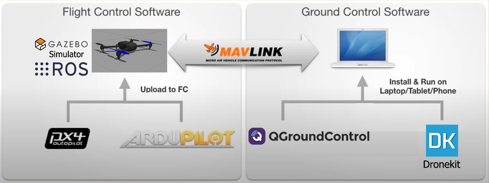
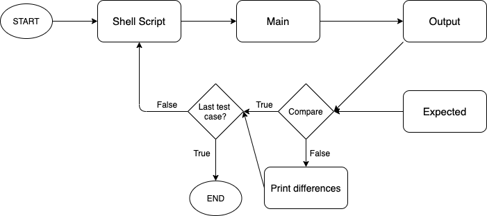
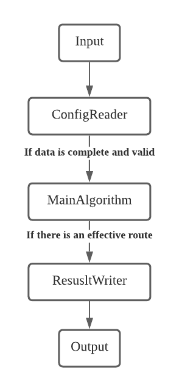
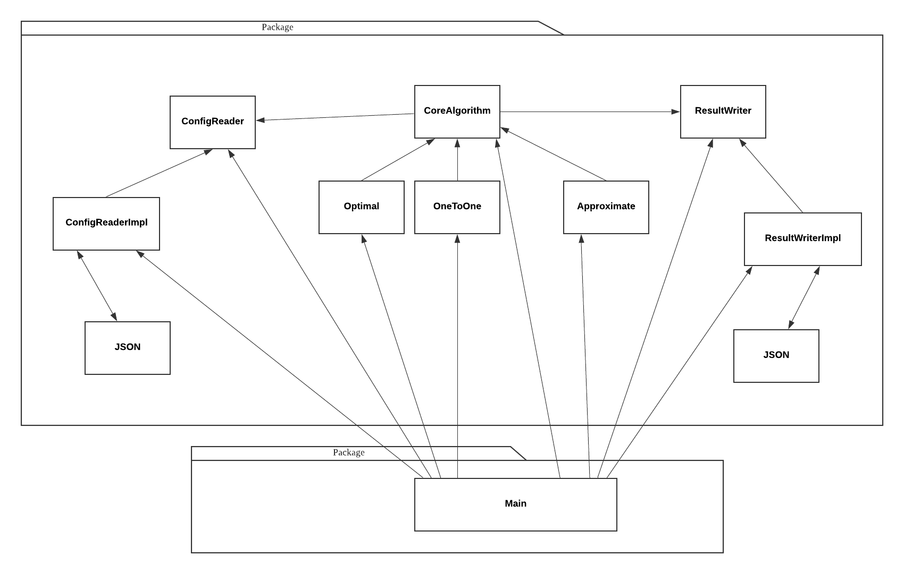

SEARCH YOUR NAME TO FIND WHAT TO DO

Executive Summary
=================

**Project Title:** CP34 - Optimal Path for Drone Delivery

**Team Members:**

-   Dylan Duplessis

-   Nicholas Hui

-   Ivan Xu

-   Jimmy Liu

-   William Wu

-   Justin Lee

Summary
-------

There is a rapid growth in the technology industry opening many opportunities for experimental drone development. This project assumes we are flying drones at various altitudes where they are constantly calculating battery level, nearest charging stations, and distance to the next way-point. The final goal of the project is to allow a fleet of drones to autonomously deliver parcels to destinations in the most optimal way considering different factors such as weather conditions, battery life, and accurate distances. This project is not concerned with object detection, but rather the algorithm to compute the shortest path given a number of parameters previously mentioned. However, collision avoidance between drones and objects will be considered.

Table of Contents
=============

1. [Introduction](#introduction)
2. [System Specifications and Design](#system-specifications-and-design)
3. [Quality of Work](#quality-of-work)
4. [Quality of Group Processes](#quality-of-group-processes)
5. [Contributions](#contributions)
    - [Jimmy](#jimmy)
    - [Dylan](#dylan)
    - [Nicholas](#nicholas)
    - [Ivan](#ivan)
    - [William](#william)
    - [Justin](#justin)
6. [Appendices](#appendices)
    - [A1 - User Stories](#a1)
    - [A2 - Acceptance Testing](#a2)

Introduction
============

Aim
---

The project undertaken is the optimal path for drone delivery which requires us to implement autonomous drone flight with built-in object detection and collision avoidance within simulated worlds. The goal is to compute and navigate the shortest path from a starting position to a number of way-points landing at charging stations along the way if necessary. Using the Gazebo simulator, a couple of flight stacks such as PX4 and ArduPilot, and help from various online communities, we have tackled a variation of the infamous traveling salesman problem and set out to create a product our client will find useful. The problem to be addressed is the drone being controlled autonomously, flying to avoid obstacles and reach way-points without running out of battery in the shortest time possible. This project is not too concerned about object detection but rather focused on the algorithms for pathfinding where collision avoidance between drones and buildings is considered. In order to resolve this problem, we have planned to use a reduction of the Dijkstra algorithm which outputs the shortest path, given way-point and charging station locations. The goal of autonomous drone flight is broken down into subtasks such as algorithm design, simple drone navigation, and collision avoidance. Each week, a predetermined milestone will be reached by working on each subproblem and the smaller tasks associated with them, and as each is resolved, the solution is tested and documented. This process is borrowed from XP principles, it ensures a higher quality of work and motivates us to continuously improve.

Key stakeholders
----------------

### Who are they?

Stakeholders include, but are not limited to:

-   Client

-   Delivery Companies

-   Relevant Communities (e.g. PX4, ArduPilot, Gazebo)

-   Development Team

### What do they do?

In the modern world, delivery companies would benefit from an updated delivery system. By using a drone with an optimal path for delivery, companies can achieve a cost-efficient and improved delivery time. As drones are not limited to ground traffic they would be more efficient in performing door-to-door deliveries especially considering that multiple drones can be deployed. Additional benefits would be the reduction of manual labor as drone delivery will be automated, and the increase of job opportunities as drones will require mechanics and software engineers. A reduction in the company's carbon footprint is also an attractive benefit as it is a growing global concern. With the growth of drone technology, communities and development teams can focus more on the automation of drone development and path optimisation. Being able to find an optimal path for drones considering external factors such as weather conditions and obstacles, will greatly benefit the drone community and delivery companies. Additionally, as technology progresses, interest in drone technology, and the technology itself, will become more prevalent, and as a result, online drone communities and companies would reap benefits from this project as they can build upon the work completed and explore exciting new avenues.

### How do they interact?

By following our extensive documentation on simulator usage and configuration, flight control software, and the algorithm we designed, delivery companies are able to simulate worlds of interest and test out optimal paths for drone delivery.

Relevant communities, including those concerned with drones or pathfinding algorithms, can use our project as a reference for further research and development. The foundation we have provided will be of great value, enabling these communities to reach further and strive to achieve bigger things.

Identification of resources and risks involved in the project
-------------------------------------------------------------

The drone model used is an iris model, the default model Gazebo provides. If users have a different model, they will have to change the drone model in the simulator and the flight control software, as different models will have different constraints affecting the pathfinding algorithm. The Civil Aviation Safety Authority (CASA) is responsible for drone safety rules and regulations. As a result, users must be well aware of these constraints and strictly comply. Users must attain a license to fly drones, as per these rules and regulations. By making this project widely available, while it encourages the use of drones and development, the risk of more unlicensed drone users increases. Furthermore, personnel associated with the university cannot fly a drone without a remote pilot license, since the university is a registered organisation with CASA. Resources available in the project include but are not limited to.

-   Feedback from the tutor,

-   Feedback from the client,

-   Discord channel which has industry experts and students from other project groups,

-   PX4 and Ardupilot forums and online communities,

-   Other related publicly available GitHub repositories

-   Edstem discussion forum.

System Specifications and Design
================================

Core Requirements
-----------------

1. As a user, I want to be able to use both ArduPilot and PX4 drones
    for delivery so I have a broader choice of drones.

2. As a user, I want the Gazebo simulator to be fully functional and
    configured with PX4.

3. As a user, I want the Gazebo simulator to be fully functional and
    configured with ArduPilot.

4. As a user, I want to be able to control the drone by doing
    coordinate based or point to point navigation in the simulator.

5. As a user, I want to be able to have different weather conditions in
    the simulator so that I can simulate the delivery in different
    environments.

6. As a user, I want to have a plan of how to achieve the optimal path
    and include base stations and proof of concepts in the simulator.

7. As a user, I want to have a charging station model in the Gazebo
    simulator so that I know what a charging station looks like.

8. As a user, I want to be able to control the drone using code/scripts
    so that I don’t have to manually control the drone.

9. As a user, I want to be able to create worlds in Gazebo with
    variable spawning locations for charging stations and delivery way
    points.

10. As a user, I want autonomous drone flight to be possible so that
    the whole delivery process is automated.

The scope document provided high-level functional and non-functional requirements that were turned into user stories. Additional user stories were added throughout the project as they revealed themselves through integration testing, or if the client specifically asked for them. These are short and concise representations of the client's needs. Each week, the relevant user stories were broken down into work items - functional tasks to be completed. Some user stories had up to 5 tasks where their value was determined by their testability and correlation to the acceptance criteria. They were aimed at being bite-sized and estimable through simplification of tasks and resulting subtasks, as appropriate. Due to the nature of the elicitation of these tasks, it can be assumed they have the client's rationale.

Completed user stories were evaluated against the set of acceptance criteria. Please find the list of completed user stories in appendix A1.

**Functional Requirements** TODO: EXPRESS THESE AS USER STORIES - IVAN

- Modelling objects such as the charging station and worlds,

- Documentation,

- Autonomous drone flight,

- Randomised locations of charging stations given specific parameters,

- Object detection and decision making.

**Non-Functional Requirements** TODO: IVAN EXPRESS THESE AS USER STORIES AND ADD MORE

- Readability: Code should be well documented and re-factored such
    that it is simple to read.

Constraints
-----------

- Infeasibility: The base problem of optimal path for drone delivery is at least as hard as TSP(traveling salesman problem), which does not give optimal results in polynomial time. We decided to go with an approximate algorithm (the result is likely to be optimal but not guaranteed to be) as well as implementing a branch-and-bound styled algorithm (i.e. using memory to record the current optimal path to avoid path exploration) to reduce significantly the time cost of the algorithm. All of these changes have been approved by the client.

- Reliability: The connection to the drone is unreliable, sometimes needing to retry the connection before it is successfully established. This is an undefined behaviour of the Gazebo simulator, and is documented as such.

- Scalability: The user should be able to render larger worlds with more drones and have the algorithm work just as effectively.

- Usability: The system should be intuitive and easy to use such that a user without technical expertise would be able to quickly learn and utilise the delivery system. This would involve implementing a single point of execution. EXPAND ON THIS - DYLAN

- The drone control program cannot control both ArduPilot and PX4 drones as they differ in their handling of API messages, requiring specific implementation for each flight stack.

- Gazebo, ArduPilot and PX4 work best with Ubuntu 18.04, as it has the most reliability being the most tested OS with respect to the required software.

TALK ABOUT BLUEPRINTS IN SPAWNER READING SDF FILES RESULTING IN HARDCODING XML - DYLAN

Systems’ Architecture
---------------------

**How we Designed the System**

The system consists of:

Gazebo 9
Flight Control Software: PX4 and ArduPilot
Ground Control Software: QGroundControl
Dronekit: A Python Library
ROS
World Generator: A software developed, commonly known as the spawner.
Automated Navigation Script: A software developed, commonly known as the mission script.

Flight control software includes PX4 and Ardupilot, which are both autopilot systems that control the drone by sending instructions. Ground control software refers to QGroundControl which communicates the route for the drone to follow and displays the drone’s telemetry data. It can also provide manual control of the drone. Dronekit, a Python library, utilises MAVLink APIs to communicate directly with the drone to send flight instructions/flight plans to the flight control system. The flight control and ground control software communicate through MAVLink, which is a messaging protocol that allows for the sending of flight instructions and receiving of drone telemetry data. The Gazebo simulator, which deploys a custom environment represented as an XML file, simulates one or more drones flying as well as physics properties such as wind and gravity, terrain, objects, obstacles, and charging stations. In order to run Gazebo with PX4 and spawn multiple drones at specified locations, the system also required ROS, which is a library that helps to automate the process of running Gazebo and PX4 with a specific configuration. Finally, the two software developed during the lifespan of this project, the World Generator, and the Automated Navigation Script. The former is a python program that accepts a number of parameters and flags to procedurally generate objects within any Gazebo world file. These objects are charging stations and delivery way-points. The latter is also a python program that uses Dronekit to automate the process of connecting to the drone and autonomously execute the delivery.

Below you'll find two diagrams that capture the relationships between the described system. The first of which portrays the high-level system architecture of the system. The second describes a flowchart depicting a lower-level usage of the system components.

[fig:sys1]

 [fig:sys2]

**How we Implemented the System**
The implementation of this system is visualised by the simple workflow seen below. There are two points of execution, the first involves running the world generator, which will spawn objects in a given world, as directed, use ROS to start Gazebo, loading the world environment and drone, and finally writing the coordinates of the charging stations and delivery way-points to a JSON input file ready for parsing by the algorithm. The second point of execution moves the input file (produced by the world generator commonly known as the spawner) to the scope of the algorithm, runs the algorithm producing the path for the drone to follow, passes this formatted path to the drone via the navigation script. These implementations are all done in Python, using relevant Python libraries where needed.

[fig:sys3]

The software we developed is flexible in that it can run any world file and generate objects in a number of different ways, depending on the flags and parameters set. These include the initial radius to spawn within, the minimum distance between objects, the minimum distance from the drone to any object, and the number of charging stations. In addition to this, the program can also take in pre-defined coordinates to spawn objects at. This allows for greater testing opportunities as it facilitates world environment design. All of these processes are documented in a clear and concise manner on the BitBucket repository.

Quality of Work
===============

Testing plan
------------

In the early stages of the project pipeline, we conducted manual and/or unit testing of the 4 main system components to verify that they work separately from the whole system. These included Gazebo, the Mission Script, the Spawner, and the Algorithm.

Thorough manual testing was done on Gazebo and the ability to load the specific worlds properly. This was difficult to write a test for as it had visual acceptance criteria being "Can we see all the objects that we told it to generate?". These tests revealed the need for ROS as initially, it proved difficult to load worlds other than the default world (an empty world) and spawn drones at specific coordinates. Before integrating ROS we adapted to this issue by renaming the generated world to the default name, "empty.world" and just accepting we couldn't move the drone automatically. Once this was verified, we knew we could continue testing the other components. POSSIBLY WRITE WHY THESE TESTS ARE ENOUGH - DYLAN

The mission script was also manually tested, as the behaviour of the drone in the simulator cannot be systematically tested. This required manual inspection of the flight of the drone when testing, either through directly monitoring the drone through the simulator or monitor its telemetry data and flight path through QGroundControl.

As the spawner was heavily modularised, unit testing seemed the most appropriate response, as seen in the commit [here](https://bitbucket.org/DylDupe/comp3888_t15a_group1/commits/c93eb6bd2787b950d86b2d7c04acdb24f36f6b5a). This was an area that could have been further tested.

Doing unit tests for specific functions can indeed easily provide a standard code coverage which can be used to serve as a guideline for development of tests. However, this creates obstacles for other teams to overcome as when they take over the project, they will have to understand the source code in order to update and maintain the tests. Thus the testing framework we designed was aimed at being portable. We gave up white box unit testing and used black box styled input/output testing, which uses paired input and expected output files in JSON format to ensure smoothest and understandable delivery and handover. This also helped simplify algorithm testing against the scenarios mentioned by our client. As a result, users do not need any coding knowledge to write these tests and can still achieve high quality software.

Incremental integration testing has been conducted on these components to ensure that the components are correctly communicating with each other by outputting appropriate and expected data for the other components to use. For the new features to be added, we designed the program such that the old test cases are not impacted by the new features by making the feature an optional input, or by having a default value for it. This allows us to add general tests to the system while developing which the client agreed was satisfactory.

System testing will be conducted to ensure that all the components implemented will be able to work with all other system components. The tests conducted are, in fact, also system testing. The most important input and output files are provided to form a single test scenario, which requires every part of the system to function correctly in order to pass the tests. The nature of these tests allowed us to assume it is sufficient but we ensured we had the client's approval.

Commits:
[1](https://bitbucket.org/DylDupe/comp3888_t15a_group1/commits/d38db5ed9534e5147eb6cdfb55ab82abdd12dd75)
[2](https://bitbucket.org/DylDupe/comp3888_t15a_group1/commits/00a18fdec8f6688bfd00f63135d8bb07630494ef)
[3](https://bitbucket.org/DylDupe/comp3888_t15a_group1/commits/80dbaf3a3975ce32baae662b07b14a222828c710)
[4](https://bitbucket.org/DylDupe/comp3888_t15a_group1/commits/2b3b33ad11a64d59f6715d783af71e0dfc83dadb)

[fig:test1]

WILLIAM - WHICH TYPES OF TESTING WILL NOT BE DONE ANY WHY

REFER TO THIS DOT POINT: which testing is conducted and why (e.g. Why are the mentioned enough), which testing will not be done and why (e.g. Why are these types of testing not applicable or needed)

Acceptance Criteria and Tests
-----------------------------

A list of acceptance criteria for each user story has been compiled and is readily available at this [link](https://bitbucket.org/DylDupe/comp3888_t15a_group1/wiki/User%20Stories). Please refer to appendix X for this list.

JUSTIN - LOOK AT ACCEPTANCE CRITERIA IN THE APPENDIX AND PICK SOME WHICH DISPLAY BOUNDARY, NORMAL AND ABNORMAL CASES

Relevant Testing Techniques
---------------------------

The automotive testing framework consists of four components, input JSON files, expected JSON files, input diagrams, and expected JSON diagrams. Each test case is equipped with at least these four elements along with an output JSON file produced by the program. Test cases aim to meet user stories. Some test cases with adjacent numbers have similar variables to fulfill boundary analysis. Another important testing technique is the use of diagrams. The testing process can be automated but it might be difficult for a new team to understand the intent of each JSON file, what specific scenario it wishes to test out. This is when the diagram comes in, the diagram provides a clear visual illustration of individual scenarios, which makes it easier for other people to understand the test cases.

Commits:
[1](https://bitbucket.org/DylDupe/comp3888_t15a_group1/commits/e095ba0a3dd0bc78c8dd2e35f6f18416f17c57e0)
[2](https://bitbucket.org/DylDupe/comp3888_t15a_group1/commits/62f5eb002edd0d65d45b1e54a131843b3caa8aed)
[3](https://bitbucket.org/DylDupe/comp3888_t15a_group1/commits/75fb82fe4756d4f522b1246f83e24dd2f1ad3d51)
[4](https://bitbucket.org/DylDupe/comp3888_t15a_group1/commits/f32ecbbc7a9ba60d089b02f9df9cefc0c6ec4abb)

Use and Application of Discipline Knowledge
-------------------------------------------

### Agile Methodologies

Agile methodologies and practices were employed during the project for the main reason of adaptation to the client's needs. As we had constant communication, and effectively worked in sprints (each week aiming to complete a milestone, as set out in the [scope document](https://bytebucket.org/DylDupe/comp3888_t15a_group1/wiki/CP34%20-%20Scope%20and%20Requirements%20Document%20September%202020%5B706%5D.pdf?rev=6a766db30a891331410f304aeb91941c59dfd748)) we were able to produce increasingly more valuable software, that the client wanted, at the end of each iteration. Holding bi-weekly client and team [meetings](https://bitbucket.org/DylDupe/comp3888_t15a_group1/wiki/Minutes/Minutes), we were able to evaluate any variance in velocity, inspect its origin, and adapt, marking areas for improvement. Writing the requirements in the form of user stories was particularly helpful for this project, as it allowed us to focus on the behavioural aspects as opposed to the technical aspects. The reason this was so useful was because no team members were experienced with the technology we were expected to use, creating a lot of technical uncertainty. The constant communication with the client provided much product clarity allowing us to proceed regardless.

### The Linux Environment

Within this project, many skills and knowledge from a variety of disciplines were required to produce deliverables to a satisfactory degree. The implementation of the system required knowledge of the Linux and Windows operating systems. This discipline knowledge was applied by all team members and includes but is not limited to:

Installing an entire operating system (In this case, Ubuntu 18.04 LTS) via dual-booting
Using the command line
Running system updates
Using built-in software unique to Linux such as text editors like vim.

### Programming Practices

As the project becomes more technical, the application of skills and knowledge from the Computer Science discipline grew more common. Programming skills are essential to this project, they are the backbone of the software developed. Strong knowledge of programming techniques and idioms as well as algorithm design and analysis enhance the quality of the code written. Additionally, through this enhanced understanding, more detailed documentation could be produced. These included pythonic comments and “docstrings”, and separate documentation reports written to describe the high-level aspects. These applications improve the overall performance and readability of the code. For evidence of this, please refer to the [spawner source code](https://bitbucket.org/DylDupe/comp3888_t15a_group1/src/master/StationSpawner/spawn.py) (here is the [commit](https://bitbucket.org/DylDupe/comp3888_t15a_group1/commits/cb8498df5b3140be0fac476be7f954b112948d35)).

### Research and Use of Relevant Algorithms and Design Patterns

During the development of the program which randomly generated charging stations within a given world, many problems arose. To combat these problems, research was conducted on algorithms that generate random points within geometric shapes. Much was learned about the cumulative distribution function and the inverse transform sampling method to generate random points within a circle. Within this program, there were numerous software design patterns utilised. Creational patterns such as prototypes and functions were relied heavily upon, as the generation of charging stations required size, colour, and other physical properties. A simple python function was created and used to fill in the generated locations concerning the drone.

Extensive research was undertaken regarding numerous existing DroneKit programs and documentation. It was all pieced together to create an automated navigation script tailored to our team’s needs. This involved refactoring existing DroneKit programs such that it is compatible with both PX4 and ArduPilot.

The core problem for the algorithm is to compute an the optimal path for the drone(s) while considering multiple factors. These are the identified factors:

Charging stations
Drone battery
Reserved battery
Weather
Obstacles
Stand by drones.

In the beginning, two possible algorithms were presented, one is called the Postman Algorithm, which finds the shortest path when a drone is required to go to multiple destinations. This algorithm has high complexity, compared to Dijkstra’s, which finds an optimal path from a starting point to an endpoint. For the ease of implementation and reduction, Dijkstra’s variation was implemented. However, it was not guaranteed in the real world that all drones carry a single item at a time. Thus, we needed to enable a "quick switch", or improvement, between algorithms in the future.

WILLIAM OR JIMMY CAN YOU RE-WRITE THE FOLLOWING TO ACCOMMODATE FOR WHAT WE COMPLETED IN THE END

This possibly requires a set of abstract classes and design patterns which we do not employ in our current algorithm code base, this might be taken into consideration in the future. The core idea behind the reduction is to convert everything into the distance, which can be easily fed to Dijkstra’s. The initial distance can be calculated using 3D coordinates. And then, for weather/obstacles/altitude, we modify this distance respectively to reflect the influence of them. In this way, using some polymorphism, we will be able to easily add multiple features. Finding the impact requires effort in the simulator. Also, new features such as weather would not impact the integrity of existing scenarios, it is entirely optional, the program accepts 3D coordinates with or without weather parameters. This makes the algorithm modularized, minimised interruption between features.

commits:
[1](https://bitbucket.org/DylDupe/comp3888_t15a_group1/commits/5ebd68591e957683fc2a84a0388f212deb934082)
[2](https://bitbucket.org/DylDupe/comp3888_t15a_group1/commits/3b47eeddf0849e98001fb896239db69e553fe0c1)
[3](https://bitbucket.org/DylDupe/comp3888_t15a_group1/commits/8275c37aabf9368dc0150ae803053a67b3cfd7fa)
[4](https://bitbucket.org/DylDupe/comp3888_t15a_group1/commits/fbf4f9b367ffe104ace898365dfc198acbd1d343)
[5](https://bitbucket.org/DylDupe/comp3888_t15a_group1/commits/59a8bb0cf0ad04b22e5eb05bc3dafe716d250091)
[6](https://bitbucket.org/DylDupe/comp3888_t15a_group1/commits/863e51898cd44ca784aa34c979580c9f68d3c835)
[7](https://bitbucket.org/DylDupe/comp3888_t15a_group1/commits/fc2326b31d60e1c9bcb5e490c76a8c00a21eb1e6)
[8](https://bitbucket.org/DylDupe/comp3888_t15a_group1/commits/ddb72b839ae9ca07e001f383d327158bf29a382a)
[9](https://bitbucket.org/DylDupe/comp3888_t15a_group1/commits/86772657ce0701adb12402c5f23ff5243c3f2362)

[fig:algo1]

[fig:algo2]

### Complexity analysis of designed algorithms

Abstracting the problem to a drone with a single start point and single
destination letting **n** be the number of charging stations in between.

First, we analyze the space complexity required to reduce the drone
problem to Dijkstra’s. The three steps to generating paths are:\

- connect start point to the destination O(1)

- connect start point to all charging stations O(n)

- connect stations (classic handshake problem)
    O(n^2)

- connect stations to destination O(1)

Space complexity In total: nodes:O(n) edges: O(n^2)

The complexity of Dijkstra’s is known: Theta(n^2) since the number of
edges is already analyzed above. Hence the running time for the algorithm is Theta(n^2).

For each edge, before it is added to the graph, we check the following
conditions:

- for outgoing edges from the start point, no longer than the existing range of battery

- for edges between stations, no longer than the maximum range

- for incoming edges to the destination, make sure a drone has sufficient
    battery left

This adds O(c) to each edge creation process. The running time for
the algorithm is still O(n^2) but theoretically, there should be fewer
edges which help reduce the actual time and space complexity.

Quality of Group Processes
==========================

Development Tools Setup, Task Allocation, and Management
-------------------------------------------------------

**Setup of Tools** JUSTIN AND NICH - WORK ON FINALISING THIS PART

The team installed the Gazebo simulator to
simulator the world and drone(s), open-source flight control software
such as ArduPilot and PX4, and flight planner software QGroundControl.
These work best with a Linux operating system thus requiring
installation of Ubuntu to work effectively with the simulator
tools and components.

(HOW DID WE INSTALL THE TOOLS, I.E. USING ONLINE FORUMS AND GITHUB OFFICIAL REPOSITORIES THIS HELPED US TO  DEVELOP THE INSTALLATION SCRIPT)
AT THE VERY BEGINNING, DIFFERENT MEMBERS HAVE DIFFERENT OPERATING SYSTEM, WINDOWS, MAC, ARC LINUX, WE HAVE TO TEST OUT WHICH OS WORKS BEST WITH THE SOFTWARE AND THE SIMULATOR. WE TRIED WSL, UBUNTU VIRTUAL BOX, AND VARIES VERSIONS OF UBUNTU. AFTER TESTING ON DIFFERENT OS, WE FOUND OUT THAT THE SOFTWARE AND SIMULATOR  UBUNTU 18.04.
WE HAVE TO INTEGRATE AND ORDER THE CODES TO ENSURE THE DEPENDENCIES ARE ALL INSTALLED BEFORE THE SOFTWARE TO PREVENT INSTALLATION ERRORS. WHERE IN THE ONLINE FORUM AND GITHUB OFFICIAL REPOSITORIES ARE ONLY MEANT FOR US TO INSTALL AND USE THOSE SOFTWARE INDEPENDENTLY.
The PX4 flight stack has better documentation and existing features compared to ArduPilot, such as multi-drone navigation and ROS documentation, thus we decided to focus on it as we’d have an easier time communicating to the drone via the mission script. The setup of these additional features followed the [PX4 documentation instructions](https://dev.px4.io/v1.11/en/simulation/multi-vehicle-simulation.html).
ROS was also installed and set up in accordance to the [PX4 documentation](https://dev.px4.io/master/en/simulation/ros_interface.html), albeit some difficulties were faced in the installation process which we used the community forums to troubleshoot and resolve the issues.
Obstacle avoidance features were installed following the [GitHub page](https://bitbucket.org/DylDupe/comp3888_t15a_group1/src/master/) instructions.

HOW MISSION SCRIPT IS NOT ABLE TO INTEGRATE WELL WITH BOTH ARDUPILOT AND PX4 - SO WE DECIDED TO USE PX4 INSTEAD WHICH WORKS BETTER WITH PLUGINS…(SPAWNING MULTIPLE DRONES? AND CONTROLLING OF MULTIPLE DRONES)
NICHOLAS AND JUSTIN - CAN YOU ELABORATE HERE

ROSLAUNCH FOR LOADING SPECIFIC WORLD FILE IN PX4, SPAWNING AND CONTROLLING MULTIPLE DRONE IN THE SIMULATOR
LOCAL PLANNER FOR OBSTACLE AVOIDANCE

**Allocation of Tasks**

The project is broken into two main challenges and problems. These are simulator tasks and the optimal path for drone delivery. the team was broken into two to reflect this. There are two team members, William and Jimmy, who were assigned to work on the algorithm design. They were required to research and understand the different factors that will affect the optimal path. The rest of the team was assigned to working on simulator tasks. These involved:

Rendering worlds and objects in Gazebo - Dylan, Justin, Nicholas
Automated drone control and other drone features - Justin
Research weather conditions and battery life in Gazebo - Nicholas, Ivan

The members allotted simulator tasks will also have to work closely with the algorithm design team as the factors which affect battery life are imperative to the core functionality of the algorithm.

AS SOME OF THE FACTORS ARE NOT ABLE IMPLEMENT LIKE WEATHER AND BATTERY IN THE SIMULATOR. AS WE KNOW THAT THE WEATHER FACTOR AFFECTS THE BATTERY LIFE OF THE DRONE, IVAN INTEGRATED THE WEATHER FACTOR IN THE PATHFINDING ALGORITHM, AND THAT WOULD AFFECT THE BATTERY LIFE OF THE DRONE, AND WILL BE ABLE TO INCREASE OR DECREASE THE BATTERY LIFE WHICH WILL INCREASE OR DECREASE THE NUMBER OF TIMES THAT DRONE HAVE TO VISIT CHARGING STATIONS IN THE SIMULATOR

**Management of Tasks**

From the agile method, scrum, we employed variations of the related events such as standup meetings in the form of team meetings. Through weekly team meetings, issues of currently assigned tasks are spoken of and dealt with considering the resources at hand. If ever there was an obstacle preventing further progression in one team’s area, it was common to re-allocate tasks to distribute the workload more effectively. As a result, we were able to progress at a rapid rate whilst keeping track of resources such as time which provided insight into roadblocks and immediate team progression. This transparency and visibility aided the team in accurately identifying issues and predicting how things will go as the project progressed and improved the overall quality of the work produced.

Evidence of Collaboration
-------------------------

[Team, Client, and Tutor Minutes](https://bitbucket.org/DylDupe/comp3888_t15a_group1/wiki/Minutes/Minutes)
[Group Contract](https://bytebucket.org/DylDupe/comp3888_t15a_group1/wiki/Group%20Contract_T15A_Group1.pdf?rev=e94c07fef00f1d05f9e731946286e6742efecd4c)
[Status Reports](https://bitbucket.org/DylDupe/comp3888_t15a_group1/wiki/browse/Weekly%20Status%20Report)

IVAN - ADD SCREENSHOTS OF SLACK CHANNEL INTO AN APPENDIX AND REFERENCE THE APPENDIX HERE
We create 4 Slack channels and each of them is used differently.
bitbuckett: This channel is linked to bitbucket, it shows all commits made and test outcomes from jenkins (see A5.1).
general: This channel talks about daily stuff, such as meetings with the client, people’s availability to meetings or tutorials, etc (see A5.2).
project:  This channel contains discussion about project development, including function design and test design (see A5.3).
urgent_updates: This channel makes big updates, such tasks urgent to handle, essential work to allocate, etc (see A5.4).

DYLAN - SCREENSHOT JIRA AND DO THE SAME

Allocation of Roles, Potential Risks, Constraints
-------------------------------------------------

Our group made a unanimous decision to retain fixed roles instead of rotating them every week. This decision strongly complemented our team dynamics as we grew into the roles we picked and agreed upon. As a result, we adopted a collaborative culture and achieved team efficacy. The XP roles, as seen in the table below, allowed us to become self-organising, boosting productivity as we knew what we were responsible for. Additionally, the team acted accountable for all choices which made any conflict resolution simple.

| Tracker | Manager | Customer | Programmer | Tester | Doomsayer |
| -- | -- | -- | -- | -- | -- |
| Jimmy | Dylan | Nicholas | William | Ivan | Justin |

It is worth noting that team members often adopted multiple other role responsibilities, this was often a response to the changing requirements of the client, leading to more work being added mid-iteration. The technical roles enabled the team to be cross-functional. This was a major benefit to us as it allowed everyone to work on their respective tasks whilst also gaining insight into other member's tasks as we often engaged in team meetings. The sharing of perspectives improved project transparency and overall communication which again, boosted productivity.

It becomes important to note, however, that there are potential risks that could arise due to a lack of organisational discipline. These may include:

As each of us acts on a specific role, if one fails to catch up with the progress, it may influence the work of the others. For example, if the programmer couldn’t push the new code on time, the tester would have nothing to test.
If one of the members fails to complete his work, the whole project may also be affected. As an example, if the manager is unable to manage the team or project, the tracker forgets to track the meetings, and so on.
Some of the roles may be overlapping work to be done, where team members will be doing repetitive tasks in XP terms, which is not optimal for the progress of the project.

The realisation of the risks above led to the creation of a set of constraints to ensure project development went smoothly.

We signed a group contract at the beginning of the project and promised to fairly contribute to the project. The failure of one team member is the failure of all. This discouraged a blame culture.
We will stay in regular contact daily to ensure everyone catches up. If one has difficulty with specific work, he can point that out and the others will lend a hand. If the problem is large, an additional team meeting may be set to discuss and solve it.
At the beginning of each week, a short meeting will be held to communicate the work of the following week. If a work item is related to multiple roles, they may divide it into tasks or decide to collaborate.

Use of Tools
------------

Our team used BitBucket and Slack extensively throughout the project. Maintaining the project wiki was a group effort however some team members, namely Nicholas, adopted the role of this role more seriously. This involved:

Regularly uploading the minutes relating to client, tutor, and team meetings,
Providing pdf versions of said minutes for extra readability,
Creating and updating links to provide easy access to important reports, videos, and information,
Uploading all relevant documents to create a central point of access for all stakeholders.

Also maintained was the source repository containing all information regarding the simulator and drone navigation. Viewers are welcomed with “readme” files describing the content within the repository. This included an installation script that ensured project reproducibility.

Another tool utilised was Jira. The bitbucket technology was used to track all relevant tasks through categorisation and assignment to team members. This allowed for improved team organisation, communication, and ability to meet deadlines more efficiently. These tasks were linked to BitBucket commits which aided team members in tracking updates to the project and provided a basic timeline of commits allowing for enhanced project planning.

The use of slack via team members was constant and consistent. As the main mode of communication, any project related information was discussed there. The use of separate text channels allowed for the important, or urgent, information, such as meeting times, to be prioritised and segregated. This feature proved extremely useful greatly improving team communication and thus overall organisation. Slack provided an easy method of communication with the client and related communities such as the PX4 slack workspace. This was one of the greatest contributors to the project's success. Constant communication with the client meant we were able to adapt more quickly to changing requirements.

Linking BitBucket integration with slack ensured that all commits were tracked in a separate, and easy to access location illustrating a timeline of commits. This timeline helped team members to stay on track and remain updated on other team member’s progress. Additionally, this provided a simple system to update team members of the current work being done by others.

Zoom was the primary mode of verbal communication with the client. It was used for the majority of team, tutor, and client meetings. The screen sharing function welcomed methods of XP programming as members were able to collaborate and program/debug as one, watching a single screen.

The last tool commonly used was Discord. The streaming application allowed team members to communicate with the other groups doing Capstone projects at the University of Sydney as there was a collective workspace dedicated to those students. This afforded new perspectives and aided in the debugging of common simulator issues.

Client Interaction
------------------

The team communicated and worked with the client through a few platforms. We initially used email before migrating to slack and then eventually discord to raise issues and clarify project
details. The scope and requirements document can be found
[here](https://bytebucket.org/DylDupe/comp3888_t15a_group1/wiki/CP34%20-%20Scope%20and%20Requirements%20Document%20September%202020%5B706%5D.pdf?rev=6a766db30a891331410f304aeb91941c59dfd748) and this details the scope statement which has been confirmed by the client. Group interaction with the client can be reviewed in the slack channel as the majority of discussions are held there on the various text channels available. The email history with the client has been downloaded and uploaded [here](https://bitbucket.org/DylDupe/comp3888_t15a_group1/wiki/Email%20History/Emails) as pdf documents.

Reflections and Conclusions
---------------------------

DYLAN TO FIX UP THIS BIT

This project has facilitated certain characteristics that has proven to
display unique skills reflected by each member. This has been
advantageous in allocating tasks as each member of the team is more
proficient and effective in a specific area of research and section of
the project. As a result, the team was better equipped to organise
priorities and assign work efforts. Perhaps the only deviation from the
groups’ processes that were initially set; is that team members became
narrowly focused on selective issues causing a lack of communication,
which of course, can be improved upon. Furthermore, it was difficult to
manage user stories with a project of this nature, where it is very open
ended and the team has freedom in exploring different options in
development. This resulted in our inability to explicitly define user
stories before starting the task. Also, the user stories tend to
be quite broad, take a lot of time to complete and needs multiple
members working on the same story, which is against the XP principles.
This may lead to repetitive work done, as some of the roles may clash with one another. This also meant that test-driven development was very difficult to follow. Therefore, the communications among the team and the client are very crucial on the flow of the whole progress of the project.

Contributions
=============

Jimmy
-----

Algorithm implementation
Core route computation implementation
Battery constraint implementation
Multiple destinations implementation
Program I/O implementation
Usability optimisation
File path optimisation
Minor bugs fix
Bitbucket commit ID:
55f64e1, 64585f2, 37a76d1, c805992, 71ec4a3, ddb72b8, 8677265, 863e518, fc2326b, 59a8bb0, fbf4f9b, 6e37f5d, ebc7bf4, 8275c37, 5ebd685, 3b47eed, a30e1d0, 38fbf69, 5e980a0, b6c7ed3, ec3c19a, d38db5e

Algorithm testing
Designed 16 test cases, input, output JSON files
Reviewed input diagrams and expected diagrams.
Reviewed algorithm testing framework, fix minor bugs.
Bitbucket commit ID:
10b2dd5, fa94396, b9da7d1, bfadef, 473765b

Youtube channel management
Managed all videos uploaded to Youtube channel
Videos Editing (suitable video length, sound volume)
Managed videos access
Link to Youtube channel(videos unlisted) [1](https://www.youtube.com/channel/UC1Xf91JqCR6Gp895mA1Eusw?view_as=subscriber)

Prenseation, demo
Demonstration of algorithm implementation
Demonstration of algorithm testing framework
Demonstration of weather feature

Group report
Algorithm implementation
Testing cases
Algorithm testing framework

Some user stories
[1](https://docs.google.com/document/d/1JQWAuDkldEuju8UrftbBUGsoJhQhpOTgSG0posH0JfY/edit)

Some meeting minutes and status report
Commit ID: b86c7c1, ee13ffd

Dylan
-----

Developed the spawner

Nicholas
--------

Minute meeting report, status report, Links for minute meeting reports
(https://bitbucket.org/DylDupe/comp3888_t15a_group1/wiki/Minutes/Minutes)
Links for weekly status report (https://drive.google.com/drive/folders/1ehulzOmiZ9Kggvq9D1SO3rUQkCI1dy1d?usp=sharing)
Battery simulation, getting the drone battery usage in the simulator, by flying the drone in the simulator horizontally and vertically to get a more accurate battery life usage of the drone for the algorithm team as reference to design the battery unit in the algorithm.
In week 5, 8, and 9.
Links of battery commits on git
(https://bitbucket.org/DylDupe/comp3888_t15a_group1/commits/b21b4fc7c9945230dc0468b7b081e2296157ffab) (https://bitbucket.org/DylDupe/comp3888_t15a_group1/commits/3846878d3895874a6ce75c2b31c81e3f3c7dcacd) (https://bitbucket.org/DylDupe/comp3888_t15a_group1/commits/7b363115e2129429292730d5335ccb0079b71c62)
Installation script testing and error fixing
Paired programmed and code reviewed with team members Justin and Dylan, in my computer environment to debug the error in the script.
(insert screenshots / link to Nicholas’s final individual report)
World modelling
Modeling of the charging stations
And research about modeling format in Gazebo
Link for charging stations commit:
(https://bitbucket.org/DylDupe/comp3888_t15a_group1/commits/3709d8eebeaabbee912f4a1aad3be1a23f11db63)
(insert screenshots of Slack pinned links)
Participated in both group and client presentations
User stories

Ivan
----

Weather simulation in simulator
https://bitbucket.org/DylDupe/comp3888_t15a_group1/src/master/Weather_Simulation/
Commits
48e61b4    e0ef213

Weather implementation of algorithm
https://bitbucket.org/DylDupe/comp3888_t15a_group1/src/master/Algorithm/src/lib/weather.py
Commits
138e73c    f1a40cd    5b08a8f

Algorithm testing case design
https://bitbucket.org/DylDupe/comp3888_t15a_group1/src/master/Algorithm/test/client_test/
https://bitbucket.org/DylDupe/comp3888_t15a_group1/src/master/Algorithm/test/testdesign.md
Commits
152eb7e    aae9019

Meeting minutes and status report
Meeting minutes
https://drive.google.com/drive/u/0/folders/1w1cnJtzzM_EQB-Ixjyt6btdRuBgA9QyM
status report
https://drive.google.com/drive/u/0/folders/1ehulzOmiZ9Kggvq9D1SO3rUQkCI1dy1d

Deployment demo presenting and recording
https://drive.google.com/drive/u/0/folders/1081geaKOZqi4uRFJzMiTNxTFmTBk-uPz

William
-------

Algorithm design, redesign, maintain as well as adjustments
Core route computation design
Battery constraint design
Weather feature design
Minor changes design

Algorithm Testing framework design
In-out paired framework design

Algorithm Testing automation
Jenkins automated build deployment

WILLIAM  - can you write about what parts of the report you did

Justin
------
[Automated Navigation Script (Mission Script) development](https://bitbucket.org/DylDupe/comp3888_t15a_group1/src/master/Missionscript/)
- All development of the code specified in the link
- All work documented in the readme file in the link
- [Conducted manual testing](https://bitbucket.org/DylDupe/comp3888_t15a_group1/wiki/Mission%20Script%20Testing)

[Implemented additional drone features](https://bitbucket.org/DylDupe/comp3888_t15a_group1/src/master/Drone_Simulation/)
- Variable drone starting location in the simulator world
- Multi-drone spawning and control in the simulator
- Obstacle avoidance (incomplete, but our implementation progress is well documented)

Documented all development - See linked documentations above

[Presentation, Demo](https://youtu.be/qlPMt1Q1Chw)
- [Responsible for simulator demos](https://youtu.be/dY0gLPvr5Vc)
- Designed and set up scenarios for demos
- Record, edit and voiceover simulator demos

[Created a promotional-like video for the entire project as requested by the client](https://youtu.be/_vVh53Fas0I)

[Recorded new user stories](https://bitbucket.org/DylDupe/comp3888_t15a_group1/jira?site=b95f0f0b-0d5c-4c02-9317-ac9d14f0d9b8&sort=-updated&page=1)

Appendices
===========

A1. User Stories
-----------------

# Developers #
## Goals and plan for the project as a developer ##
- As developers, they should be able to have working simulators with both ArduPilot and PX4 environments so that the model can be tested in two different environments.
- As developers, they should have the ability to do path navigation based on coordinates or point to point in the simulators because it is an important first step for further research of optimal paths.
- As developers, they should be able to model battery life of the drone into the simulator or the algorithm to achieve more accurate and relevant information in the real-world scenarios.
- As developers, they should be able to model weather conditions into the simulator in order to derive more accurate and relevant information in real-world scenarios where there are complex environmental variables.
- As developers, they need to have a plan on how to achieve the optimal path and include base stations and proof of concepts in the simulator.
- As developers, they are expected to properly document the process of development. Meeting minutes, status reports, and weekly video reports. This helps to keep track of the progress and provide insights on what to do in the following week.
---
# Users #
## The expectations of the User and what the User wants from the project ##
1. As a user, I want to be able to use both ArduPilot and PX4 drones for delivery so I have a broader choice of drones.
1. As a user, I want the Gazebo simulator to be fully functional and configured with PX4.
1. As a user, I want the Gazebo simulator to be fully functional and configured with ArduPilot.
1. As a user, I want to be able to install and set up the software and environment for the project easily.
1. As a user, I want to be able to control the drone by doing coordinate based or point to point navigation in the simulator.
1. As a user, I want to be able to have different weather conditions in the simulator so that I can simulate the delivery in different environments.
1. As a user, I want to have a plan of how to achieve the optimal path and include base stations and proof of concepts in the simulator.
1. As a user, I want to have a charging station model in the Gazebo simulator so that I know what a charging station looks like.
1. As a user, I want to be able to control the drone using code/scripts so that I don’t have to manually control the drone.
1. As a user, I want to be able to create worlds in Gazebo with variable spawning locations for charging stations and delivery waypoints.
1. As a user, I want an autonomous drone flight to be possible so that the whole delivery process is automated.
1. As a user, I want documentation for placing objects such as signs, traffic lights, objects so that I can place objects myself.
1. As a user, I want to have multiple drones in the simulator at the same time so that I can use multiple drones for delivery.
1. As a user, I want a primitive detection/model working on 4 signs (stop, turning, parking, traffic lights).
1. As a user, I want the drone to be able to do an autonomous flight with detection active so that it does not crash into anything.
1. As a user, I want the drone to be able to fly to any number of destinations and return to home so that it can deliver multiple packages on one trip.
1. As a user, I want landing pads to be modelled into the simulator so that I know when the drone is landing at a destination.
1. As a user, I want the drone to stay on the charging station for a period of time so that I know the drone is being charged.
1. As a user, I want the Gazebo world generator to pass the location of charging station and landing pads (destinations) to the optimal path algorithm so that the algorithm knows the coordinates it needs to work with.
1. As a user, I want a way to charge the drone's battery in the simulator when it is at a charging station so that an accurate representation of the drone's battery is shown.
1. As a user, I want the battery to be enabled in PX4 so that I can see the battery percentage.
1. As a user, I want the system combined and have a single point of execution so that all components will work together automatically.
1. As a user, I want all 12 unique objects that were outlined in the table to be detected so that the drone can recognise the objects.
1. As a user, I want the drone to take appropriate corresponding action when it detects an object so that it behaves in a specified way.
1. As a user, I want instructions/demo videos showing the process to import new objects and create worlds so that I can create environments myself.
1. As a user, I want a completed project demo showcasing all functionalities so that I know the project meets the requirements.

Wiki Link: [User Stories](https://bitbucket.org/DylDupe/comp3888_t15a_group1/wiki/User%20Stories)
Wiki Link: [User Story Commit History](https://bitbucket.org/DylDupe/comp3888_t15a_group1/wiki/history/User%20Stories)

A2. Research, studies of similar system
-----------------------

ADD WHAT YOUR TEAM LEARNT

We started the project without any knowledge of drone delivery, we had to look for similar projects related to drone delivery to gain a better understanding and concept of the project. A lot of research has to be done in our team to get familiar with the flight control and simulation software required for this project.

Wiki Link: [Research](https://bitbucket.org/DylDupe/comp3888_t15a_group1/wiki/Research)

A3. Unit testing summary
-----------------------

DYLAN - ABOUT YOUR SPAWNER PROGRAM

A4. Acceptance Testing
-----------------------

# Acceptance Criteria
| User Story | Acceptance Criteria |
| -- | -- |
| 1 | Be able to configure ArduPilot and PX4 without errors. |
| 2 | Be able to open Gazebo through PX4. Be able to use Gazebo and with all it's functionality with PX4. |
| 3 | Be able to open Gazebo through ArduPilot. Be able to use Gazebo and with all it's functionality with ArduPilot. |
| 4 | Be able to run the installation script without errors. Be able to follow the documentation and run Gazebo and intended without errors. |
| 5 | Be able to use the mission script to control the drone without errors. Have the drone fly as it is intended to by passing the desired coordinates and locations. |
| 6 | Have the drone be affected by weather in the simulator. Be able to control the weather parameters in Gazebo. |
| 7 | Have clear documentation on the algorithm and it's techniques. Have phases of algorithm documents describing the evolution of the algorithm which explain how it computes the path. Have videos demonstrating proof of concepts such as the drone navigating the optimal path as computed by the algorithm. |
| 8 | The model should be a distinct object recognisable as a charging station. The model should be spawnable in any Gazebo world. The drone should be able to land on this object. |
| 9 | Have a script to connect to the drone and have it fly as desired. Have a script which can take in a computed path and have the drone navigate the path as directed. |
| 10 | Be able to generate destination objects and charging stations either randomly or at specified locations in a given Gazebo world file. Have the drone navigate within this generated world. |
| 11 | Have the drone completely automated and follow a given route. Have the drone drop down to the desired height in order to simulate either charging or dropping off a package. |
| 12 | Have documentation on how to use the world generator. Have documentation on how to place objects in Gazebo. |
| 13 | Be able to control multiple drones in Gazebo with scripts, one at a time, and simultaneously. |
| 14 | Be able to identify signs in Gazebo. Be able to differentiate the different types through a notification message or output. Be able to make the drone do something depending on which object it sees. |
| 15 | The drone should stop when it reaches an object standing in its path and make a decision as to where it should go next. The drone should automatically decide on it's route and complete the given path regardless of the obstacles in the way. |
| 16 | The drone should visit the waypoint(s) in the order it is told, lower down, and rise back up, making its way to the next waypoint or home, and charge at a charging station when necessary. The drone should return home when it has completed it's route. |
| 17 | Landing pads should be visible in Gazebo. Landing pads should be spawnable at a random location or given coordinates. The drone should be able to land on these landing pads. |
| 18 | The drone should wait at these charging stations for a short period of time before taking off again. |
| 19 | The generated coordinates of the waypoints and charging stations should be written to a file. The file should be readable by the algorithm. |
| 20 | The drone waiting time should vary depending on the current battery length to simulate accurate relative charging times. |
| 21 | The battery should be visible in the hub of Gazebo or QGroundControl. The battery should increase and decrease when appropriate. |
| 22 | There should be a single script which generates the waypoints and charging stations and starts Gazebo. There should be a single script which connects to the drone and flies it. |
| 23 | Each object should be placeable and recognisable by the drone. A notification or terminal output should be seen when one of these objects is recognised. |
| 24 | The drone should be able to react to any specific object in the most appropriate way. |
| 25 | Videos explaining how to create objects and spawn objects in Gazebo. Videos getting the viewers familiar with the Gazebo file directory structure, i.e. the worlds file and models file. |
| 26 | A video demonstrating the project working in full with voice over guiding the user. |

A5. Slack
-----------------------
# picture in google drive folder <Slack Evidence>, name corresponding to the following name.
A5.1 bitbuckett
A5.2 general
A5.3 project
A5.4 urgent_updates
