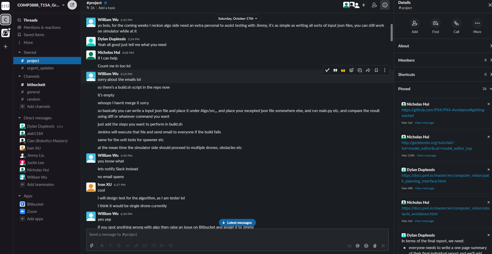
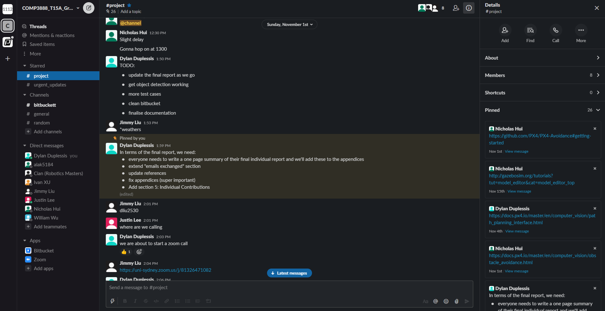
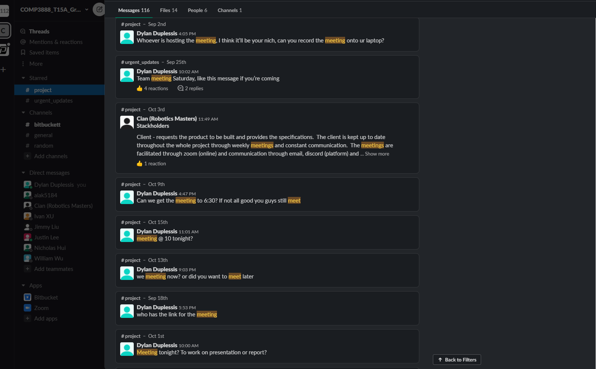
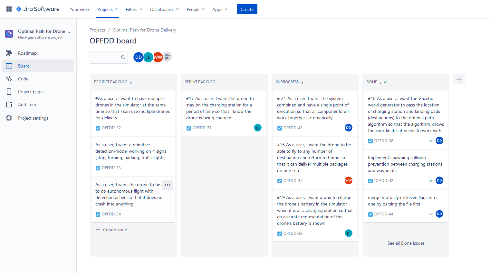
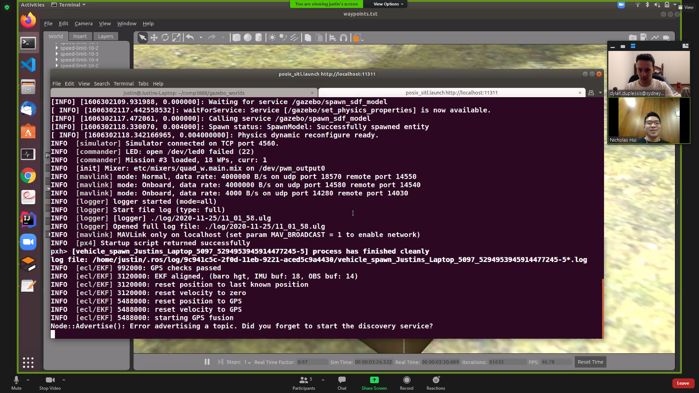
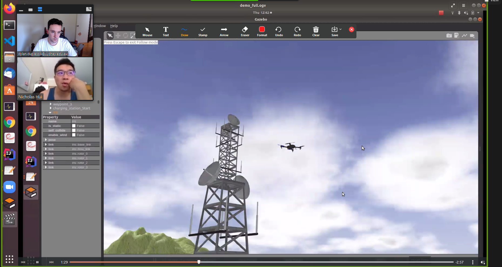
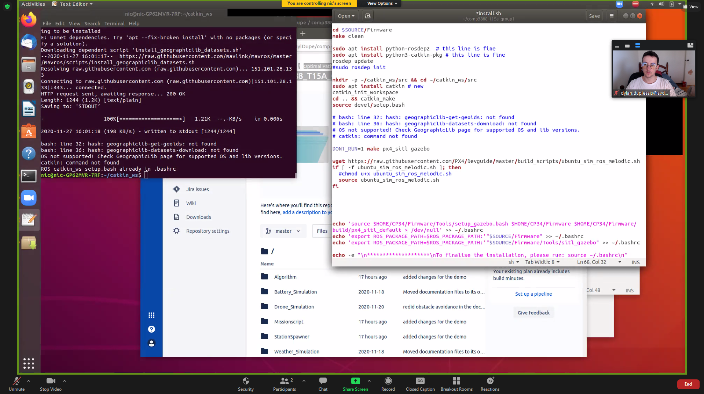

Table of Contents
=================

> Note: Anchors only work for PDF version

1. [Introduction](#introduction)
2. [Statement of Completed Work](#statement-of-completed-work)
3. [Extent of Completed Work](#extent-of-completed-work)
4. [Quality of Technical Work](#quality-of-technical-work)
5. [Other Contribution to Group Processes](#other-contribution-to-group-processes)
6. [Reflection](#reflection)
7. [Appendix](#appendix)

Introduction
============

For this project, I have been assigned numerous roles to help achieve a high level of organisation and quality of work. These roles include team manager, Bitbucket expert, and document controller.

As the Bitbucket expert, I created and maintained both repositories, the group wiki, and the source repository. This entailed uploading the weekly client, tutorial, and team minutes, as well as the pdf versions, and the creation and updating of links and other relevant documents to create a central point of access. In addition to this, I was in charge of making sure everybody has correct access and rights on the repository.

The XP roles undertaken were not rotated weekly. Instead, members were allocated the role they were suited for at the beginning of the project. For me, I was allocated to the team manager. As the team manager, I was responsible for communicating the date and time for team meetings that suited all (or the majority at best) team members. I often posted reminders, summaries of work to be completed, and monitored the work being produced by other team members to ensure it was at a high standard.

In addition to the team manager, I was the document controller. This role encapsulated the revision of documents added to the Bitbucket repositories and fixing typos, structural errors, and other flaws. Often the minutes produced for a meeting were written on a google document by all team members. It was my job to convert these documents to markdown form for easy viewing on the Bitbucket wiki.

In terms of the technical roles I undertook, my main role was Developer. I worked mainly on the software which allows a user to generate objects in a given world Gazebo world file. This program was incrementally developed and re-factored frequently to assure quality and continuous delivery as It was imperative for the team to have a working version of the software to test new simulator features and produce videos or documentation, as needed.

---

Statement of Completed Work
===========================

### Week 7 ###

__What I planned to do:__ The coming weeks for me I expected to be extremely busy, so I set out quite a lot of tasks to compensate for the lower amounts of work I completed in the coming weeks. During this week I had planned to do some general bug fixing of the spawner (detailed below), adding some new functionalities to help with the demo, add some basic unit-testing on the functions of the spawner, finalise the installation script (to accommodate for what we have installed so far), try to create a script to automate the execution process and write much of the documentation in the source repository detailing how to use the programs. The documentation aspects of the tasks set out were to be completed last as I knew the urgency of the other tasks, what with the demo coming up.

__What I did:__ I achieved everything I set out to do except for fully finalising the installation script. This was because I was unable to test the installation as I was lacking a proper Ubuntu installation and the Ubuntu Virtual Image I had set out to use (and sunk a lot of hours into trying to get to work), failed as it was too slow, even with 4GB RAM. I still was able to improve it but I could not finish it. However, as I am well versed in XP principles and agile methodologies, I know that small increments of work and always improving code quality is what I should aim to do, so over the week, I accomplished the following:

* Improve the installation script to add necessary environment variables, reduce overall installation time by adding a flag to specify not to install un-needed components, and adding bug-fixes with Gazebo. ([Commit](https://bitbucket.org/DylDupe/comp3888_t15a_group1/commits/06d023dc6a8c8879232b9ce74b2cd11b712e8a70), [Commit](https://bitbucket.org/DylDupe/comp3888_t15a_group1/commits/da6a3b3143bc6606ecf071d323f1fb38ed9fa57f) - note this commit message says "Finalised install.sh", this doesn't mean fully complete)
* Adding a new flag to the spawner, the static flag. This was quite a major update to the software. It allows the user to specify waypoints and charging station coordinates to be generated in the specified world. The upcoming demo inspired the need for this flag as we were required to demonstrate certain test cases displaying the correctness of the algorithm. This prompted the need for generating waypoints and charging stations at specific coordinates. This feature was used extensively throughout testing and further demos. ([Commit](https://bitbucket.org/DylDupe/comp3888_t15a_group1/commits/187a58e94cd3e9bec2ce8aa47abccacd03d9be0e), this [Commit](https://bitbucket.org/DylDupe/comp3888_t15a_group1/commits/fc281d0c8ad134c44cdea987ac87931173dd65c0) showcases a new program which demonstrates using static files for testing purposes)
* Fixing a bug in the distance calculations which was causing the charging stations to spawn too close to each other. ([Commit](https://bitbucket.org/DylDupe/comp3888_t15a_group1/commits/66f9ac8c39c51bb969e0a6832e292e3141e24e5d))
* Added basic unit-testing for the spawner just testing the main functions which had been implemented at the time. ([Commit](https://bitbucket.org/DylDupe/comp3888_t15a_group1/commits/c93eb6bd2787b950d86b2d7c04acdb24f36f6b5a))
* Added functionality to the spawner allowing it to write the coordinates of the waypoints and charging stations to a JSON file in the format required by the algorithm. This required some coordination with the Algorithm team as they walked me through the current implementation and why the input JSON file is structured the way it is. ([Commit](https://bitbucket.org/DylDupe/comp3888_t15a_group1/commits/9600bf1b919e5a749e0e00879e60eef0ad276157))
* I created a simple running script in an attempt to automate the process of controlling the drone. It moves the input file generated by the spawner to the scope of the algorithm, runs the algorithm, and moves the output file generated by the algorithm to the scope of the Drone control script, `MissionScript`, and finally, runs the drone control script. ([Commit](https://bitbucket.org/DylDupe/comp3888_t15a_group1/commits/8e235c46e5c67c370dacdf28fceaed8c7ef79eef))
* I ended up writing some more comprehensive documentation on what is contained in the repository. This was something I was hoping I would get done as the source README, the main README, was very empty at this stage. What I wrote covers the thought process behind the execution of the project using the software written so far, I believe that readers, or specifically, the group to take over this process, will find that information useful. ([Commit](https://bitbucket.org/DylDupe/comp3888_t15a_group1/commits/e345b21ad8c27f72c3aa0d436e1b9bddaf577489))
* General fixes to the documentation and scripts in the source repository as well as cleaning. ([Commit](https://bitbucket.org/DylDupe/comp3888_t15a_group1/commits/c5a9df006cee126bcf6fe01d6153bc14e175d1e3), [Commit](https://bitbucket.org/DylDupe/comp3888_t15a_group1/commits/83b42a8e52148fe3ac3899603458506350cccb8a), [Commit](https://bitbucket.org/DylDupe/comp3888_t15a_group1/commits/9600bf1b919e5a749e0e00879e60eef0ad276157), [Commit](https://bitbucket.org/DylDupe/comp3888_t15a_group1/commits/f137c85178287b9f74e23824135460daa1d7e406), [Commit](https://bitbucket.org/DylDupe/comp3888_t15a_group1/commits/e17452509c68f3a639557ef9bbc705dc939cba98), [Commit](https://bitbucket.org/DylDupe/comp3888_t15a_group1/commits/28af16b60736bfd5a089aa7acb8870605d061eed), [Commit](https://bitbucket.org/DylDupe/comp3888_t15a_group1/commits/725b273cd5d6a1d684aba1edd21822174c59223b), [Commit](https://bitbucket.org/DylDupe/comp3888_t15a_group1/commits/770d75298185697d80825228f399bdbae9c131c0), [Commit](https://bitbucket.org/DylDupe/comp3888_t15a_group1/commits/67d78a23710f3e86db30b53f0283427d0bd35b00), [Commit](https://bitbucket.org/DylDupe/comp3888_t15a_group1/commits/bc4fef8e898b0685a30241ad5eb5f3e85126f60d))
* Towards the end of the week, I had accomplished all I set out to do, so I practiced the XP principles of re-factoring the spawner (quite substantially) and writing additional documentation on the source README to accommodate for all the new changes throughout the week. ([Commit](https://bitbucket.org/DylDupe/comp3888_t15a_group1/commits/61214bde47ca3eb6718a8289256b071fa00f81fc), [Commit](https://bitbucket.org/DylDupe/comp3888_t15a_group1/commits/a37925483da012d4862ee440940b5253e98c45b8), [Commit](https://bitbucket.org/DylDupe/comp3888_t15a_group1/commits/6586d84b3df3282b1fe2fafb23f0c5b5b07f02da))
* Worked on the client demo presentation slides, which can be found [here](https://docs.google.com/presentation/d/1Dq_ZhCjCLjsC4mtmlesd24IWrwqW3VuGlKc6Roa4tA8/edit?usp=sharing). It is evident through the history of the document the changes I made and what parts I spoke due to the speaker notes I wrote.
* Create a new script, [for_team_runme.sh](https://bitbucket.org/DylDupe/comp3888_t15a_group1/src/6dc2c6a85c27787057b8991e8d25b6a85cb1db8e/for_team_runme.sh), which solved the missing environment variable issues that some team members were experiencing. This problem arose due to the new addition of, the extremely useful, environment variables: SOURCE, WORLDPATH, and FIRMWARE, which can be seen in the [installation script](https://bitbucket.org/DylDupe/comp3888_t15a_group1/src/master/install.sh). Many other programs I wrote required these variables as they were intended to be portable across systems and users, but as their addition was new, team members trying to run these programs couldn't due to the lack of these variables. This program solved that problem. ([Commit](https://bitbucket.org/DylDupe/comp3888_t15a_group1/commits/6dc2c6a85c27787057b8991e8d25b6a85cb1db8e ))

In addition to the above, we attended a client meeting, for which the minutes can be found [here](Client Meeting 10](https://bitbucket.org/DylDupe/comp3888_t15a_group1/wiki/Minutes/Client%20Meetings/Client_Minutes_10), where we discussed the upcoming demo. We also held two team meetings; the first was concerned mainly with the client demo and creating more scripts to automate the execution process and installation, the minutes can be found [here](https://bitbucket.org/DylDupe/comp3888_t15a_group1/wiki/Minutes/Team%20Meetings/Team_Minutes_6), the second meeting was just improving on the work being completed at the last meeting and seeing how the tasks we set out to complete (i.e. improving the installation script) were tracking, the minutes can be found [here](https://bitbucket.org/DylDupe/comp3888_t15a_group1/wiki/Minutes/Team%20Meetings/Team_Minutes_7).

### Week 8 ###

__What I planned to do:__ During this week, I had little to no time to spend on the project for several reasons. The only work I had set out for this week, was to conduct research on possible improvements for the algorithm and if I had time and create test cases for the algorithm. However, this required a testing framework which hadn't been designed yet. The simplest idea I had was to create diagrams of scenarios that the algorithm would compute a path for and then create the diagrams of the expected paths the current algorithm would compute.

__What I did:__ I did not get around to writing any test cases or producing scenario diagrams for the algorithm. However, I researched Minimum Spanning Tree algorithms and Branch and Bound algorithms trying to find any information that would help us to speed up the current algorithm.

The client meeting for this week emphasised the algorithm and its limitation and current implemented features as well as the simulator's ability to fly multiple drones. The minutes can be found [here](https://bitbucket.org/DylDupe/comp3888_t15a_group1/wiki/Minutes/Client%20Meetings/Client_Minutes_11). The team meetings focused on designing a comprehensive algorithm testing framework and ways to improve the algorithm, the minutes can be found [here](https://bitbucket.org/DylDupe/comp3888_t15a_group1/wiki/Minutes/Team%20Meetings/Team_Minutes_8) and [here](https://bitbucket.org/DylDupe/comp3888_t15a_group1/wiki/Minutes/Team%20Meetings/Team_Minutes_9).

### Week 9 ###

__What I planned to do:__ I planned on working on the scenario diagrams that I wasn't able to produce last week. This, and helping to produce an algorithms testing framework, were my main goals.

__What I did:__ Working in conjunction with the algorithms team to produce a portable testing suite for the algorithm, I fixed the [build.sh](https://bitbucket.org/DylDupe/comp3888_t15a_group1/commits/2b3b33ad11a64d59f6715d783af71e0dfc83dadb) file to be a program which can run any number of tests within a specified folder. While this doesn't allow for achieving code coverage like in traditional testing, this method was inspired by the idea of portability, the next team would easily be able to introduce more tests by adding their test cases JSON files. It is also a very transparent testing framework, easy to read and understand. I also was able to produce some testing input diagrams ([Commit](https://bitbucket.org/DylDupe/comp3888_t15a_group1/commits/2b3b33ad11a64d59f6715d783af71e0dfc83dadb)) using draw.io, these can be found [here](https://bitbucket.org/DylDupe/comp3888_t15a_group1/src/master/Algorithm/test/input_diagrams/). I completed the first 3 along with their expected diagrams which can be found [here](https://bitbucket.org/DylDupe/comp3888_t15a_group1/src/master/Algorithm/test/expected_diagrams/).

The client meetings held (minutes [here](https://bitbucket.org/DylDupe/comp3888_t15a_group1/wiki/Minutes/Client%20Meetings/Client_Minutes_12) and [here](https://bitbucket.org/DylDupe/comp3888_t15a_group1/wiki/Minutes/Client%20Meetings/Client_Minutes_13)) regarded issues with the simulator and controlling multiple drones, however, this was more Justin's area and creating more tests cases for the algorithm, as that seemed to be Cian's main concern at this point. Despite being absent, It is evident through the minutes [here](https://bitbucket.org/DylDupe/comp3888_t15a_group1/wiki/Minutes/Team%20Meetings/Team_Minutes_9) that I was responsible for the build.sh file.

### Week 10 ###

__What I planned to do:__ During this week, the goals were to bug-fix the spawner, specifically the map issue where it wouldn't print properly, write more documentation including a research file which includes all the links we have utilised so far, and clean the BitBucket repository.

__What I did:__ I completed all but creating the research document, which was my main task, unfortunately. However, as we organised a team meeting, it became clear how late in the semester it was and that we still were yet to implement collision detection and avoidance. During a team meeting, we devoted some time to researching this to evaluate how difficult it would be to implement.

* Fixed the persistent map bug in the spawner, added some practical quality assurance checks, and as cleaned and re-factored the source code. ([Commit](https://bitbucket.org/DylDupe/comp3888_t15a_group1/commits/52245f94d17af39629f4fb380cde8f550078bbd7), [Commit](https://bitbucket.org/DylDupe/comp3888_t15a_group1/commits/c0736e5ac3fda81b93b4dabeb2ba643a32107717), [Commit](https://bitbucket.org/DylDupe/comp3888_t15a_group1/commits/fc25940a858e1872933d82f04084f6dbe582527e), [Commit](https://bitbucket.org/DylDupe/comp3888_t15a_group1/commits/97e98b0f4be35de38791bf0e0cb95f073c3b25b3))
* Added the ability to generate waypoints randomly within a radius and given world file in the spawner. ([Commit](https://bitbucket.org/DylDupe/comp3888_t15a_group1/commits/97e98b0f4be35de38791bf0e0cb95f073c3b25b3))
* Wrote more documentation to accommodate new changes to the spawner. ([Commit](https://bitbucket.org/DylDupe/comp3888_t15a_group1/commits/1f9ab7898b13816f425e50e9759b0dc43b833658), [Commit](https://bitbucket.org/DylDupe/comp3888_t15a_group1/commits/f47c045a08fe52b3222a6b0a7f0f135253ffd318))

The minutes for the team meetings where we discussed Ivan's weather implementation are [here](https://bitbucket.org/DylDupe/comp3888_t15a_group1/wiki/Minutes/Team%20Meetings/Team_Minutes_12) and the meeting regarding the research into obstacle avoidance has minutes [here](https://bitbucket.org/DylDupe/comp3888_t15a_group1/wiki/Minutes/Team%20Meetings/Team_Minutes_11). Both client meetings we discussed the team's progress and discussed briefly obstacle avoidance, the minutes are [here](https://bitbucket.org/DylDupe/comp3888_t15a_group1/wiki/Minutes/Client%20Meetings/Client_Minutes_14) and [here](https://bitbucket.org/DylDupe/comp3888_t15a_group1/wiki/Minutes/Client%20Meetings/Client_Minutes_15).

### Week 11 ###

__What I planned to do:__ I planned to create the research markdown document to host all the relevant and important links we have utilised over the semester. Again, this was a particularly busy week and thus not much was completed.

__What I did:__ I completed the research markdown document as I had hoped. It can be found [here](https://bitbucket.org/DylDupe/comp3888_t15a_group1/wiki/Research) ([Commit](https://bitbucket.org/DylDupe/comp3888_t15a_group1/wiki/commits/74c4855dac025c7fb80eaed7f0b5f12019bde42b)).

The client requested a demo in the first of the bi-weekly meetings, the minutes for which can be found [here](https://bitbucket.org/DylDupe/comp3888_t15a_group1/wiki/Minutes/Client%20Meetings/Client_Minutes_16). Similarly, the end of the week client meeting just discussed finalising the project and the final client demo and product delivery, the minutes for these are [here](https://bitbucket.org/DylDupe/comp3888_t15a_group1/wiki/Minutes/Client%20Meetings/Client_Minutes_17).

### Week 12 ###

__What I planned to do:__ Going into this week I was well aware of how busy I would be as the semester was coming to a close and as a result, all assignment due dates were approaching. This week I had planned to complete the Tutor presentation with the group, and work on making the project easier to run. I had in mind, the idea of adding launching capabilities to the spawner. Originally I had a script that ran the two primary software together but it was extremely buggy as it didn't like running Gazebo and other programs from the same script.

__What I did:__ This week was a particularly busy week as the semester was wrapping up. Despite that, I was able to:

* Completed the Tutor Presentation, here are the [slides](https://docs.google.com/presentation/d/1jhspC_VTzPFimZ6vA7ocGJytdCgQTIBLAbUWvoptvaw/edit?usp=sharing), this included preparing the slides and writing the speaker notes as well as filming on Zoom.
* Adding launching capabilities to the spawner to create a single point of execution for the user. ([Commit](https://bitbucket.org/DylDupe/comp3888_t15a_group1/commits/f32033f82b38ce44c69a9db70f05a8adccb265b3))
* Added a feature to the spawner allowing it to load unloaded worlds, please see [here](https://bitbucket.org/DylDupe/comp3888_t15a_group1/src/master/worlds/) for an explanation of what that means. ([Commit](https://bitbucket.org/DylDupe/comp3888_t15a_group1/commits/001241c5feeead9f53b2642a3be0746f6a8645ba))
* Simple bug fixing for the spawner: the coordinates were being written in reverse order. This was a particularly annoying bug as the source of the problem was difficult to trace. ([Commit](https://bitbucket.org/DylDupe/comp3888_t15a_group1/commits/63fb8996084dbe53c0307269ff24e4f2c92b8403))

The only team meeting held this week was for filming for the tutor presentation, the minutes for which are [here](https://bitbucket.org/DylDupe/comp3888_t15a_group1/wiki/Minutes/Team%20Meetings/Team_Minutes_13).

### Week 13 ###

__What I planned to do:__ During this week I had planned to finish all the documentation that was required, do a general clean-up of the BitBucket repository, and finalise the installation script. This included:

* Documenting object placing in Gazebo with a thorough markdown document
* Compiling a bug-free, fully complete installation script
* Writing the final individual and group reports
* Completing the final client demo and presentation
* Completing the Handover Document

__What I did:__ What I completed this week was far more than I had set out to do. As the semester drew near, implicit requirements that weren't completed were added to the TODO list. A complete list of tasks completed this week, with evidence, is as follows:

* Writing the acceptance criteria for the user stories ([Commit](https://bitbucket.org/DylDupe/comp3888_t15a_group1/wiki/commits/996203ff1b4a381de678e0bc78bbdea1743c5b1b), [Commit](https://bitbucket.org/DylDupe/comp3888_t15a_group1/wiki/commits/ab21662c6dc509dc9202553fc96618acdc25907d), [Commit](https://bitbucket.org/DylDupe/comp3888_t15a_group1/wiki/commits/6b805dcdb8059d4ed85f89f6e001f5e8dc783d38))
* Documenting world rendering, adding a "Docs" folder to host links to all the documentation, as required, and cleaning up the world's folder, removing unnecessary files. ([Commit](https://bitbucket.org/DylDupe/comp3888_t15a_group1/commits/e9403b202dce129d1c33115a04d3fac7b4541cbb))
* Fixed the installation script; that is, removed all previous bugs which were present in the client technical deployment. ([Commit](https://bitbucket.org/DylDupe/comp3888_t15a_group1/commits/e386340c624819151c57d0cf594c5765569ba255), [Commit](https://bitbucket.org/DylDupe/comp3888_t15a_group1/commits/e28820aea8064f11a2c81afdd47d60336215e423), [Commit](https://bitbucket.org/DylDupe/comp3888_t15a_group1/commits/444a82f2481bb9a0b62b8a232c8614991f4a07aa), [Commit](https://bitbucket.org/DylDupe/comp3888_t15a_group1/commits/0a44e33b309b0f50554a3f6231cac84cc8eed930), [Commit](https://bitbucket.org/DylDupe/comp3888_t15a_group1/commits/8035debc2862cc1908ed86f6998639b975b2a33c), [Commit](https://bitbucket.org/DylDupe/comp3888_t15a_group1/commits/8bd351885eb9c0bf5d17378b7bcf911098475406), [Commit](https://bitbucket.org/DylDupe/comp3888_t15a_group1/commits/208342accd2f525cc78e188224a48fb7ee38801a), [Commit](https://bitbucket.org/DylDupe/comp3888_t15a_group1/commits/c4d45450852697f0b543301bf0a95b771f0d9814), [Commit](https://bitbucket.org/DylDupe/comp3888_t15a_group1/commits/24901d687c7f2cfc0be4be2faa229072779acacd), [Commit](https://bitbucket.org/DylDupe/comp3888_t15a_group1/commits/0db66b8901f149875e667218026f8ac3eb94ee6f), and the final [Commit](https://bitbucket.org/DylDupe/comp3888_t15a_group1/commits/c2aa36eb287c795ab6cbef42e6943a5479e73063))
* Uploaded, and linked in the BitBucket repository, a video demonstrating how to place objects in Gazebo. ([Video](https://youtu.be/P7tDbInoHgU))
* Filled out and uploaded the Handover Document, as required. ([Commit](https://bitbucket.org/DylDupe/comp3888_t15a_group1/wiki/commits/174336c0984ee89a764b5ae708143e2745e8b5da), [Commit](https://bitbucket.org/DylDupe/comp3888_t15a_group1/wiki/commits/6d989d8262d8c391fafeed83810f9ee6cf68c0f9))

The client demo for the week informed us of the presentation and demo that was coming up, [here](https://bitbucket.org/DylDupe/comp3888_t15a_group1/wiki/Minutes/Client%20Meetings/Client_Minutes_18) are the minutes for this. Since we needed to complete the Project Demo and Presentation for the client we held team minutes, the minutes are [here](https://bitbucket.org/DylDupe/comp3888_t15a_group1/wiki/Minutes/Team%20Meetings/Team_Minutes_13) and describe the work we did to prepare for it.

---

Extent of Completed Work
========================

### Technical Development ###
The setup of the environment consumed a lot of my time in the earlier stages of the project. It involved learning about many different packages and software and writing the relevant documentation for those to be able to reproduce our experiments and procedures later on. These included:

* Installing Gazebo, PX4, and ArduPilot onto my machine proved to be a difficult task, it was not heavily documented and thus took around a week to complete. There were issues with the installation of python on Ubuntu as PX4 and ArduPilot required python2 for some programs and python3 for others. Doing a fresh installation of Ubuntu came with no installation of python and thus when installed, the binary file is named python3 rather than just python. The program files for the flight stacks specified the binary file “python” to run the code so it was defaulting to python2 if it was installed. The solution to this was to create a symlink of the binary “python” to “python3”.

* Compiling many python2 and python3 packages such as pymavlink, dronekit, and MAVProxy.

* Generating objects in worlds also took a few days to complete. World files are formatted as XML files and objects in these files are children of the main tags. There is a specific placement of these children throughout the files which required me to learn how to use the XML.etree.ElementTree library in python3. The methods in this library allowed me to place these objects in the right positions but the tricky part was knowing which combination of properties to set for the objects to spawn correctly. At first, they would spawn with random values of yaw, roll, and pitch, see this [video demonstration](https://www.youtube.com/watch?v=zJaSMwK0zO4) of that. It wasn’t until a day later that I’d discovered the right combination of values to assign the properties of the charging station object. Here’s a [video demonstration](https://www.youtube.com/watch?v=cgtDnoudIR8) of the working program.

* The bulk of my technical development stems from the software I created, the Spawner. Over the weeks, employing XP principles, I worked incrementally improving code quality through re-factoring, writing unit-tests, and adding new features. The beta version of the software could only generate the coordinates and print out a scaled ASCII map to the terminal displaying the rough area of the charging stations generated. There were many bugs with this and required a lot of research into algorithms that generate random points within geometric shapes. I learned a lot about the cumulative distribution function and the inverse transform sampling method to generate random points within a circle. From this, I was able to generate random points within a circle with a given radius. These points were the coordinates I was to generate charging stations at. Many more features were added incrementally such as the ability to change the default: number of stations, radius, spawning barrier (i.e. minimum distance away from the drone the stations must be), and distance between stations. Later on, the ability to specify waypoints and/or charging stations was added, this was to help stage-specific scenarios for testing purposes but was used extensively otherwise. Towards the end of the project, with the goal of making this project more transparent, I thought that by making it easier to run, it would achieve this. I added Gazebo launching capabilities to the spawner, this decreased the number of times the user had to interact with the terminal and was another step closer to a single point of execution.

* In addition to creating the spawner, I also created auxiliary files that the spawner depends on. These files are all contained within the [StationSpawner](https://bitbucket.org/DylDupe/comp3888_t15a_group1/src/master/StationSpawner/) folder. Scripts like `launch.sh` and `setup.py` are examples of these.

### Non-Technical Development ###

I played a pivotal role in the development of the project as the Team Manager and Bitbucket expert. It was my job to maintain the wiki as you can see I’ve done in the [wiki commit
history](https://bitbucket.org/DylDupe/comp3888_t15a_group1/wiki/history/Home.md?page=1) in the earlier weeks of the project. I spent on average 3-5 hours per week converting meeting minutes into markdown documents, uploading them and the pdf files, and fixing typos and structural errors to ensure a higher quality of work. In addition to this, I created and maintained a Jira project which I linked to the main repository to track commits and set issues for other team members. This was integral to the organisation and time management of the project.

As the manager, I opened multiple slack text channels to communicate prioritised information in its channel, this way team members could easily find the time and dates I set for team meetings and other important information pertinent to project issues or development. In addition to this, I was responsible for pinning important information to the channels such as links and team member information.

I must note that as the semester progressed, my responsibilities tilted into the more technical development side, and as a result, Nicholas took over as the main Document Controller. Nevertheless, my non-technical contributions were still substantial, I wrote much of the documentation in the source repository. To be specific, I wrote:

* Half of the [research document](https://bitbucket.org/DylDupe/comp3888_t15a_group1/wiki/Research) (as seen [here](https://bitbucket.org/DylDupe/comp3888_t15a_group1/wiki/commits/74c4855dac025c7fb80eaed7f0b5f12019bde42b))
* The [main README file](https://bitbucket.org/DylDupe/comp3888_t15a_group1/src/master/README.md) which documents how to use the project and what is in the repository. Evidence: [Commit](https://bitbucket.org/DylDupe/comp3888_t15a_group1/commits/e9403b202dce129d1c33115a04d3fac7b4541cbb), [Commit](https://bitbucket.org/DylDupe/comp3888_t15a_group1/commits/9600bf1b919e5a749e0e00879e60eef0ad276157#chg-README.md), [Commit](https://bitbucket.org/DylDupe/comp3888_t15a_group1/commits/c5a9df006cee126bcf6fe01d6153bc14e175d1e3#chg-README.md), [Commit](https://bitbucket.org/DylDupe/comp3888_t15a_group1/commits/e345b21ad8c27f72c3aa0d436e1b9bddaf577489#chg-README.md), [Commit](https://bitbucket.org/DylDupe/comp3888_t15a_group1/commits/3df85fae0accdff32c8965945785df3c28d0db7c), [Commit](https://bitbucket.org/DylDupe/comp3888_t15a_group1/commits/212efb5e09c5c665cad576510ec95e4a7d895521), [Commit](https://bitbucket.org/DylDupe/comp3888_t15a_group1/commits/f47c045a08fe52b3222a6b0a7f0f135253ffd318), [Commit](https://bitbucket.org/DylDupe/comp3888_t15a_group1/commits/301777014c7940962b891710ff9922c9b77a049f)
* An early installation guide which I shared with the other drone groups, has since been deleted but the commit with all the information and evidence can be found [here](https://bitbucket.org/DylDupe/comp3888_t15a_group1/commits/e8554ace0323d34a608dfa58930242e33ad38eb0)
* The [world rendering and object placing documentation](https://bitbucket.org/DylDupe/comp3888_t15a_group1/src/master/worlds/README.md) ([Commit](https://bitbucket.org/DylDupe/comp3888_t15a_group1/commits/e9403b202dce129d1c33115a04d3fac7b4541cbb))
* The [spawner documentation](https://bitbucket.org/DylDupe/comp3888_t15a_group1/src/master/StationSpawner/README.md) which was incrementally updated as new features were added. Evidence: [Commit](https://bitbucket.org/DylDupe/comp3888_t15a_group1/commits/6586d84b3df3282b1fe2fafb23f0c5b5b07f02da#chg-StationSpawner/README.md), [Commit](https://bitbucket.org/DylDupe/comp3888_t15a_group1/commits/cb8498df5b3140be0fac476be7f954b112948d35#chg-StationSpawner/README.md), [Commit](https://bitbucket.org/DylDupe/comp3888_t15a_group1/commits/1fde0b8b6d52a12e5ddac2c1beaa83defbb41d28), [Commit](https://bitbucket.org/DylDupe/comp3888_t15a_group1/commits/9d1b4f4f7c24b517fce4a031be144d57075a33c5)

In summary, my role in the project was essential to the development of the project as I provided structure, documentation, and acted as the supervisor of subtasks that were assigned to team members. I employed principles of XP throughout the project such as pairwise programming (examples seen in the next section) and encouraged team communication by setting meetings and performing regular check-ins with team members. In addition to this, I also completed the acceptance criteria of the user stories which can be found [here](https://bitbucket.org/DylDupe/comp3888_t15a_group1/wiki/User%20Stories) (evidence: [Commit](https://bitbucket.org/DylDupe/comp3888_t15a_group1/wiki/commits/6b805dcdb8059d4ed85f89f6e001f5e8dc783d38)) as it was necessary to evaluate the completeness of the project.

---

Quality of Technical Work
======================================

The quality of the technical work has been incrementally improved throughout the duration of the project through the utilisation of XP principles. These include pairwise-programming (please find attached screenshots below) which stimulated foresight into issues which might have arisen later, and constant refactoring of source code (evidence: [Commit](https://bitbucket.org/DylDupe/comp3888_t15a_group1/commits/61214bde47ca3eb6718a8289256b071fa00f81fc), [Commit](https://bitbucket.org/DylDupe/comp3888_t15a_group1/commits/3c834237dd713117f58814a3f60bc01f063cadb6), [Commit](https://bitbucket.org/DylDupe/comp3888_t15a_group1/commits/cb8498df5b3140be0fac476be7f954b112948d35)). These measures were put in place as a result of the lack of quality early on in the semester evident through the number of bugs I had to fix (many of which are mentioned in the weekly schedule above). Much of what I had written had to be re-factored into nicer functions with clear and concise pythonic documentation which greatly improved the readability and transparency of the programs. A simple comment or short paragraph explaining what a program or function does go a long way in improving code quality. These code reviews were imperative to the success of the programs, such as the spawner. Early on in the development of the spawner, my main piece of technical development, I had placed more emphasis on test-driven development, writing unit-tests and only writing code that I knew worked, by performing manual testing before committing any changes to the main repository (or private branch).

In the appendices are snapshots from just a few of the times we employed pairwise programming. It proved to be an invaluable resource as it helped solve many bugs and improve code. The final image is from when we had to re-install ubuntu around 8 times, Nicholas and I were working on finalising the installation script (which we completed in that photo). You can see that it says up the top in the middle of the screen "You are controlling Nic's Screen"; his laptop served as the fresh Ubuntu installation as I was not able to produce one locally, so we were able to work collaboratively on the same laptop doing component testing (using sections of installation code) and then regression testing on the script to pinpoint the exact area of failure which we were encountering.

In summary, discipline knowledge from a variety of areas such as computer science and software development were applied in many aspects of the project. Software design patterns were used when generating objects in Gazebo as the code relied heavily on prototypes and blueprints as it repeatedly spawns similar objects with varying properties. Additionally, the Software developed employed heavy use of functions to complete it's tasks. This modularity allowed for improved readability and transparency. When collaborating on the algorithm's design, a lot of algorithm design and analysis, particularly concerning minimum spanning trees, Dijkstra's, and branch-and-bound algorithms, was conducted. This discipline knowledge set a solid foundation allowing us to explore more advanced algorithmic techniques such as pruning, to increase the run-time of the algorithm.

In addition to the above, many Agile principles and practices were adopted and used. The idea of having a variation of the standup meetings, the team meetings, accelerated team comfortability in the early stages of the semester. As a result, we were able to work and communicate ore effectively resulting in a boost in productivity. Parts of agile methods, such as scrum and XP, were also borrowed. Using time-boxed iterations to complete the weekly milestones improved team organisation and most of the tasks set out by the client lended themselves to the XP principles quite well. We employed pairwise programming (Please refer to [here](#pairwise-programming)) in order to increase code quality and stimulate foresight into issues that may arise later.

### Individual Challenges Summary

* When generating the waypoints and charging stations using the spawner, the initial idea was to use model.sdf files (which host that models XML information), and spawn them that way. However, it became difficult to adjust the XML tags, whose values held the coordinates of each object, from python as they were in a file. The solution was to hardcode the XML into the given Gazebo world file and using a simple python function, replace the values that represent the coordinates to the correct coordinate of the object being spawned in. While this solution is less robust, it worked. It provides an opportunity for the next team to make improvements on this code as they can follow [this video](https://youtu.be/P7tDbInoHgU) I created to get a better understanding of everything I have just described.
* Building on the previous challenge, once the objects were rending, they would spawn with ridiculous values of yaw, pitch, and roll, causing the objects to spin and act unnaturally. Please see [this video](https://www.youtube.com/watch?v=zJaSMwK0zO4) for a demonstration. The solution to this was to research object rendering in Gazebo and after playing around with the charging station properties, a working combination of properties was revealed and this is what is currently in the spawner.
* Getting Gazebo to spawn worlds that aren't the default world was an initial problem. The solution was simple, it involved just renaming the new world (containing the generated objects) to the name of the default world, which was "empty.world", in the Gazebo worlds folder.

---

Other Contribution to Group Processes
=====================================

In order to maintain organisational discipline and structure, I created a Jira project and linked it to the project (please refer to [here](#jira-evidence)) to link issues to commits and as per the group contract, we attempted to make two tickets per week. You can see my contribution in regards to this on the [Jira page](https://bitbucket.org/DylDupe/comp3888_t15a_group1/jira?site=b95f0f0b-0d5c-4c02-9317-ac9d14f0d9b8&projects=10000&assignees=5c89b0b9d4660946c9509183&sort=-updated&page=1). In the earlier weeks of the semester, I would assigned team members to work on items from the product backlog (i.e. the scope document) and these represented the sprint backlog. After many weeks of team communication and collaboration, we were beginning to work more effectively as we had become self-organising.

For further evidence of my collaboration and teamwork, our slack channel can be reviewed [here](comp3888t15agroup1.slack.com) where there is currently, over 3000 messages are sent. On this slack channel, it can be seen that I have been consistently organising team meetings and providing summaries of work items still be completed (Please refer to [here](#slack-evidence)).

My attendance at team meetings and client meetings is stellar, this is evident in the attendees column of the meeting minutes for these. However, as I had tutoring commitments during the time of the tutorial, I was unable to attend each week (apart from the first). The minutes can be found [here](https://bitbucket.org/DylDupe/comp3888_t15a_group1/wiki/Minutes/Minutes).

---

Reflection
==========

### Programming ###

The earlier stages of the project required little to no programming as they were mainly concerned with the setup of the environment and basic usage of the tools which are all pre-written. When It came to scripting for autonomous drone flight, using pre-written code from various GitHub repositories and communities online was difficult as it was often undocumented. Much time was spent just reading through relevant documentation until the common ground was found between all of the code written by others online. From there, it was just a matter of understanding the simple functions and putting them together to get basic point-to-point navigation. If there was some more concrete information as to how to get the simulator running and controlling it with both PX4 and ArduPilot, that would have sped up the project immensely. When it came to developing the program which randomised the charging station location, I had to do a lot of heavy programming and research into the relevant algorithms. There is a built-in function of Gazebo to spawn *populations* of objects randomly within a given map, but this was flawed at it didn’t take into consideration minimum distance between objects, from the drone, or object collision. The main reason I didn’t use this feature was that there was no way to procedurally generate objects. That is, each charging station spawned increases the area of possible locations for the next. This growth in the spawning area is essential to the project as it represents the maximum distance the drone can travel as opposed to a single set radius which cannot be pre-determined as the drone can be recharged. It would have been nice if there was some room to adjust the population generation feature of Gazebo or some more documentation on it at the least. If future software projects could spend more time writing more specific documentation, all other projects would greatly benefit from this.

### Version Control ###

Bitbucket was the version control system used. The team relied on a repository I created and shared. I found Bitbucket to be very simple to use and that it provided a great amount of organisation. However, it would have been a nice feature if we could link our Jira issues to specific commits and view a timeline of these together. The Bitbucket can be found [here](https://bitbucket.org/DylDupe/comp3888_t15a_group1/src/master/), it includes the majority of the work I completed and documentation written. Other tools that would have been helpful would be commit analytics, this would have allowed us to inspect variance in activity and velocity and adapt.

### XP ###

Many of the principles of XP were employed throughout the lifespan of the project thus far as this project does lend itself to them very well. My XP role as the manager was to organise the team and encourage communication and collaboration. As XP emphasises teamwork, I believe that we achieved synergy through constant communication, SMART bite-sized goals and work items, weekly team meetings, and an open environment to discuss issues and ask for feedback or help. However, an improvement we could make is to document things as we go rather than in chunks when things are completed. I’d like to note that with the generous help of the client, an inviting and honest environment was created which motivated me to stay on tasks and not be afraid to ask for help if I was unsure. The reinforcement of the client's needs in specific detail for subtasks greatly improved the quality of work and I believe went a long way in ensuring that the final product will be one of satisfaction to the client. As this agile method promotes constant code improvement, many of the goals set each week focused on small increments of development. I dedicated many hours to refactoring the software I wrote and employed pairwise programming techniques with Nicholas which stimulated foresight into issues that may arise later on. This ended up saving us both a lot of time which we would have had to spend debugging. Additionally, many hours were sunk into reviewing code at the end of each week, which I treated similarly to a sprint review. This is evident through the addition of the detailed pythonic documentation in `spawn.py`, some commits relating to this can be seen [here](https://bitbucket.org/DylDupe/comp3888_t15a_group1/commits/61214bde47ca3eb6718a8289256b071fa00f81fc#chg-StationSpawner/spawn.py) and [here](https://bitbucket.org/DylDupe/comp3888_t15a_group1/commits/cb8498df5b3140be0fac476be7f954b112948d35). The lack of strict quality checks led to the choice to re-factor and review code as it became increasingly difficult to implement new features and flags the program `spawn.py` could take in.

### Challenges ###

Throughout the duration of the project thus far, the challenges have been surmountable due to the help of the client and online communities. The main challenges have been:

#### **Installing the tools and environment:**

The early stages of the project were plagued with installation issues taking us all weeks to put together a stable environment and gather knowledge on using it efficiently. It took a lot of trial and error, re-installations, and debugging source code to get applications to work. In addition to the base applications, integrating both flight stacks, i.e. PX4 and ArduPilot was seemingly impossible. This was a result of a clash with independent python library versions and API calls. However, by going through this early on, I and the other team members learned a lot about the software and became familiarized with the online forums, learning where to look when there were issues. This issue arose again in the later weeks of the project as we were required to implement primitive object detection and collision. This was an avoidance software, "local planner". The lack of any helpful FAQs, troubleshooting documentation, and people struggling with the same issues as we did (evident through the lack of GitHub issues about any issues we had) meant we could not install and use the environment properly. As another example, installing "ros-melodic", proved difficult due to many Linux path problems.

##### How was this overcome?

In the end, only one member had all the correct software installed and was able to run the software in full. Justin achieved this by having the correct version of Ubuntu installed and devoting his time to overcoming the installation issues by which point it was the end of the semester and there was no need for any other team members to install the environment.

#### **Lack of Documentation:**

There was little documentation on SITL (Software In The Loop) simulation with PX4 and ArduPilot. While there were basic installation guides, there lacked any extensive documentation on usage, but mainly troubleshooting. If there had been a more active online community with FAQs to refer to, I think this would have helped a lot. Much of the available documentation was also outdated, using python2 instead of python3. This was not a huge problem, but another hurdle to jump over certainly didn’t speed things up. This became the biggest problem in the later weeks when it came to implementing collision detection. The documentation regarding this was little to non-existent as it was essentially in a beta-stage.

##### How was this overcome?

This was brought to the client's attention and it was decided that given the short time left to meet the requirements of the project, and the growing number of other work requiring our attention (i.e. other assignments, etc), primitive collision detection would not be implemented.

#### **Gaps in Knowledge:**

This perhaps was the biggest and most frustrating problem. Not a single team member had any experience with drone simulation at this level and as a result, lacked any sort of idea as to how the software worked or the high-level ideas behind the design of these software and their relationships. For example, coming to understand the way PX4 and Gazebo worked together with QGroundControl or MissionPlanner was a big hurdle that took a few weeks to wrap my head around and came with experience.

##### How was this overcome?

Through persistent research and initially keeping a record of the important sites by pinning them on the Slack channels, then moving them to the [research document](https://bitbucket.org/DylDupe/comp3888_t15a_group1/wiki/Research).

#### **Compiling an Installation Script:**

The installation script was difficult to build as there were many dependency related issues. Ubuntu was re-installed around 8 times to conduct regression testing on the script.

##### How was this overcome?

The solution to this was to adopt XP principles and whilst pairwise programming (Nicholas and I, Please refer to [here](#pairwise-programming)) develop the script in increments, with emphasis on test-driven development. By running through the incrementally updated script each time, we were able to pinpoint the rough areas of improvement. From here we conducted component testing to ensure at each stage the correct component was installed.

### Improvements ###

Some areas that could be improved include documentation; consistently documenting the work being completed at the time of doing it. If this problem could be reduced, we would have more time to spend on development rather than assigning chunks of time to writing the documentation which has a higher chance of being incomplete as information tends to go missing the longer you leave it undocumented. Toward the end of the semester, the amount of work done decreased, due to the increase in attention required from other subjects, one way to combat this would be to adopt agile practices more openly and work in sprints, attempting to keep the velocity constant and the rate of development steady.

### Role as a Software Engineer ###

Besides reading through code repositories, writing software, and debugging source code, my role as a software engineer was displayed through discussions with the client about requirements such as specific world rendering for trees and buildings and whether a custom city was required or if just a basic world and features would suffice. These discussions occurred during sprints with the client. As previously mentioned, I had the individual job of developing the spawner from scratch. This required my software development skills and agile methodologies to produce software that was functional, efficient, and continuously available to the team.

---

Appendix
========

Slack Evidence
--------------

[fig:Team Communication]
[fig:Team Manager Evidence]
[fig:Meetings Set by Myself as Team Manager]

Jira Evidence
-------------

[fig:JIRA]

Pairwise Programming
--------------------

[fig:pairwise1]
[fig:pairwise2]
[fig:pairwise3]
