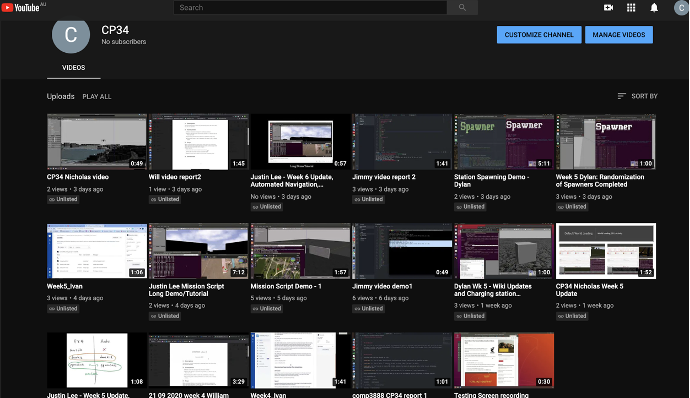
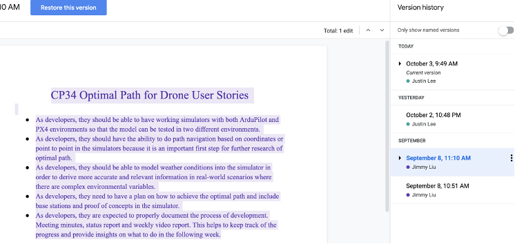
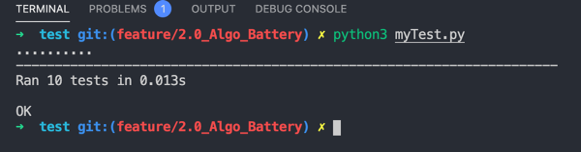
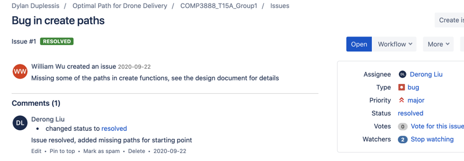
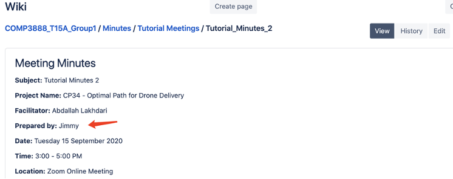
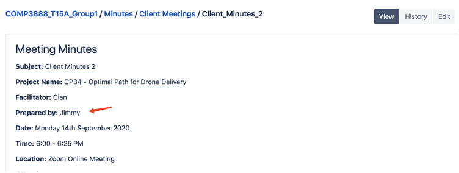

# COMP3888 Capstone Project

Project: CP34 - Optimal Path for drone delivery

Name: Derong(Jimmy) Liu

SID: 480399917

## Clear statement of work done

### Extreme Programming roles

- Manager Stand-in: Prepared meeting minutes and participated in group meetings.
- Programmer: Design, implement and test the optimal path algorithm.
- Tester: Functional testing, check the correctness of the algorithm. Usability testing, smooth transition for the simulator group.
- Report Writer: Update bitbucket wiki page, group report, meeting minutes.
- Demo and poster: Manage video reports and video demos for all group members.

###Responsibilities and Contribution

1. My main responsibility is the realisation of algorithms design in Python code. In charge of the implementation the optimal path algorithm in Python. Program Testing. Provide an easy to access interface for the simulator group to test the algorithm in the simulator. Commit history available on bitbucket.

    

   

   

   

   

2. Manager of a YouTube channel cp34. Responsible for managing upload of group members&#39; weekly video reports.

Links to videos:

- [https://youtu.be/V7FBFGMhiuc](https://youtu.be/V7FBFGMhiuc)
- [https://youtu.be/DlJkorVf4g0](https://youtu.be/DlJkorVf4g0)
- [https://youtu.be/FM98Prt\_MRM](https://youtu.be/FM98Prt_MRM)

Link to the YouTube channel (videos unlisted):

- [https://www.youtube.com/channel/UC1Xf91JqCR6Gp895mA1Eusw?view\_as=subscriber](https://www.youtube.com/channel/UC1Xf91JqCR6Gp895mA1Eusw?view_as=subscriber)

3. Wrote test cases to test the correctness of the algorithm.

4. Participated and engaged in most of the group meetings, client meetings and tutorial meetings. Prepared or contributed to several meeting minutes.

5. Participated in the drafting and editing of user stories. Version history showed on google doc.

## Weekly Plan

|       | Plan to do                                                   | Actually done                                                |
| ----- | ------------------------------------------------------------ | ------------------------------------------------------------ |
| Week2 | Get in touch with the client                                 | Kick start meeting with the client. Discuss project specification, tasks and roles. |
| Week3 | Install PX4, ArduPilot, and Gazebo on all team members machines. Have a working environment for simulating drone. | PX4 and Gazebo were working on my machine but failed to load word in ArduPilot due to unknown issues in macOS. |
| Week4 | Two members in our group including me are working on the optimal path algorithm as both of us could not set up the environment successfully but have a solid knowledge of algorithm design. Other four members are in the simulator group. Get started on the algorithm, come up with basic assumptions and scenarios. | Designed and implemented phase 1 of our algorithm. This algorithm to find the optimal path for drones is based on Dijkstra’s shortest path algorithm. No factor will be considered at this stage. I implemented the algorithm in Python. |
| Week5 | Test phase 1 algorithm implementationStart working on phase 2 algorithms, take battery life into consideration. | Performed unit test, wrote test cases, fixed bugs. Implemented phase 2 of our algorithm in Python. |
## Extant of that work

###Algorithm Design

This project has two main components. Firstly, working with drone simulators, where we have to build and rending the environment of the simulation world for the drone to operate in. Secondly, designing an optimal path algorithm for drone delivery, where we will design a path-finding algorithm that includes real-life scenarios such as obstacles, weather, battery life, and more. I am in the algorithm group, my main technical development responsibility is to implement the algorithm in Python code so that the simulator group can use it to build the script for the simulator drone. We broke down the algorithm problems into different stages. Adapting the agile mindset, each stage we only consider a limited number of factors that need to be considered. For instance, in phase 1 we only focus on the algorithm that finds the shortest path between nodes. And in phase 2 we started to consider the battery life and remove invalid edges before running the path-finding algorithm.

###YouTube Channel

The client requires each member of the group to submit a weekly video report to demonstrate what we have done over the past week. To simplify the process and fulfil the XP role of demo and poster, I created a Youtube channel called CP34 and used this channel to manage all of our video submission. All the weekly report videos, demo videos will be uploaded to this channel for easy access. Other members are given the admin role to this channel, this allows them to upload videos to this channel from their own Youtube accounts, we do not need to share login details of a single Youtube account. Bitbucket Wiki stores all the documentation regarding this project, where this Youtube channel stores all the reports and demo videos.

## Quality of technical work done

###Functional Test

Unit test, wrote test cases to assess the correctness of the algorithm.

###Usability Test

At first, users could only interact with the algorithm using the terminal, command-line user inputs and arguments. This was then replaced by .TXT files to handle input/output of data. At last, we changed it from .TXT to .JSON files for better usability and consistency after a discussion with the simulator group.

###Code Review

Code review is performed by William who is the other member of the Algorithm group. Black-box testing, white-box testing and edge cases.

###Refactoring

Renamed variables, fixed typo for better readability. Separate classes that process input and output.

## Other contribution to group processes

###Extreme Programming role rotation

As at step-in manager, I prepared several meeting minutes and made updates on bitbucket wiki.

###Cover for other group members when they are not available

This video (link [https://youtu.be/Zp8S66IjuBU](https://youtu.be/Zp8S66IjuBU)) is a weekly video I did for William as he was unable to make the video. Since both of us are in the algorithm group, I am well aware of his contribution during that week. This allows me to make the weekly report video for him and upload it to YouTube.

###Evidence of collaboration and teamwork

Slack: communication takes place on the slack channel:

[https://app.slack.com/client/T019DALSMN2/C019YM4M5C1](https://app.slack.com/client/T019DALSMN2/C019YM4M5C1)

Discord: communication takes place on the discord channel:

[https://discord.gg/6cafBg](https://discord.gg/6cafBg)

Bitbucket wiki: meeting minutes, video reports, project documentation available on the wiki page.[https://bitbucket.org/DylDupe/comp3888\_t15a\_group1/wiki/Home](https://bitbucket.org/DylDupe/comp3888_t15a_group1/wiki/Home)

## Reflection

###Tools

The tools we used for version control are Git and Bitbucket. I am comfortable with Git and so do are my group members. We who are part of the algorithm group create new branches for new features in algorithm development. This separates our work process from the simulator group in order to minimise disruption. After the code is completed and well tested we then merge into the master branch.

###Extreme Programming

Every member in this group has a programmer XP role, where four of us focus on the drone environment set up in the simulator and two of us are working on the algorithm that predicts the optimal path. As a manager stand-in and report writer, I had to write user stories. This was challenging in the beginning because this is not a typical website or app project where user preferences are much easier to be discovered. I have difficulty to apply the popular format &quot;As users, I want to be able to do this so that….&quot; to this project. When we brought it up to the tutor, the tutor advised us to focus on the requirements of the project, start by looking at this project as a whole, then focus on specific areas.

###Coding style

Python is the main programming language I used for the implementation of the algorithm. I follow PEP 8 coding style.

###Challenges

Team members have to work remotely most of the time. Four members are in Sydney, two members are not in Sydney and in different time zone. Team members have different schedules and commitments. We experienced difficulties with collaboration, meetings schedules include client meetings, tutor meetings and team meetings. However, we were able to overcome these issues with the help of a number of tools such as Slack, Zoom and Bitbucket etc. We were able to work as a team, distribute tasks properly and communicate effectively. As an example, I failed to get the simulator environment working on my system, and one member also experiencing the same issue. This is considered to be the main challenge we faced in the early stage of this project because a working simulator is crucial for testing the drone optimal path. Fortunately, we had four members set up their environments successfully, we then made the decision to split the whole team into two groups. A 4 people simulator group and 2 people algorithm. William and I who are both not in Sydney but in the same city could actually meet up in person and work on the algorithm problem together. By dividing the team into two groups and with the help of useful tools which make online collaboration easier, we overcame this challenge.

