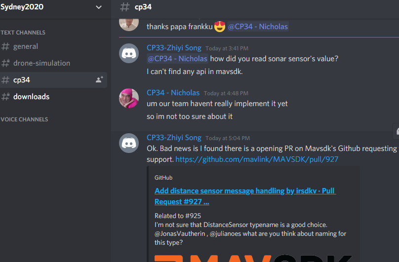
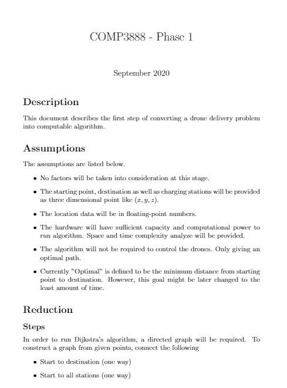
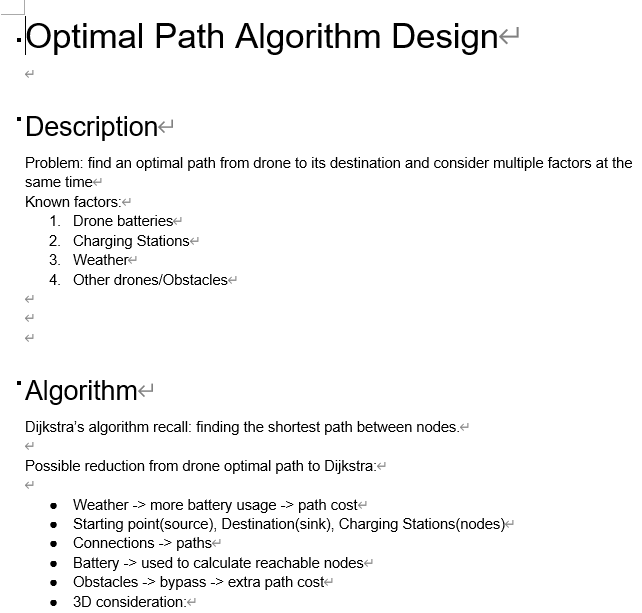
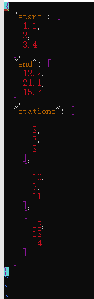
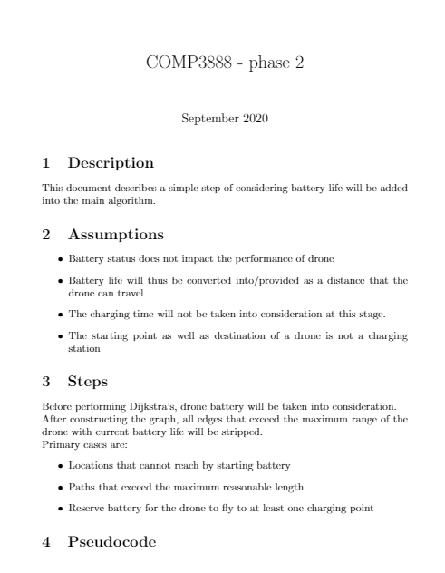
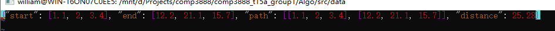
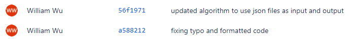
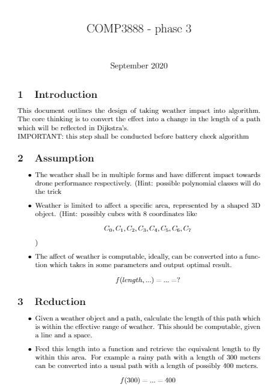
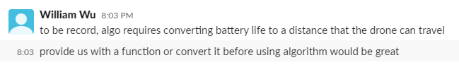
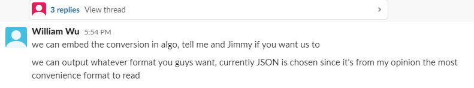

## Individual Report

### William

### 480177832

### COMP3888_T15A_Group1

## Statement of Work Done

Note: because the nature of our group, it is difficult for us to do role rotation. Hence, we have decided that everyone should have a fixed role throughout the semester.

Some management work has been accomplished internally. And documents are produced not by a single person but by the whole team together instead. (like status report). However, for client communications and meeting minutes, it is mostly done by Nicholas Hui. Thanks, him for his effort in this area.

#### Week 2

Meeting with client and get a brief overview of the project. Furthermore, we also fully set up the team tools including Bitbucket, Jira, Slack, and the client-preferred communication tool Discord as well as inviting the client to all of our tools. The rough outline of the project has been determined.

>>>>>  gd2md-html alert: inline image link here (to images/image1.png). Store image on your image server and adjust path/filename/extension if necessary.  (<a href="#">Back to top</a>)(<a href="#gdcalert2">Next alert</a>) >>>>> 

#### Week 3

Attempted to install and deploy simulator on my own device. This step has encountered a lot of difficulties since I am currently overseas and all attempted access to required resources are being blocked. Especially when doing dual boot, ubuntu does not support the VPN which the university provided. 

After some attempts, we had finally decided to split the group into two teams. One consisting four members for working with simulator since the work of getting the simulator is heavy. And we require them to provide some linear functions for reduction for the reduction of the document.

Scheduled algorithm design phases and provided the first ever brief algorithm guideline document.

>>>>>  gd2md-html alert: inline image link here (to images/image2.png). Store image on your image server and adjust path/filename/extension if necessary.  (<a href="#">Back to top</a>)(<a href="#gdcalert3">Next alert</a>) >>>>> 

Planned activities:

1. Install and boot simulator (failed and decided not to proceed)
2. (newly decided) produce raw idea of the algorithm (done)
3. Attend regular team activities (done)

#### Week 4

Algorithm design phase 1 started and documented. 

>>>>>  gd2md-html alert: inline image link here (to images/image3.png). Store image on your image server and adjust path/filename/extension if necessary.  (<a href="#">Back to top</a>)(<a href="#gdcalert4">Next alert</a>) >>>>> 

Design phase one algorithm as well as analyze it, and handover to Jimmy, who will implement the algorithm. (done)

Planned activities:

1. Design phase 1 algorithm (done)
2. Attend regular team activities (done)

#### Week 5

Algorithm design phase 2 started and documented.

>>>>>  gd2md-html alert: inline image link here (to images/image4.png). Store image on your image server and adjust path/filename/extension if necessary.  (<a href="#">Back to top</a>)(<a href="#gdcalert5">Next alert</a>) >>>>> 

Improved phase 1 code and testing implementation of phase 1. Here are some sample files

>>>>>  gd2md-html alert: inline image link here (to images/image5.png). Store image on your image server and adjust path/filename/extension if necessary.  (<a href="#">Back to top</a>)(<a href="#gdcalert6">Next alert</a>) >>>>> 

 

>>>>>  gd2md-html alert: inline image link here (to images/image6.png). Store image on your image server and adjust path/filename/extension if necessary.  (<a href="#">Back to top</a>)(<a href="#gdcalert7">Next alert</a>) >>>>> 

>>>>>  gd2md-html alert: inline image link here (to images/image7.png). Store image on your image server and adjust path/filename/extension if necessary.  (<a href="#">Back to top</a>)(<a href="#gdcalert8">Next alert</a>) >>>>> 

The original way of reading and parsing normal text files has been optimized to the use of JSON files. And some sample data has been provided to test that the algotithm actually works.

Note: We have planned a number of tests to run with the simulator, without which algorithm became useless.

Planned activities:

1. Design phase 2 algorithm (done)
2. Test and improve phase 1 algorithm (done)
3. Attend regular team activities (done)

#### Week 6

Algorithm design phase 3 started and documented. (done)

>>>>>  gd2md-html alert: inline image link here (to images/image8.png). Store image on your image server and adjust path/filename/extension if necessary.  (<a href="#">Back to top</a>)(<a href="#gdcalert9">Next alert</a>) >>>>> 

Testing implementation of phase 2. (half done)

## Extent of Work

[https://bitbucket.org/DylDupe/comp3888_t15a_group1/wiki/Main%20Algorithm/Algorithm%20Startup%20Design.docx](https://bitbucket.org/DylDupe/comp3888_t15a_group1/wiki/Main%20Algorithm/Algorithm%20Startup%20Design.docx)

[https://bitbucket.org/DylDupe/comp3888_t15a_group1/wiki/Main%20Algorithm/COMP3888___phase_1.pdf](https://bitbucket.org/DylDupe/comp3888_t15a_group1/wiki/Main%20Algorithm/COMP3888___phase_1.pdf)

[https://bitbucket.org/DylDupe/comp3888_t15a_group1/wiki/Main%20Algorithm/COMP3888___phase_2.pdf](https://bitbucket.org/DylDupe/comp3888_t15a_group1/wiki/Main%20Algorithm/COMP3888___phase_2.pdf)

[https://bitbucket.org/DylDupe/comp3888_t15a_group1/wiki/Main%20Algorithm/COMP3888___phase_3.pdf](https://bitbucket.org/DylDupe/comp3888_t15a_group1/wiki/Main%20Algorithm/COMP3888___phase_3.pdf)

I have produced related documents for my work and uploaded to wiki for the ease of reading. Other deliverable documents are all completed by the whole team instead of individual, they are also available on wiki.

## Quality of Technical Work Done

Since most of the implementation work is done by Jimmy, my job is to ensure the quality of his work. For each implementation of every phase, I manually review his code and provide advices. For issues found, I raise an issue on JIRA so that he can fix later.

>>>>>  gd2md-html alert: inline image link here (to images/image9.png). Store image on your image server and adjust path/filename/extension if necessary.  (<a href="#">Back to top</a>)(<a href="#gdcalert10">Next alert</a>) >>>>> 

[https://optimal-drone-delivery.atlassian.net/browse/OPFDD-27](https://optimal-drone-delivery.atlassian.net/browse/OPFDD-27)

I met Jimmy routinely every Saturday to do a pair programming. (We are both overseas and within the same city)

## Other Contribution to Group Process

I also actively participate the group discussion and provide the driving force for the simulator side to develop more functionality.

>>>>>  gd2md-html alert: inline image link here (to images/image10.png). Store image on your image server and adjust path/filename/extension if necessary.  (<a href="#">Back to top</a>)(<a href="#gdcalert11">Next alert</a>) >>>>> 

>>>>>  gd2md-html alert: inline image link here (to images/image11.png). Store image on your image server and adjust path/filename/extension if necessary.  (<a href="#">Back to top</a>)(<a href="#gdcalert12">Next alert</a>) >>>>> 

## Reflection

At the beginning our group has mostly underestimate the effort required to get this project up and running. After the first two weeks of exploring we have found that setting up and playing around with simulator took most of our time, without which we cannot deploy the algorithm even if we can come up with one. Thus, we altered our strategy and assigned 4 out of 6 of team member to work on simulator and thus increase the performance of our group.

As an algorithm designer, I designed the main reduction from drone delivery program to a Dijkstra’s based algorithm. In the future I’m planning to stick to current role and enhance the current algorithm to meet the client’s requirements and overcome problems.